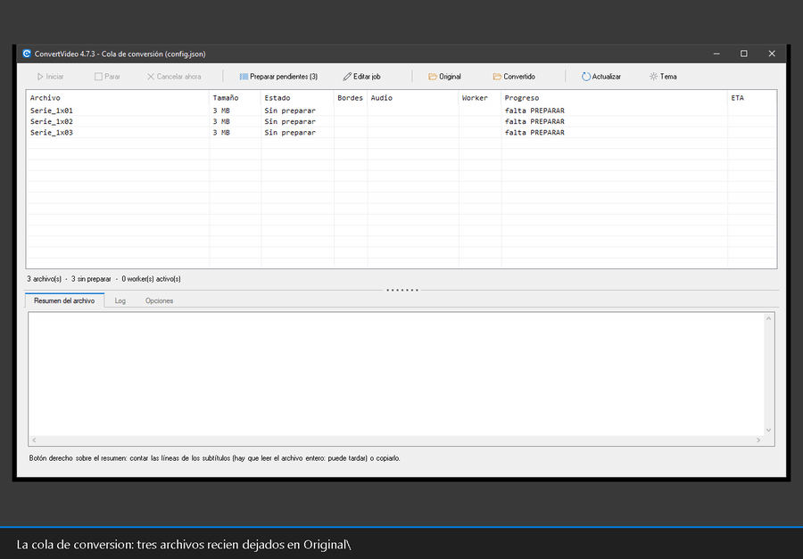

# ConvertVideo

Conversor/recodificador de vídeo por lotes para Windows, escrito en **PowerShell 5.1**, que usa **FFmpeg** como motor. Diseño modular en `lib\`, los scripts en `bin\` y toda la configuración en `config\config.json`.

Recodifica a **MKV** (vídeo H.265/H.264/AV1 por GPU NVIDIA o CPU; audio AAC, AC-3, E-AC-3, MP3, FLAC u Opus, o copia sin recodificar), con detección y recorte de bandas negras, selección de pistas (vídeo/audio/subtítulos, con preview), corrección de sincronía, normalización de volumen y **MKV final limpio** (sin metadatos heredados ni etiquetas `DURATION`).

*La cola de conversión de principio a fin: dejar los vídeos, `Preparar pendientes`, `Iniciar` y listo. Es una sesión real grabada con [`manual/generar-capturas.ps1`](manual/generar-capturas.ps1).*

> La versión antigua en Batch (CMD + VBScript) se conserva en la rama **`v3.x`**.

***

## Puesta en marcha

1. Copia tus vídeos en la carpeta `Original\` (por defecto `.avi`, `.flv`, `.mp4`, `.mov`, `.mkv`; ampliable en `config.json` → `encode.extensions`).
2. Doble clic en **`Convert.cmd`**.
   - Si falta FFmpeg, se ofrece a **descargarlo** (build de [GyanD/codexffmpeg](https://github.com/GyanD/codexffmpeg), verificado con SHA256).
   - Primero **pregunta** la configuración de cada archivo; luego **codifica** sin más preguntas.
3. El resultado queda en `Convertido\<nombre>_fix.mkv`.

`Convert.cmd` solo lanza `bin\Convert.ps1` con `-ExecutionPolicy Bypass` (no cambia la política del sistema) y pone la consola en UTF-8.

> ¿Prefieres ventanas? **[Manual de uso con capturas](manual/README.md)**: preparar, la cola de conversión, los workers y qué hacer cuando algo se queda a medias.

Para gestionar las herramientas (FFmpeg, aacgain, MKVToolNix, 7zr) o editar la configuración cómodamente: **`setup.cmd`**. Ambos lanzadores admiten `-Config <ruta>` para usar un fichero de configuración alterno (se **reenvía** a las ventanas worker que se abran en paralelo). Para depurar hay **`Convert-Debug.cmd`**, que usa `config.debug.json` (`debug.enabled = true`) y muestra el log detallado sin tocar tu `config.json`; y **`setup-Debug.cmd`** para editar/gestionar ese `config.debug.json` con el editor de setup.

## En qué consiste

Modelo **preparar → procesar**:

- **PREPARAR**: elige un perfil y, por cada vídeo, pregunta/detecta todo (selección de pista de vídeo si hay varias, bordes con preview en varios puntos, resize, animación, pista de audio con su idioma, sincronía, subtítulos) y lo congela en `Proceso\<nombre>.job.json`.
- **WORKER**: codifica cada preparado de forma desatendida (audio → vídeo → multiplexado) y deja el MKV en `Convertido\`.
- **Paralelo**: cuando todos tienen `.job`, puedes abrir varias ventanas de `Convert.cmd`; cada una toma archivos libres mediante un lock atómico. O abre **`Convert-gui.cmd`**: un solo panel con toda la cola, los workers y su progreso ([docs/ref-cola.md](docs/ref-cola.md)).

## Funcionalidades

Todo es configurable en `config.json` (detalle en [ref-configuracion.md](docs/ref-configuracion.md)). Resumen por áreas:

### Vídeo

| Funcionalidad | Opciones |
|---|---|
| **Recodificación** | H.264 (`libx264` CPU / `h264_nvenc` GPU), H.265 (`libx265` / `hevc_nvenc`), AV1 (`libsvtav1` CPU / `av1_nvenc` GPU), o `copy` (sin recodificar) |
| **Perfil Auto** | Elige el mejor encoder soportado por el equipo (AV1 > H.265 > H.264, GPU antes que CPU), también como `videoEncoder: "auto"` en un perfil; filtros de solo-GPU y tope de códec |
| **Control de tasa** | CRF (CPU, 0-51) · CRF AV1 (0-63) · QP mín/máx (NVENC) |
| **Profundidad / perfil / level** | 8 o 10 bits (`main10`), perfil y level del códec |
| **2-pass NVENC** | Off · ¼ de resolución · resolución completa |
| **Tuning** | Preset por familia de encoder, `rc-lookahead`, `refs`, `tier` |
| **Detección/recorte de bandas negras** | `cropdetect` con muestreo en varios puntos + preview; por perfil: no / sí / auto |
| **Reescalado (resize)** | Ancho máximo (solo reduce) o escalado fijo (p. ej. `1920:-2`) |
| **FPS** | Forzar el fps de salida o conservar el del origen |
| **HDR → SDR (tone-mapping)** | Auto u off con `libplacebo` + curva configurable (`bt.2390`…) |
| **Vídeo anamórfico (SAR ≠ 1)** | Conservar · cuadrar por ancho · cuadrar por alto |
| **Control de calidad** | SSIM o VMAF de la salida frente al origen |
| **Animación** | `-tune animation` (libx264/libx265); PREPARAR pregunta por archivo |
| **Selección de pista de vídeo** | Menú con preview cuando hay varias pistas (y preview del **original** al lado del recortado) |
| **Si recodificar engorda, quedarse con el original** | Compara la pista codificada con la de partida y, si ha salido **más grande** y la imagen no se toca, multiplexa el vídeo original (el audio y los subtítulos ya hechos se conservan) |

### Audio

| Funcionalidad | Opciones |
|---|---|
| **Recodificación** | AAC, AC-3, E-AC-3, MP3, FLAC, Opus, o `copy` (sin recodificar) |
| **Canales / downmix** | Estéreo / 5.1 / 7.1 como **máximo** (no hace upmix); downmix 5.1→estéreo estándar o con voz reforzada (coeficientes) |
| **Frecuencia** | Hz de salida (Opus fuerza 48000) |
| **Normalización de volumen** | Pico (`peak`) · `loudnorm` (EBU R128) · `aacgain` |
| **Sincronía A/V** | Corrección con `adelay` (1 pasada) o WAV clásico; el desfase inicial solo se compensa si la ruta pierde los timestamps; detección de audio **adelantado** con aviso y preview forzoso |
| **Multipista** | Conservar varias pistas del idioma preferido y elegir la predeterminada |
| **Selección por idioma** | Idioma preferido con *fallback* + preview; conservar (o no) el título de la pista |

### Subtítulos

| Funcionalidad | Opciones |
|---|---|
| **Selección automática** | Conserva forzados + completos del idioma preferido; clasifica por flag o por tamaño de cues; *fallback* para elegir cuáles conservar |
| **Conversión a SRT** | Lista configurable `encode.subtitles.toSrt` (por defecto `webvtt`): convierte esos subtítulos a SubRip; el WEBVTT que ffmpeg no puede leer se rescata con `mkvextract` y se convierte en la misma ejecución; los ilegibles no cubiertos se ignoran (evita que tumben la conversión) |
| **Preview / contenido** | Previsualizar con ffplay o ver el `.srt` extraído |
| **FixSyncSub** (`.srt` externos) | Re-sincronización lineal, OCR (`l`→`I`), espaciado y detección de codificación |

### Contenedor, salida y post-proceso

| Funcionalidad | Opciones |
|---|---|
| **Contenedor de salida** | MKV (recomendado) · MP4/MOV (con `+faststart`) |
| **Extensiones de entrada** | Lista configurable |
| **Adjuntos** | Conservar fuentes / carátulas / otros al multiplexar |
| **Limpieza** | Quita metadatos heredados y etiquetas `DURATION` con `mkvpropedit`; conserva los capítulos |

### Flujo y operación

| Funcionalidad | Opciones |
|---|---|
| **Preparar → worker** | Congela las decisiones en `Proceso\<nombre>.job.json` y codifica desatendido |
| **Ejecución en paralelo** | Varias ventanas con lock atómico; reintentos por archivo |
| **Progreso en vivo** | % + ETA + velocidad + bitrate + cuantizador `q` |
| **Perfiles** | de serie + propios en `config.json` + builder custom interactivo |
| **Una sola pasada** 🧪 | Audio + vídeo + multiplexado en un único ffmpeg (beta) |
| **Validación de encoders por GPU** | Sondea qué NVENC soporta la GPU real y lo cachea |
| **Timeouts de prompt** | Auto-aceptar por tipo de pregunta tras N segundos |
| **Descarga de FFmpeg** | Automática, verificada con SHA256 |
| **Modo test / debug** | Recortar la codificación a N minutos · log detallado |

### Ventanas e idioma

| Funcionalidad | Opciones |
|---|---|
| **Idioma de la interfaz** | `ui.language`: `auto` (el de Windows), `es` o `en`. Los textos viven en `lang\<idioma>.json` y **añadir un idioma es soltar un fichero ahí**: la lista sale de los que haya y cada uno dice su propio nombre. Lo que no esté traducido cae al castellano |
| **La cola en ventana** (`Convert-gui.cmd`) | Todo el estado en un panel: fila por archivo, workers, progreso en vivo, resumen de lo que se le hará a cada uno y log. Con **atajos de teclado** (`F5`, `F2`, `F6`, `F9`, `Esc`…) y, si quieres, **se esconde en el área de notificación** al minimizarla |
| **Preparar en ventana** | El mismo recorrido que en consola: pregunta el perfil una vez y solo se para donde se pararía la consola, abriendo el editor del archivo con el motivo escrito |
| **Editor del job** | Pista de vídeo, recorte (con detección de bordes **a medida**: desde qué segundo, cuántas muestras y de cuánto), escalado, audio con idioma y retardo —y preview del original y del resultado— y subtítulos |
| **Editar varios jobs a la vez** | Marca las filas y cambia **solo lo que marques**; el resto de cada job se queda como estaba |
| **Tema claro / oscuro** | `gui.theme`: `system`, `light` o `dark`; se cambia desde la propia ventana y se recuerda |
| **Setup en ventana** (`setup-gui.cmd`) | Herramientas, editor de `config.json`, perfiles propios, logs y mantenimiento |

## Requisitos

- Windows de 64 bits con **PowerShell 5.1** (el que trae Windows).
- FFmpeg/FFprobe/FFplay: se descargan solos a `tools\ffmpeg\<version>\<plataforma>\` (o instálalos con `setup.cmd`).
- Para los perfiles NVENC, una GPU NVIDIA compatible con la versión de FFmpeg elegida.

## Estructura

| Carpeta / fichero | Uso |
|---|---|
| `Convert.cmd` / `setup.cmd` | Lanzadores del conversor / de la utilidad de gestión. |
| `Convert-gui.cmd` / `setup-gui.cmd` | Lo mismo en **ventana**: la cola de conversión ([docs/ref-cola.md](docs/ref-cola.md)) y el setup ([docs/ref-setup.md](docs/ref-setup.md)). |
| `Convert-gui-Config.cmd` | La cola en ventana **preguntando** con qué `config*.json` trabajar (el normal va directo). |
| `Convert-Debug.cmd` / `setup-Debug.cmd` / `config.debug.json` | Conversor / editor de setup en modo debug (log detallado), sobre `config.debug.json`. |
| `bin\` | Los scripts del programa: `Convert.ps1` (orquestador: clasificar / preparar / worker), `setup.ps1` (herramientas + editor de `config.json` + limpieza), sus dos versiones en ventana y `FixSyncSub.ps1`. En el raíz solo quedan los lanzadores. |
| `config\` | Las configuraciones: `config.json`, `config.debug.json`… y `config.json.example`, un mínimo de ejemplo para copiar. Un `config.json` que siga en el raíz de una versión anterior se sigue usando. |
| `lib\` | Módulos PowerShell (`*.psm1`); las ventanas, una por fichero, en `lib\form\`. |
| `lang\` | Textos de la interfaz por idioma (`es.json`, `en.json`…). |
| `Original\` | Vídeos de entrada (las cuatro carpetas de trabajo se pueden mover con `paths`). |
| `Proceso\` | Trabajo: `*.job.json`, `*.lock`, temporales. |
| `Convertido\` | Resultado final (`*_fix.mkv`). |
| `tools\<app>\<ver>\<plat>` | Ejecutables (FFmpeg, aacgain, mkvpropedit, 7zr). |
| `manual\` | **Manual de uso con capturas** de las ventanas (y el script que las regenera). |
| `docs\` | Documentación detallada. |

## 📖 Documentación

Para **usarlo**, el manual con capturas de las ventanas: **[`manual/`](manual/README.md)** — [primeros pasos](manual/01-primeros-pasos.md), [preparar](manual/02-preparar.md), [la cola de conversión](manual/03-convertir.md) y [qué hacer cuando algo no sale](manual/04-cuando-algo-falla.md).

La documentación técnica y detallada (cómo trabaja, flujos, diagramas y **los comandos exactos** que se lanzan en cada fase) está en **[`docs/`](docs/README.md)**:

- [Arquitectura](docs/ref-arquitectura.md) — módulos, contexto, fuentes de verdad.
- [Flujo de trabajo](docs/ref-flujo.md) — clasificar → preparar → worker, con diagramas.
- [Comandos de las herramientas](docs/ref-comandos.md) — ffmpeg/ffprobe/ffplay/aacgain por fase.
- [Perfiles](docs/ref-perfiles.md) — perfiles de serie, propios de `config.json` y custom.
- [Configuración](docs/ref-configuracion.md) — referencia de `config.json`.
- [Herramientas](docs/ref-herramientas.md) — versiones, plataforma, descargas y versión por job.
- [Setup](docs/ref-setup.md) — utilidad `setup` (menú, editor de config, `-Config`, debug, fallback NVENC).
- [Jobs](docs/ref-jobs.md) — formato del job, lock y temporales.
- [La cola en ventana](docs/ref-cola.md) — estados, columnas, workers, atajos y opciones de la ventana.
- [FFmpeg](docs/ref-ffmpeg.md) — qué build se usa y por qué.
- [FixSyncSub](docs/ref-fixsyncsub.md) — el arreglador de `.srt` externos.
- [Trampas conocidas](docs/ref-gotchas.md) — errores reales ya pisados (PowerShell 5.1, ffmpeg, NVENC, WinForms).
- [Pruebas](docs/ref-pruebas.md) — muestras de test, batería del pipeline y fuentes/licencias.

Y los *cómo y por qué* con diagramas —[detección de bordes](docs/explica-deteccion-bordes.md), [audio](docs/explica-audio.md), [control de tasa](docs/explica-control-tasa.md), [anamórfico](docs/explica-anamorfico.md), [HDR→SDR](docs/explica-tonemap-hdr.md), [calidad](docs/explica-calidad.md)— y algún [postmortem](docs/caso-rendimiento-subtitulos.md), listados en el [índice](docs/README.md).

## Star History

<a href="https://www.star-history.com/?repos=vsc55%2FConvertVideo&type=date&legend=top-left">
 <picture>
   <source media="(prefers-color-scheme: dark)" srcset="https://api.star-history.com/chart?repos=vsc55/ConvertVideo&type=date&theme=dark&legend=top-left&sealed_token=gYf48RZjn0JBHtsRHDu34uj_Q5kwHFMSV1CS9jBqnCdRBTi17K4Xx-2F0jJRqAnUbpGFmc1L8MwFzASv1ZPcf6FaZklhbEAPoaTCLu0gKeS0_qRH6yx46kDLHA8l4qzaUVgGJPX90B_gpEeE0kVgEWUruZ_QnSzBaY9EqNemxKQpuQqGBVAejjkNA4s1" />
   <source media="(prefers-color-scheme: light)" srcset="https://api.star-history.com/chart?repos=vsc55/ConvertVideo&type=date&legend=top-left&sealed_token=gYf48RZjn0JBHtsRHDu34uj_Q5kwHFMSV1CS9jBqnCdRBTi17K4Xx-2F0jJRqAnUbpGFmc1L8MwFzASv1ZPcf6FaZklhbEAPoaTCLu0gKeS0_qRH6yx46kDLHA8l4qzaUVgGJPX90B_gpEeE0kVgEWUruZ_QnSzBaY9EqNemxKQpuQqGBVAejjkNA4s1" />
   
 </picture>
</a>