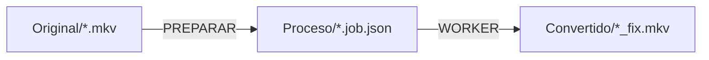

# Documentación — ConvertVideo

Documentación técnica y detallada del conversor. Para la visión general y la puesta en marcha, ver el [README principal](../README.md); para **usar el programa** (qué ves en cada ventana y qué hacer), el [manual con capturas](../manual/README.md).

## Índice

| Documento | Contenido |
|---|---|
| [ref-arquitectura.md](ref-arquitectura.md) | Estructura de ficheros, módulos, el contexto (`$ctx`), y las "fuentes únicas de verdad". |
| [ref-flujo.md](ref-flujo.md) | Cómo trabaja: clasificar → preparar → worker. Diagramas, locks, paralelismo, reglas de los prefijos `_` y `TEST_`. |
| [ref-comandos.md](ref-comandos.md) | **Los comandos exactos** de ffmpeg/ffprobe/ffplay/aacgain que se lanzan en cada fase. |
| [ref-ffmpeg.md](ref-ffmpeg.md) | **Glosario de todas las opciones y filtros** de ffmpeg/ffprobe/ffplay que usamos: qué hace cada una (doc oficial) y cómo la usamos. Complementa a `ref-comandos.md`. |
| [ref-perfiles.md](ref-perfiles.md) | Perfiles de codificación de serie, los propios de `config.json` (sección `profiles`), el perfil custom y las preguntas por archivo (vídeo/audio/subs/bordes). |
| [ref-configuracion.md](ref-configuracion.md) | Referencia completa de `config.json` (todas las secciones y claves). |
| [ref-herramientas.md](ref-herramientas.md) | Sistema de herramientas versionadas (`tools\<app>\<version>\<plataforma>`), descargas, plataforma y versión por job. |
| [ref-setup.md](ref-setup.md) | La utilidad `setup.ps1`/`setup.cmd`: menú (herramientas/estado/pruebas/limpieza), editor de `config.json`, config alterno `-Config`, lanzadores debug y fallback NVENC. Incluye **setup en ventana** (`setup-gui.cmd`) y el modo no interactivo `-Task`. |
| [ref-cola.md](ref-cola.md) | La **cola de conversión en ventana** (`Convert-gui.cmd`): estados de cada archivo, workers desatendidos (`-Unattended`), parada ordenada y ficheros de control de `Proceso\`. |
| [ref-jobs.md](ref-jobs.md) | Formato del `.job.json`, el lock atómico y los ficheros temporales. |
| [ref-pruebas.md](ref-pruebas.md) | Muestras de test (`test\`): qué prueba cada una, resultado esperado, cómo regenerarlas y las fuentes/licencias. |
| [explica-audio.md](explica-audio.md) | Selección de la pista de audio (mejor por canales/códec/bitrate) con diagramas, y comparativa de tiempo de los métodos de volumen (peak/loudnorm/aacgain). |
| [explica-control-tasa.md](explica-control-tasa.md) | Qué son **CRF**, **QMIN/QMAX** y **QP**, para qué sirven, cómo se traducen a ffmpeg y cómo elegir valores (escala 0–51). |
| [explica-tonemap-hdr.md](explica-tonemap-hdr.md) | Por qué un **4K HDR** se ve "lavado" al pasarlo a SDR y cómo el conversor lo **tone-mapea** a BT.709 (detección `Test-CvHdr`, filtro `libplacebo` en GPU, clave `encode.video.tonemapHdr`). |
| [explica-deteccion-bordes.md](explica-deteccion-bordes.md) | Detección de bordes negros: escaneo `cropdetect` multipunto, reparto por el vídeo, y la auto-aceptación por votos (% + margen) con matriz de decisión. |
| [explica-anamorfico.md](explica-anamorfico.md) | Vídeo **anamórfico** (SAR ≠ 1): por qué el tamaño almacenado no es el que se ve, la pregunta de PREPARAR y los modos `encode.video.anamorphic` (`square`/`squareheight`/`keep`) que de-anamorfizan a píxeles cuadrados. |
| [explica-calidad.md](explica-calidad.md) | **Control de calidad** de la salida vs origen (`encode.video.qualityCheck`): diferencia entre **SSIM** (rápido, 0-1, estructural) y **VMAF** (perceptual de Netflix, 0-100, requiere `libvmaf`), cuándo usar cada uno y cómo se mide. |
| [caso-rendimiento-subtitulos.md](caso-rendimiento-subtitulos.md) | Nota técnica: diagnóstico de la lentitud de PREPARAR con subtítulos (conteo de cues vía tag `NUMBER_OF_FRAMES` en vez de demultiplexar), cómo se localizó y la mejora medida. |
| [ref-gotchas.md](ref-gotchas.md) | **Trampas y cosas a tener en cuenta**: fallos reales ya corregidos y reglas para no repetirlos (PowerShell tipos/números, ffmpeg/códecs, NVENC/GPU, verificación). Revisar antes de tocar esas áreas. |
| [ref-fixsyncsub.md](ref-fixsyncsub.md) | Utilidad **independiente** `FixSyncSub.ps1`/`.cmd` para corregir y sincronizar subtítulos `.srt`: normaliza codificación → UTF-8, corrige OCR (`l`→`I`) y espaciado, y re-sincroniza (offset / lineal 2 cues / por tramos / por extremos). Explica cómo calcula la desviación (`t' = a·t + b`). |

## Convención de nombres

El **prefijo** del nombre indica el **tipo** de documento (un único eje); el resto del nombre es el tema. Así se distingue de un vistazo una referencia de una explicación o de un caso:

| Prefijo | Tipo | Qué es | Ejemplo |
|---|---|---|---|
| `ref-` | **Referencia** | Documentación estable y consultable: qué hay y cómo se configura. Es la mayoría. | `ref-configuracion.md` |
| `explica-` | **Explicación** | Cómo funciona un mecanismo en profundidad (el porqué, diagramas, decisiones de diseño); complementa a la referencia. | `explica-deteccion-bordes.md` |
| `caso-` | **Caso** | Nota técnica de un problema concreto: síntoma → diagnóstico → solución → mejora medida (postmortem). | `caso-rendimiento-subtitulos.md` |

Reglas:

- El prefijo describe el **tipo**, no el área (no se usan prefijos de tema tipo `conf-`/`audio-`; el tema va en el nombre: `explica-deteccion-bordes`).
- Un solo prefijo por fichero (nada de `explica-conf-…`).
- `README.md` (este índice) no lleva prefijo.
- Al añadir un documento nuevo: elige el prefijo por su tipo y añádelo a la tabla del índice de arriba.

## Fuente única (no duplicar el detalle)

Para que un cambio en el código **no obligue a tocar N documentos**, cada dato transversal tiene **un solo hogar canónico**; el resto de docs lo mencionan de pasada y **enlazan**, sin repetir la lista/tabla/número completos:

| Dato | Hogar canónico | El resto |
|---|---|---|
| Args de ffmpeg por encoder (profile/level, `-pix_fmt`/profundidad, preset, lookahead, multipass) | [ref-comandos.md](ref-comandos.md) §8 | mención + enlace |
| Nº y lista de perfiles de serie | [ref-perfiles.md](ref-perfiles.md) (tabla, autogenerada de `Get-CvProfiles`) | "de serie" + enlace; **no** escribir el número |
| Claves y valores válidos de `config.json` (enums) | [ref-configuracion.md](ref-configuracion.md) | enlace (los valores válidos ya viven en catálogos únicos del código: `Get-Cv*Modes`/`Get-Cv*Options`) |
| Elegibilidad/flujo de la una-pasada y por etapas | [ref-flujo.md](ref-flujo.md) | enlace |

Regla: si vas a copiar una tabla/lista de otro doc, **enlaza** en su lugar. Si un valor sale de un catálogo del código (`lib\Config.psm1`/`lib\Profile.psm1`), ese catálogo es la fuente; los docs no lo re-enumeran salvo el canónico.

## Resumen en una frase

`Convert.cmd` lanza `Convert.ps1`, que en una primera pasada **pregunta** toda la configuración de cada vídeo de `Original\` y la congela en un `Proceso\<nombre>.job.json`; después, en la misma ventana (o en otras ventanas en paralelo), un **worker** codifica cada archivo preparado de forma desatendida, reclamándolo con un lock atómico.

