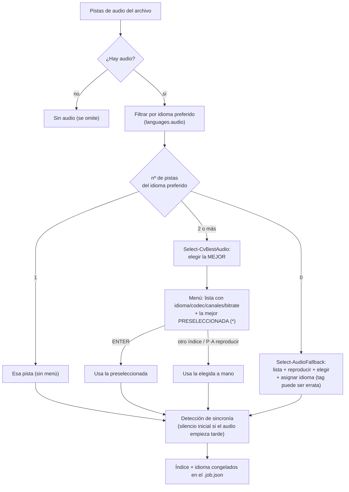
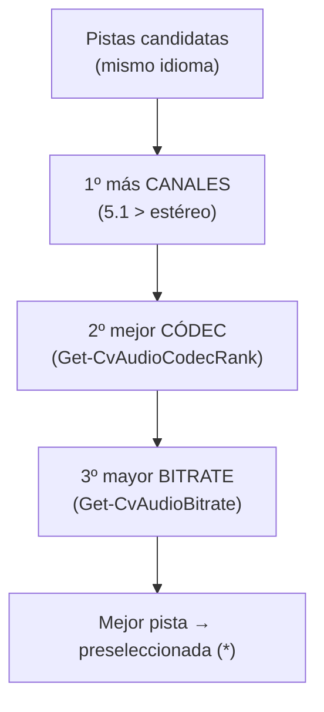
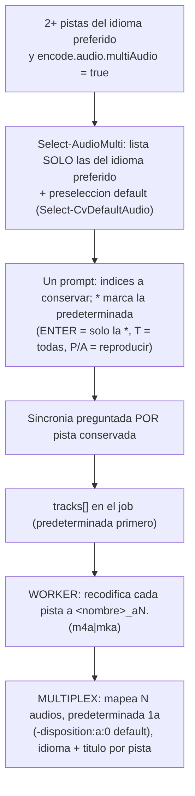
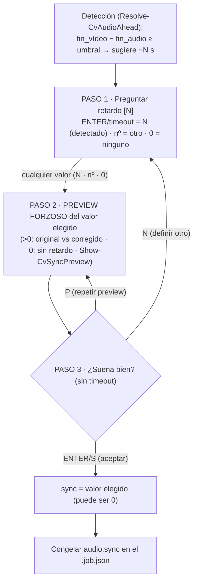
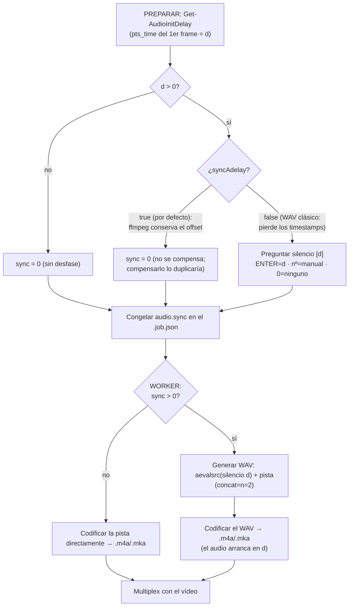
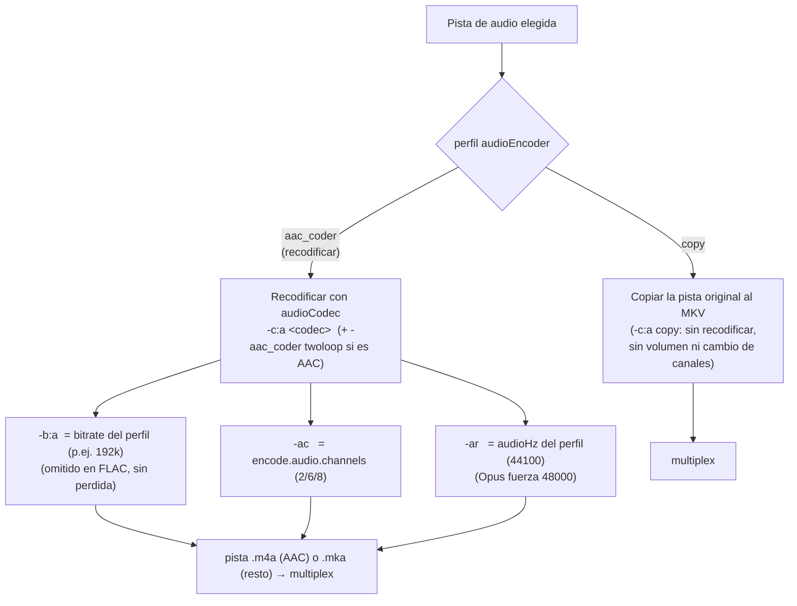

# Audio: selección de pista y procesado de volumen

Cómo el conversor **elige la pista de audio** cuando hay varias y cómo **ajusta el volumen** (con la comparativa de tiempo de cada método). Implementación en `Select-AudioStream`/`Select-CvBestAudio` ([MediaInfo.psm1](../lib/MediaInfo.psm1)) e `Invoke-AudioRun`/`Invoke-AudioAsk` ([Audio.psm1](../lib/Audio.psm1)).

## 1. Selección de la pista de audio

En PREPARAR se decide qué pista de audio se conserva. Preferencia por **idioma configurado** (`languages.audio`); con varias del idioma preferido se elige automáticamente la **mejor calidad** y se pregunta (preseleccionada); sin ninguna del idioma preferido, se pregunta cuál y qué idioma asignar.



### Criterio "mejor pista" (`Select-CvBestAudio`)

Cuando hay 2+ pistas del idioma preferido, se ordenan por calidad de **fuente** y se preselecciona la primera:



- **Canales**: más canales = fuente más rica (aunque luego se baje a estéreo, el downmix de un 5.1 es preferible).
- **Códec** (`Get-CvAudioCodecRank`, mayor = mejor máster): TrueHD/MLP · FLAC/PCM · DTS · **E-AC-3 · AC-3** · Opus · AAC · Vorbis · MP3 · resto.
- **Bitrate** (`Get-CvAudioBitrate`): se lee de `stream.bit_rate` o, si falta, del tag de estadísticas **`BPS`** de mkvmerge. Se muestra en el menú (`bitrate=NNNk`) para decidir a mano.

Ejemplo (dos pistas 5.1 en español): `eac3 768k` gana a `ac3 640k` por códec (E-AC-3 > AC-3), aunque el bitrate sea parecido.

### Multipista de audio (conservar varias)

Por defecto se conserva **una** pista. Con la multipista (`encode.audio.multiAudio = true`, por defecto) se pueden conservar **varias** del idioma preferido (p. ej. principal + comentarios) y elegir la **predeterminada**. Es simétrico con los subtítulos.

**Toggle:** `encode.audio.multiAudio` — `true` (por defecto) habilita conservar varias; `false` = monopista (elige una, comportamiento clásico). Solo se dispara con **2+ pistas del idioma preferido**.



- **Preselección de la predeterminada** (`Select-CvDefaultAudio`): la marcada `disposition.default` en el origen; si ninguna, la de mejor calidad (`Select-CvBestAudio`).
- **Título**: por defecto se deja **en blanco** (como el resto de pistas recodificadas). Con `encode.audio.keepTitle = true` se **conserva el título del origen** en cada pista (útil para distinguir varias del mismo idioma: principal/comentarios/…); el multiplex lo lee del origen por el índice de la pista.
- **Orden en el MKV**: la predeterminada **primero** y el resto después (orden de listado). Orden global de pistas: **vídeo → audio → subtítulos → capítulos**.
- **Modo `copy`**: también conserva el conjunto elegido, copiando las pistas del original (`-c:a copy`, sin recodificar); sin la beta (o con 0-1 pistas) es el copy clásico de una pista.
- **Temporales por pista**: `<nombre>_aN.(m4a|mka)` (pos 0 = predeterminada); los limpia `Remove-CvTemps`.
- **Job**: `audio.tracks[]` (ver [ref-jobs.md](ref-jobs.md)); los jobs antiguos monopista (`audio.index`) se siguen leyendo.

## 2. Procesado de volumen: métodos y tiempo

`encode.audio.volume.method` elige cómo se ajusta el volumen al recodificar el audio (`Invoke-AudioRun`):

| Método | Qué hace | Pasadas sobre el audio |
|---|---|---|
| `loudnorm` **(por defecto)** | Normalización de **sonoridad EBU R128** (I/TP/LRA) con el filtro `loudnorm`, en **1 pasada** dentro del encode. | 1 (encode), pero el filtro es pesado |
| `peak` **(legacy)** | Mide el pico (`volumedetect`) y **amplifica** hasta `encode.audio.volume.peakTarget` con el filtro `volume`. | 2 (análisis + encode), ambas ligeras |
| `aacgain` | Codifica sin ajuste y aplica **ReplayGain** sobre el `.m4a` ya codificado, **sin recodificar**. | 1 encode + escaneo aacgain |

> **`loudnorm` es el default desde v4.5.5** (antes lo era `peak`). El motivo: `peak` solo iguala el **pico**, que no dice nada del volumen **percibido** — dos archivos normalizados a pico 0 dBFS pueden sonar muy distintos —, mientras que `loudnorm` iguala la **sonoridad** (LUFS), que es lo que se nota al saltar de un archivo a otro. `peak` se mantiene por compatibilidad y para cuando prime la velocidad.

### Comparativa de tiempo

Medido sobre **5 minutos** de audio AC-3 5.1 → AAC (solo la fase de audio; el vídeo se codifica aparte). Valores orientativos (dependen de la CPU), para comparar entre sí:

| Método | Tiempo (5 min audio) | Relativo | Nota |
|---|---|---|---|
| `peak` | **~14 s** | **1×** (más rápido) | filtro `volume` trivial |
| `aacgain` | ~18 s | ~1,3× | encode sin filtro + escaneo ReplayGain |
| `loudnorm` | **~63 s** | **~4,5×** (más lento) | el filtro EBU R128 es pesado |

> El método de volumen apenas mueve el **tiempo total** de la conversión: manda el encode de **vídeo**. Por eso el default es `loudnorm` pese a ser el más lento de los tres (su filtro hace análisis de sonoridad + true-peak): da el volumen más uniforme entre archivos y lo que cuesta se pierde en el ruido frente al vídeo. Si procesas **solo audio** y prima la velocidad, `peak` (legacy) sigue siendo el más rápido; `aacgain` ajusta sin recodificar (reversible).

Los parámetros de cada método (`encode.audio.volume.peakTarget`, `encode.audio.volume.loudnormI/TP/LRA`) están en [ref-configuracion.md](ref-configuracion.md); los comandos exactos, en [ref-comandos.md](ref-comandos.md).

## 3. Sincronía audio/vídeo

### El problema

Algunos contenedores traen la pista de audio con un **desfase inicial**: su primer frame no está en el segundo 0, sino en `pts_time = d` (el audio "empieza más tarde" que el vídeo). En el archivo original eso está bien porque los timestamps lo colocan en su sitio.

El conflicto aparece **solo si la ruta de procesado PIERDE ese timestamp**. La solución es **anteponer `d` segundos de silencio** a la pista, para que vuelva a empezar en `d` y quede alineada.

> **Importante — hoy eso solo pasa en el modo WAV clásico.** Medido con `ffprobe`/`silencedetect` (ffmpeg 7.1.1):
>
> | Ruta | ¿Conserva el offset? | ¿Compensar? |
> |---|---|---|
> | Una-pasada (`filter_complex`) | **Sí** | **No** |
> | Etapas · temporal `.m4a` | **Sí** | **No** |
> | Etapas · temporal `.mka` | **Sí** | **No** |
> | Etapas · **WAV clásico** (`encode.audio.syncAdelay = false`) | **No** (el WAV no guarda marcas de tiempo) | **Sí** |
>
> Por eso la compensación **solo se aplica con `syncAdelay = false`**. Con `syncAdelay = true` (por defecto, y obligatorio en una-pasada) ffmpeg ya conserva el offset: añadir el silencio lo **duplicaría** y dejaría el audio `d` s **tarde** en la salida —una desincronía **real**, con la fuente correcta—.

Ojo al mecanismo: compensar **AÑADE silencio** (`adelay` / `aevalsrc`+`concat`); **no mueve** los timestamps. Por eso se **suma** al `start_time` en vez de sustituirlo:

```
  tiempo →   0    d        2d           fin
  vídeo:     |====|=========================|
  ORIGEN:         [==== audio ====]           start_time = d   -> correcto

  Ruta que CONSERVA el timestamp (adelay / una-pasada):
   sin tocar:     [==== audio ====]           sigue en d       -> correcto   OK
   + silencio:    [sil][==== audio ====]      d + d = 2d       -> AUDIO TARDE   BUG

  Ruta que PIERDE el timestamp (WAV clásico):
   sin tocar: [==== audio ====]                empieza en 0    -> adelantado d  MAL
   + silencio:[sil][==== audio ====]           silencio 0..d   -> alineado   OK
```

### Detección (fase PREPARAR)

`Get-AudioInitDelay` ([Audio.psm1](../lib/Audio.psm1)) decodifica **un solo frame** de la pista elegida y lee su `pts_time`:

```
ffmpeg -hide_banner -i <file> -map 0:<i> -af ashowinfo -f alaw -frames:a 1 -y NUL
```

Si `pts_time = d > 0`, el comportamiento depende del modo de sincronía (ver la tabla de arriba):

- **`syncAdelay = true`** (por defecto, y siempre en una-pasada): **no se compensa** y **no se pregunta** — ffmpeg ya conserva el offset. Solo se informa: `[SYNC] - El audio empieza d s más tarde que el vídeo: offset ya conservado por ffmpeg, no se compensa.` → `sync = 0`.
- **`syncAdelay = false`** (WAV clásico, que sí pierde los timestamps): se avisa y se **pregunta** cuánto silencio añadir, con `d` por defecto:
  - `[ENTER]` → usar `d` (el detectado).
  - teclear un número → usar ese (ajuste manual).
  - `0` → no añadir silencio.

El valor elegido se **congela** en el job (`audio.sync`); que haya habido pregunta marca el archivo como *selección manual* (`[AVISO]`).

### Caso 2: audio ADELANTADO (acaba antes que el vídeo)

Hay un segundo desfase que **no** tiene retardo inicial (audio y vídeo empiezan en `pts 0`) pero el audio va **adelantado de forma constante**: el sonido llega antes que la imagen. Se "esconde" porque los `start_time` son 0; la pista es que el **audio ACABA varios segundos antes que el vídeo** (el vídeo trae ~N s de más al inicio —logo/intro— que el audio no incluye, así que todo el audio queda N s adelantado).

- **Detección** (`Resolve-CvAudioAhead`): compara el último `pts` del vídeo con el de la pista de audio (leídos baratos por índice cerca del final, `Get-CvStreamEndPts`). Si `fin_vídeo − fin_audio ≥ encode.audio.syncThreshold` (por defecto **2 s**), se sugiere retrasar el audio esa diferencia. Como esa lectura de la cola (un `ffprobe` por índice) **tarda un poco**, avisa en consola: `[SYNC] - Analizando fin de video/audio pista N...` y `[OK]` con el fin detectado al terminar.
- **Pregunta + preview forzoso** (fase PREPARAR), en tres pasos:
    1. **Preguntar el retardo**: `[SYNC] - Retardo a anadir al audio en seg [N] (ENTER=usar N / 0=ninguno / <seg>=otro)`. **ENTER o timeout** (`promptTimeout.audioSync`, 15 s) → el **detectado `N`** (o el último tecleado); `0` → ninguno; teclear otro número → lo fija. **Cualquier** valor —**incluido `0`**— pasa por los pasos 2 y 3 (no hay atajo que salga del loop sin validar).
    2. **Preview forzoso** del valor elegido en el paso 1 (`Show-CvSyncPreview`): **siempre se muestra antes de aceptar**, así nunca se aplica un valor sin haberlo visto/oído. Se reproduce la **fuente directa** con ffplay (no se codifica ningún clip) desde `T` (≈15 % del audio) y **sin límite de tiempo** por defecto — hasta el final o hasta cerrar con `q`/ESC (topable con `preview.syncSeconds > 0`). Con un retardo `> 0`, **dos pases**: el **original** (se oye el desfase) y el **corregido** (mismo punto con el audio retrasado ese valor vía `adelay`, tal cual lo aplica el worker: `vídeo(W)` suena con `audio(W−valor)`; los primeros ~`valor` s de audio son silencio). Con `0`, **un solo pase** "sin retardo" (audio tal cual) para confirmar que ya suena bien (falso positivo).
    3. **Confirmar** (**sin timeout** — espera confirmación explícita): `Suena bien? Aceptar retardo de N s? (ENTER/S=aceptar / N=definir otro / P=repetir preview)`. **ENTER o `S`** → acepta; **`N`** → vuelve al paso 1 a definir otro; **`P`** → repite el preview. **No auto-acepta por timeout**: como el preview puede durar más que el timeout, el loop **no sale** hasta confirmar de oído/vista que suena bien (así no se cuela un valor sin escucharlo).
- **Aplicación**: el retardo elegido va a `audio.sync` y el worker lo aplica con `adelay` (igual que el caso 1).



> **Ojo con los falsos positivos:** un audio con **cola legítimamente más corta** (créditos con música que acaba antes, etc.) también "acaba antes" sin estar desfasado. Por eso NO se aplica a ciegas: se **pregunta** y se ofrece el **preview** para confirmar de oído/vista. Sube `audioSyncThreshold` (o ponlo a `0`) si te da falsos positivos.

### Aplicación (fase WORKER)

En `Invoke-AudioRun`, si `sync > 0` **no** se recodifica la pista directamente: primero se genera un **WAV** = `silencio(d)` **+** `pista`, concatenados, y ese WAV pasa a ser la fuente del encode (medición de volumen incluida). Si `sync = 0`, se codifica la pista tal cual.



Comando de generación del WAV (silencio + pista, en el layout de salida):

```
ffmpeg -hide_banner -y -i <file> -filter_complex \
  "[0:<i>]aformat=channel_layouts=<layout>[a2];aevalsrc=0:d=<sync>:sample_rate=<hz>:channel_layout=<layout>[sil];[sil][a2]concat=n=2:v=0:a=1[out]" \
  -map "[out]" <name>_concat.wav
```

Detalles:

- Se referencia `[0:<i>]` (el **índice concreto** de la pista elegida), no `[0:a]` (que sería la primera pista y podría no ser la seleccionada).
- El silencio (`aevalsrc=0`) se genera en el **mismo layout y samplerate** que la salida, para que el `concat` no falle por formatos distintos.
- Se pasa por un **WAV intermedio** (en vez de aplicar el retardo en el mismo encode) para evitar un problema del AAC que se desincroniza al concatenar directamente.
- En **modo pruebas** el WAV se acota a `test.minutes` (`-t`).

Comandos exactos: [ref-comandos.md](ref-comandos.md) (§4 detección, §5 WAV).

### Modo de sincronía: `adelay` (por defecto) vs clásico (WAV)

Hay **dos** formas de aplicar el silencio, elegibles con **`encode.audio.syncAdelay`** en `config.json`:

| | `adelay` — **por defecto** (`encode.audio.syncAdelay: true`) | Clásico (`encode.audio.syncAdelay: false`) |
|---|---|---|
| Cómo | 1 paso: filtro `adelay=<ms>:all=1` **encadenado con el volumen** en el mismo encode | 2 pasos: genera un WAV `silencio + pista` y luego lo codifica |
| Procesos ffmpeg | **1** | 2 (WAV + AAC) |
| Temporal `_concat.wav` | **no** | sí |

En modo `adelay`, la cadena de filtros combina retardo + volumen en una sola pasada, p. ej.: `[0:<i>]adelay=<ms>:all=1,volume=<g>dB[a]` (o `,loudnorm=...` según `encode.audio.volume.method`). Es el **método por defecto** desde la validación (ambos dan el mismo resultado audible; `adelay` cuantiza a **ms enteros** — ver [ref-gotchas.md](ref-gotchas.md)).

> **Implementación.** Config: **`encode.audio.syncAdelay`** (`lib/Config.psm1`) · Contexto: **`SyncAdelay`** (`lib/Context.psm1`). Lógica: rama `if ($Sync -gt 0 -and $Context.SyncAdelay)` en **`Invoke-AudioRun`** (`lib/Audio.psm1`); la rama `else` es el clásico (WAV). Verificado (ffmpeg 7.1.1) y en uso real: misma duración y silencio inicial que el clásico.

## 4. Canales y códec de la pista de salida

El perfil decide si el audio se **copia** tal cual o se **recodifica** al códec elegido (`audioCodec`, por defecto **AAC**):



### Códecs de salida soportados

Cuando se recodifica (la mayoría de perfiles), el códec de salida lo fija `audioCodec` del perfil. Formatos soportados y sus especificaciones (verificado con ffmpeg 7.1.1):

| `audioCodec` | ffmpeg (`-c:a`) | Tipo | Contenedor temp. | Bitrate (presets del builder) | Samplerate | Notas |
|---|---|---|---|---|---|---|
| `aac` (por defecto) | `aac -aac_coder twoloop` | con pérdida | `.m4a` | 96k–320k (**192k** rec.) | `audioHz` (44100) | AAC-LC, muy compatible. `twoloop` = coder de mayor calidad del AAC nativo (2 pasadas internas de asignación de bits por bloque). |
| `ac3` | `ac3` | con pérdida | `.mka` | 192k–640k (**384k** rec.) | `audioHz` | Dolby Digital. Máximo **640k** (tope del formato). Compatible con TV/receptores en 5.1. |
| `eac3` | `eac3` | con pérdida | `.mka` | 192k–640k (**384k** rec.) | `audioHz` | Dolby Digital Plus (E-AC-3). Mejor calidad que AC-3 a igual bitrate. |
| `libmp3lame` | `libmp3lame` | con pérdida | `.mka` | 96k–320k | `audioHz` | MP3, universal. |
| `flac` | `flac` | **sin pérdida** | `.mka` | — (no aplica) | `audioHz` | No se pasa `-b:a` (el tamaño lo decide el contenido). |
| `libopus` | `libopus` | con pérdida | `.mka` | 96k–320k | **48000** (forzado) | Opus, muy eficiente. Solo admite 8/12/16/24/**48** kHz, así que se ignora `audioHz` y se usa 48 kHz (44,1 kHz haría fallar la codificación). |

`aac` es el valor por defecto (comportamiento previo a esta función). El default es **configurable** en `customProfile.audioCodec`.

### Parámetros comunes al recodificar

- **Bitrate**: `-b:a`, el `audioBitrate` del perfil (p. ej. `192k`). **No** se pasa para FLAC (sin pérdida) ni si el perfil no lo define.
- **Canales**: `-ac`, del **perfil** (`audioChannels`) si lo fija, o del global `encode.audio.channels`: `2` = estéreo (por defecto), `6` = 5.1, `8` = 7.1. Es un **MÁXIMO**: hace **downmix** si la fuente tiene más canales, pero **NO hace upmix** si tiene menos (se conservan los del origen; ver más abajo).
- **Samplerate**: `-ar`, el `audioHz` del **perfil** (`44100` por defecto); `encode.audio.hz` es el valor de reserva si el perfil no lo trae. Excepción: **Opus** se codifica siempre a `48000`.

### Downmix 5.1 → estéreo con voz reforzada (`encode.audio.downmixMode`) 🧪 BETA

> 🧪 **El modo `dialogue` está en BETA.** Los coeficientes del filtro `pan` son **provisionales**, a la espera de validarlos y afinarlos con más material y distintos tipos de mezcla. El worker lo señala con `[beta]` en la línea del paso. El modo `default` (estándar de ffmpeg) no es beta.
>
> **Doble llave mientras sea beta:** `encode.audio.downmixMode = "dialogue"` fija el modo, pero solo refuerza la voz si además `test.betaDownmix = true`. Con `betaDownmix = false` (por defecto), aunque `downmixMode` sea `"dialogue"` se usa el downmix **estándar** (y el worker avisa: `… activa test.betaDownmix para la voz reforzada [beta]`). Al promocionar la mezcla se retirará este flag.

Al bajar un audio **5.1 a estéreo** (`audioChannels = 2`), el downmix estándar de ffmpeg mezcla el canal **central** (FC, donde van casi todos los **diálogos**) atenuado junto con los frontales y los surrounds (ambiente/efectos/música). Con la normalización ajustando el nivel a los picos de acción, los diálogos quedan **por debajo** y hay que subir/bajar el volumen constantemente.

`encode.audio.downmixMode` controla cómo se hace ese downmix:

| Valor | Downmix |
|---|---|
| `default` (por defecto) | Downmix estándar de ffmpeg (`-ac 2`). |
| `dialogue` | **Voz reforzada**: filtro `pan` que **sube el central** y **baja los surrounds** (descarta el LFE), para que los diálogos destaquen sobre el ambiente. |

Detalles del modo `dialogue`:

- Filtro: `pan=stereo|c0=<center>*c2+<front>*c0+<surround>*c4|c1=<center>*c2+<front>*c1+<surround>*c5` — usa **índices de canal** (`c0..c5`), así vale para `5.1` y `5.1(side)` (SL/SR vs BL/BR). `c2` = central; `c0`/`c1` = frontales; `c4`/`c5` = surrounds; `c3` (LFE) se descarta.
- **Coeficientes configurables** en `encode.audio.downmixCoeffs` (`center`/`front`/`surround`; por defecto `0.5`/`0.35`/`0.15`), así se pueden afinar sin tocar código. El LFE se descarta siempre.
- **`audioChannels` es un MÁXIMO — no hace upmix:** si el origen tiene menos canales que el objetivo (p. ej. estéreo con `6`), se conservan los del origen; bajar sí (5.1→estéreo). Nunca se fabrican canales de surround que no existen.
- **Por perfil (override del global):** cada perfil puede fijar su propia salida de audio — `audioChannels` (canales, máximo), `downmixMode` (`default`/`dialogue`) y `downmixCoeffs` — que manda sobre `encode.*`; si el perfil no los define, se usa el global. El builder de perfil **custom** pregunta canales y, si sale estéreo, el modo de downmix (los coeficientes se dejan al global). El activador beta `test.betaDownmix` es siempre global.
- **Clip-safe** si los coeficientes suman ≤ 1,0 (los de serie suman 1,0): el pico del downmix **no supera** el del origen, así que la normalización de volumen (medida sobre el origen) sigue siendo correcta y no hay recorte, sea cual sea el método (`peak`/`loudnorm`/`aacgain`). Si subes los pesos por encima de 1,0 en total, puede recortar.
- **Solo actúa** al bajar 5.1 → estéreo: si la salida no es estéreo o el origen no es 5.1, no hace nada (downmix estándar / sin cambios). Se aplica en las tres rutas de audio (sin sincronía, `adelay` beta y WAV clásico).
- Es un **ajuste de mezcla**, no de volumen: sube los diálogos *relativos* al resto; el nivel global lo sigue fijando la normalización.

### Contenedor intermedio (`.m4a` / `.mka`)

El audio recodificado se escribe primero en un temporal en `Proceso\`, que luego se multiplexa (copiando el stream, **sin recodificar**) al MKV final. La extensión depende del códec:

- **AAC → `.m4a`** (MP4): así sigue funcionando la normalización `aacgain`, que solo procesa AAC/MP3 en contenedor MP4.
- **Resto → `.mka`** (Matroska): admite cualquier códec (ac3/eac3/mp3/flac/opus), a diferencia de `.m4a`, que solo acepta aac/ac3/alac.

Por eso, si se elige un códec **distinto de AAC** y el método de volumen configurado es `aacgain`, se usa en su lugar el **método por defecto de config** (`loudnorm`; basado en filtro, válido para cualquier códec) — hasta v4.5.5 caía al fijo `peak`. `Invoke-Multiplex` toma el temporal que exista (`.m4a` o `.mka`) y `Remove-CvTemps` limpia ambos.

### Cómo se elige en el builder custom

En el constructor de perfil interactivo (opción `0` del menú *USAR PERFIL*), el audio se pide en **dos pasos**:

1. **SALIDA DE AUDIO (codec)**: `copy` (no recodificar) o uno de los códecs de arriba. El default es el de `customProfile.audioCodec` (o `copy` si `customProfile.audioBitrate` es `"copy"`).
2. **BITRATE**: solo si se recodifica y el códec **no** es FLAC. Los presets se adaptan al códec: rango de **sonido envolvente** (hasta 640k) para AC-3/E-AC-3, rango **estéreo/lossy** para AAC/MP3/Opus; además de `custom` para teclear cualquier valor.

Excepción — **`audioEncoder: copy`**: el audio **no se recodifica**; la pista original se copia tal cual en el MKV final (sin ajuste de volumen, canales ni samplerate; se conservan sus metadatos). Ver claves en [ref-configuracion.md](ref-configuracion.md).
