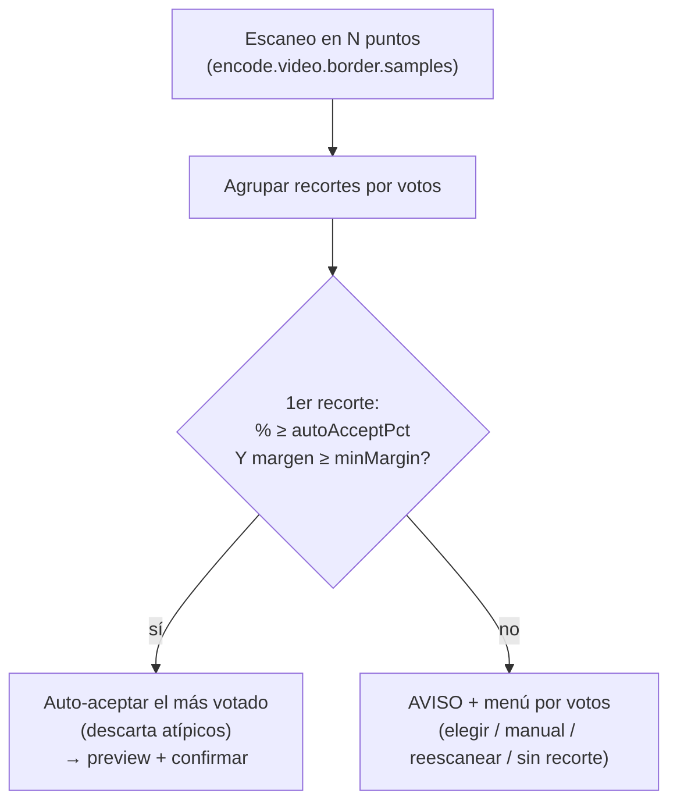

# Detección de bordes negros (cropdetect multipunto)

Cómo el conversor detecta y recorta las barras negras (letterbox/pillarbox), por qué escanea en **varios puntos** del vídeo y cómo decide **automáticamente** cuándo fiarse del resultado y cuándo preguntar. Implementación en `Find-CropDetect` / `Find-CropDetectSamples` ([Video.psm1](../lib/Video.psm1)); configuración en la sección `border` de [ref-configuracion.md](ref-configuracion.md).

## Cuándo se activa

La detección de bordes se ejecuta en PREPARAR según el campo **`detectBorder`** del perfil (o si el nombre del archivo **empieza por `_`**, que fuerza el modo interactivo):

- **`false`** — nunca; se codifica sin recorte.
- **`true`** — **siempre, interactivo**: escaneo completo (`encode.video.border.samples` puntos × `encode.video.border.duration` s), con preview y confirmación. **Antes de escanear pregunta el nº de muestras** (por defecto `encode.video.border.samples`, editable); útil para hacerlo más rápido o más fiable puntualmente. Al reescanear (`R`) se puede volver a cambiar.

> **Auto-aceptar por inactividad:** todas las preguntas del modo interactivo (nº de muestras, inicio/duración del scan, reintentar/continuar y la confirmación del recorte) admiten el **timeout** de `behavior.promptTimeout.border` (por defecto 10 s): si no tocas el teclado en ese tiempo, se acepta el valor por defecto (para dejar PREPARAR desatendido). Ver [ref-configuracion.md](ref-configuracion.md#behaviorprompttimeout--timeout-granular-por-pregunta).
- **`'auto'`** — **decide solo** con un pre-escaneo rápido (ver abajo).

Quién ejecuta la detección: la fase PREPARAR de la **consola** (`Invoke-VideoAsk`), el **recorrido** de *Preparar pendientes* de la ventana (`Get-CvJobAutoPlan`) y el **editor de jobs** al abrir un archivo sin preparar. Los tres miran lo mismo —el `detectBorder` del perfil y la regla del prefijo `_`— y usan las mismas funciones; un job **ya guardado** no se re-escanea: su recorte quedó congelado al prepararlo.

## Modo `auto` (decidir si recortar sin preguntar)

Pensado para no tener que saber de antemano si un vídeo tiene barras. Hace un **pre-escaneo ligero** (`encode.video.border.autoSamples` puntos × `encode.video.border.autoDuration` s — mucho menos que el escaneo completo) y decide:

1. **Tolerancia (¿es ruido o barra real?)** — `cropdetect` casi siempre recorta unos pocos píxeles de borde aunque no haya barras (p. ej. `3824:1600` sobre `3832:1600` = 0,2%). Solo se considera que **hay barras** si el recorte más votado reduce **≥ `encode.video.border.minCropPct`%** (def. 2). Por debajo → **no recorta**.
2. **Los puntos se COMBINAN, no se votan** (`Merge-CvCropBoxes`). Una barra negra es lo que está negro en **todos** los puntos, así que lo correcto es la **unión** de las cajas de contenido, no la mayoría: si en un punto la imagen llega más lejos, ahí hay contenido y recortar se lo comería. Votar era el error de fondo — dos planos oscuros le ganaban al único punto que veía el fotograma entero.
3. **Simetría.** Las barras de un letterbox/pillarbox son simétricas. Si un lado dice 94px y el opuesto 2px, esa diferencia es contenido oscuro de un plano, no barra: se toma el **menor** de cada par de márgenes opuestos, que es lo conservador.
4. **Ruido por eje.** El punto 1 se aplica **por eje**: si lo que se quitaría de ancho no llega a `minCropPct`, el ancho se deja intacto aunque el alto sí se recorte. Es el caso típico: barras arriba y abajo, y 2px de borde sucio a los lados.

Resultado (sobre los puntos del pre-escaneo):

| Situación | Acción |
|---|---|
| La unión no deja recorte significativo (< `minCropPct`% en los dos ejes) | **No recorta** (sin preguntar) |
| Queda un recorte normal (≤ `autoMaxCropPct`% de ancho y de alto) | **Aplica el recorte** (sin preguntar) |
| El recorte sale **desproporcionado** (> `autoMaxCropPct`%, def. 40) | Lo **propone** y pide confirmación: casi siempre significa que ningún punto llegó a ver un plano a pantalla completa |

> La decisión vive en **una sola función pura**, `Resolve-CvCropAutoDecision` ([Video.psm1](../lib/Video.psm1)), que usan igual la consola y la ventana.
>
> **El caso real que lo motivó** (episodio HDTV 1080p con barras 2:1): con 3 puntos de 5 s los recortes fueron `1168:640`, `1824:960:94:60` y `528:672` — tres cajas distintas, dos de ellas planos oscuros. Por votos no había mayoría y **no se recortaba nada**. Combinando: la unión da `1824:960:94:60`, la simetría deja los laterales en 2px, esos 2px son ruido (0,2% < 2%) y el resultado es **`1920:960:0:60`**, exactamente lo que devuelve el escaneo completo de 4x120 s.

Así, en la práctica: los vídeos **sin barras** (incluidos los scope nativos donde cropdetect da recortes dispersos por escenas oscuras) y los que las tienen **claras** se resuelven **sin intervención**; solo los que tienen barras dudosas (acuerdo parcial) preguntan.

## Cómo funciona

Cada escaneo usa el filtro `cropdetect` de ffmpeg sobre un tramo del vídeo y se queda con **la última** caja (`W:H:X:Y`) que imprime ese tramo. Es importante: `cropdetect` **acumula** —su caja de contenido solo crece mientras analiza—, así que la última línea es la que cubre todo lo visto en el tramo, mientras que la *más repetida* (lo que se hacía antes) devuelve la del plano que más dure: si el tramo empieza con 3 s de escena oscura, esa caja pequeña sale repetida decenas de veces y ganaba.

```
ffmpeg -ss <inicio> -to <fin> -i <archivo> [-map 0:<pista>] -vf cropdetect -f null -
```

### Por qué en varios puntos

Un solo escaneo al inicio se equivoca a menudo: los primeros minutos pueden ser créditos, un logo, una escena oscura o un plano con formato distinto al del grueso de la película. Por eso se muestrea en **`encode.video.border.samples`** puntos repartidos **uniformemente** entre `encode.video.border.start` y casi el final del vídeo, y cada punto **vota** su recorte.

- **`encode.video.border.start`** (def. 120): segundo del primer punto.
- **`encode.video.border.duration`** (def. 120): segundos que escanea **cada** punto. No es un presupuesto que se reparta: con `samples=6` son **6 escaneos de `duration` segundos** cada uno (más puntos = más tiempo total de análisis, pero cada muestra conserva su ventana completa).
- **`encode.video.border.samples`** (def. 6): número de puntos. Con `1` (o duración desconocida) se comporta como el escaneo único clásico.

Ejemplo de reparto en un vídeo de 46 min (`start=120`, `duration=120`):

| samples | ventana por punto | tiempo total de análisis | puntos de muestreo (s) |
|---|---|---|---|
| 3 | 120 s | 360 s | 120, 1380, 2639 |
| 9 | 120 s | 1080 s | 120, 435, 750, 1065, 1380, 1694, 2009, 2324, 2639 |

## Decisión: auto-aceptar o preguntar

Los recortes de todos los puntos se agrupan por **votos**. El más votado se **acepta automáticamente** (y se muestran preview + confirmación) si cumple **las dos** condiciones:

1. **Porcentaje** — alcanza `encode.video.border.autoAcceptPct` % (def. **60**) de los puntos que detectaron borde.
2. **Margen** — supera al segundo candidato por al menos `encode.video.border.autoAcceptMinMargin` votos (def. **2**).

Si no se cumplen ambas (voto repartido o empate), se avisa (`▐ AVISO ▌`) y se muestra un **menú de recortes ordenado por votos** para elegir a mano (o valor manual / reescanear / sin recorte).

### Por qué el porcentaje solo no basta

Un umbral de solo `%` **no mide la fuerza de la evidencia**: `2/3` y `6/9` son ambos 67%, pero uno son 2 confirmaciones y el otro 6. Si se bajara `samples`, el mismo % se alcanzaría con muchísimos menos votos → se auto-aceptaría con evidencia débil → **falsos positivos** (recortes atípicos aceptados como buenos). El **margen absoluto** lo corrige: con pocas muestras es difícil sacar margen, así que esos casos caen al menú en vez de auto-aceptarse.

### Matriz de decisión (con los valores por defecto: 60 % y margen +2)

| Votos | Total | % del 1º | Margen | Resultado |
|---|---|---|---|---|
| 2, 1 | 3 | 67 % | +1 | **Menú** (evidencia débil: pocas muestras) |
| 3, 1 | 4 | 75 % | +2 | Auto |
| 2, 1, 1 | 4 | 50 % | +1 | **Menú** |
| 8, 1 | 9 | 89 % | +7 | Auto |
| 7, 2 | 9 | 78 % | +5 | Auto |
| 6, 3 | 9 | 67 % | +3 | Auto |
| 5, 4 | 9 | 56 % | +1 | **Menú** (sin mayoría clara) |
| 3, 3, 3 | 9 | 33 % | +0 | **Menú** (empate) |
| 4, 4, 1 | 9 | 44 % | +0 | **Menú** (empate al primer puesto) |

El caso `8, 1` (un punto atípico frente a ocho coincidentes) se resuelve solo, sin molestar; el caso `2, 1` (esos mismos "dos de tres" pero con muy pocas muestras) se lleva al menú, que es justo lo que evita el falso positivo.



## Ajustes relacionados (`config.json` → `encode.video.border`)

| Clave | Def. | Efecto |
|---|---|---|
| `start` | `120` | Segundo del primer punto (se ajusta solo si el vídeo es más corto). |
| `duration` | `120` | Segundos que escanea **cada** punto. |
| `samples` | `6` | Nº de puntos repartidos por el vídeo (`1` = escaneo único clásico). |
| `autoAcceptPct` | `60` | % de votos del más votado para auto-aceptar. `100` = exigir unanimidad. |
| `autoAcceptMinMargin` | `2` | Margen mínimo de votos sobre el 2º (además del %). `0` = solo cuenta el %. |
| `autoSamples` / `autoDuration` | `3` / `15` | Pre-escaneo del modo `'auto'`: puntos y segundos por punto. **15 s, no 5**: en 5 s el tramo puede caer entero dentro de un plano oscuro y la caja no llega a crecer hasta el fotograma real (medido sobre un episodio: con 5 s ningún punto daba las barras; con 15 s, uno; con 30 s, dos — y combinando basta con uno). |
| `autoMaxCropPct` | `40` | Tope de lo que el modo `'auto'` recorta **solo**; por encima lo propone y pide confirmación. Referencia: un 2.39:1 dentro de 16:9 se lleva ~22% del alto; un 4:3, ~25% del ancho. |
| `minCropPct` | `2` | Reducción mínima (% de ancho/alto) para que el modo `'auto'` tome el recorte como barras reales; por debajo lo ignora (ruido de borde). |

Ejemplos de configuración:

- **Más exigente** (auto-acepta solo con mucho acuerdo): `autoAcceptPct = 80`, `autoAcceptMinMargin = 3`.
- **Más automático** (menos preguntas, mayoría simple): `autoAcceptPct = 50`, `autoAcceptMinMargin = 1`.
- **Rápido** (menos análisis): baja `samples` (p. ej. 3) o `duration`; ten en cuenta que con menos puntos el margen protege de auto-aceptar en falso.
