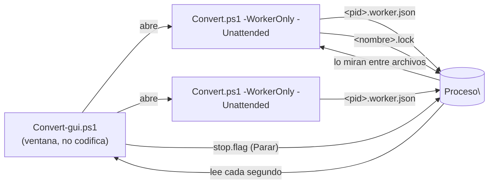

# La cola de conversión en ventana (`Convert-gui.cmd`)

Panel único con **todos los archivos de `Original\`**, en qué estado está cada uno, qué worker lo está codificando y por dónde va, más el log en vivo. Sustituye a tener varias consolas negras abiertas (`Convert.cmd -WorkerOnly`) y mirarlas de una en una.

Es la fase **WORKER** con ratón, y también la de **PREPARAR** para el caso normal: con doble clic en un archivo se abre el editor de su job (más abajo). Lo que no está en ventana se sigue haciendo en la consola de siempre: ver [ref-flujo.md](ref-flujo.md).

| Lanzador | Qué hace |
|---|---|
| **`Convert-gui.cmd`** | Va **directo** con el `config.json` de junto al programa (le pasa `-Config`, por eso no pregunta). |
| **`Convert-gui-Config.cmd`** | **Pregunta** con qué configuración trabajar: lista los `config*.json` que haya al lado (`config.json`, `config.debug.json`…) y deja buscar otro en disco. Es el equivalente de elegir entre `Convert.cmd` y `Convert-Debug.cmd` sin cambiar de lanzador. |

```
powershell -NoProfile -ExecutionPolicy Bypass -Sta -File Convert-gui.ps1 [-Config <ruta>]
```

La regla es esa: **con `-Config` va directo, sin `-Config` pregunta** (el mismo selector que `setup-gui.cmd`).

## Al abrir: comprueba las herramientas

Lo primero que hace la ventana es mirar si está lo necesario (`Test-CvConvertReady`):

- **Falta `ffmpeg`** (no está instalada la versión que fija `downloads.ffmpeg.selected`): no se puede ni analizar ni codificar. Se dice **qué versión falta y cuáles hay instaladas**, y se ofrece **abrir setup ahí mismo** para instalarla o elegir otra ([ref-setup.md](ref-setup.md) → *Usar una versión YA instalada*). Si dices que no, la cola se abre igualmente para mirar, pero preparar y codificar seguirán avisando.
- **Faltan opcionales que esta configuración SÍ usa** (`aacgain` con `volume.method = aacgain`, `mkvtoolnix` con la limpieza de etiquetas activada): no bloquean, pero se avisa al abrir en vez de descubrirlo a mitad de una conversión.

Antes esto salía como la excepción cruda de `Process.Start` (*"el sistema no puede encontrar el archivo especificado"*) en medio de un análisis, que no dice nada.

## Qué se ve

| Columna | Contenido |
|---|---|
| Archivo | Nombre base (el mismo que identifica su job y su salida). |
| Tamaño | Del archivo de entrada. |
| Estado | Uno de los cinco de abajo. |
| Worker | PID del worker que lo tiene reclamado. |
| Progreso | Paso + barra + % + velocidad mientras se codifica; tamaño de la salida (y % respecto al original) cuando está hecho. Es la columna que **se estira** con la ventana: se queda con todo el espacio libre (las demás tienen ancho fijo). |
| ETA | Lo que falta, según el worker. |

Estados (catálogo único `Get-CvQueueStates`, en `lib\WorkerCore.psm1`):

| Estado | Cuándo | Qué hacer |
|---|---|---|
| **Sin preparar** | Hay vídeo en `Original\` pero no tiene `.job.json`. | Botón `Preparar pendientes` (o `Editar job` para uno solo). |
| **En cola** | Tiene job y nadie lo ha reclamado. | `Iniciar`. |
| **Codificando** | Lo tiene un worker vivo. | Mirar el progreso. |
| **Bloqueo huérfano** | Quedó un `.lock` de un worker que ya no existe. | Menú contextual → *Liberar el bloqueo huérfano* (o lo roba solo el siguiente worker). |
| **Sin terminar** | Existe la salida **pero el job sigue ahí**: la conversión no acabó (se canceló, se cerró la ventana, se fue la luz), así que lo que hay en `Convertido\` está **a medias**. | Menú contextual → *Eliminar la salida a medias*: vuelve a la cola y se rehace. |
| **Hecho** | Existe `Convertido\<nombre>_fix.<ext>` **y ya no queda job**. | — |

## De dónde sale cada dato

Casi todo el estado de la cola **ya está en disco** y la ventana solo lo cruza (`Get-CvQueueStatus`), sin lanzar `ffprobe`: el job (`Proceso\<n>.job.json`), el bloqueo (`<n>.lock`, que guarda `PID`+equipo — ver [ref-jobs.md](ref-jobs.md)) y la salida (`Convertido\<n>_fix.<ext>`).

Ahí está la señal que distingue **hecho** de **cortado a medias**: el worker borra el `.job.json` **solo cuando termina bien**, así que *salida + job todavía presente* significa que la conversión no acabó. Importa más de lo que parece, porque el worker **salta** los archivos que ya tienen salida: mientras ese resto esté ahí, ese vídeo no se rehace nunca.

Lo único que **no** está en disco es el avance dentro de un archivo, así que cada worker lo publica en **`Proceso\<pid>.worker.json`**: archivo en curso, paso, %, ETA y velocidad. Lo escribe `Update-CvWorkerProgress` desde `Invoke-ToolProgress`, con **los mismos números que pinta la consola**, así que las dos caras enseñan lo mismo. Es best-effort: si falla la escritura, el worker sigue codificando como si nada.

Esto vale para **cualquier** worker, no solo los que abre la ventana: `Convert.ps1` publica su estado siempre, así que una consola arrancada a mano también aparece en el panel.



## Preparar en ventana (editor del job)

Dos caminos, los mismos que en consola.

### Preparar pendientes (el flujo normal)

Botón **`Preparar pendientes (N)`**. Hace lo mismo que la consola, en el mismo orden:

1. **Pregunta el perfil una vez** para todo el lote (mismo catálogo y mismas etiquetas que el menú de consola; *Auto* preseleccionado).
2. Recorre los archivos **uno a uno** haciendo el **autodiscover** (`Get-CvJobAutoPlan`): pistas, idiomas, subtítulos, escalado y **detección de bordes según el perfil** (`detectBorder` false/auto/true, con los mismos umbrales de votos). Cada fase se escribe en la barra de estado, así que siempre se ve qué está haciendo.
3. Lo que la consola resolvería sola **se guarda solo** (fila *preparado / automático*). Solo se para a preguntar **en los mismos casos en que preguntaría la consola**, y entonces abre el editor ya relleno y con el motivo escrito arriba:

| Se para cuando... | Igual que en consola |
|---|---|
| Hay **varias pistas de vídeo** | elige cuál usar |
| Vídeo **anamórfico** y se recodifica | revisa el escalado |
| **Ninguna** pista de audio en el idioma preferido | elige una |
| **Varias** pistas de audio en el idioma preferido | cuáles conservar y cuál es la predeterminada |
| Hay subtítulos pero **ninguno** del idioma preferido | cuáles conservar |
| Recorte **desproporcionado** (> `border.autoMaxCropPct`), o `detectBorder = true` | confirma el recorte propuesto |

4. Al terminar, resumen: cuántos preparados (y cuántos necesitaron revisión), omitidos y con error. Los jobs ya están escritos y la cola los ve *en cola*.

La lista lleva una columna **`Bordes / tamano`** para ver de un vistazo en qué archivos ha entrado el recorte, sin abrir ningún job:

| Celda | Significa |
|---|---|
| `[x] 1920x960` | Se han detectado barras: se recortan y el vídeo queda con ese tamaño (ya con el escalado aplicado). |
| `[ ] sin barras` | Se buscaron (el perfil detecta bordes) y no había. |
| `1280x720` | No hay recorte, pero el escalado sí cambia el tamaño. |
| *(vacío)* | Ni se buscó ni cambia nada (por ejemplo, con el vídeo en `copy`). |

Si un archivo se revisa a mano, la celda se rellena con lo que **se guardó de verdad**, no con lo que proponía el borrador (en el editor se puede quitar el recorte o poner otro).

La regla del prefijo `_` (forzar detección de bordes) se respeta igual que en consola.

### Editar un job suelto

Botón **`Editar job`** (o doble clic en la fila, o menú contextual): abre el editor de **ese** archivo, para verlo o retocarlo. Sin nada seleccionado coge el primer archivo sin preparar.

Si el archivo **aún no tiene job**, lo primero que hace es **preguntar el perfil**, igual que la consola antes de preparar: el perfil decide si se recodifica, con qué encoder y a qué tamaño, así que no se elige por su cuenta (cancelar ahí = no se abre nada). Si el job ya existe, manda el perfil que tiene **congelado** — y se puede cambiar en el desplegable.

Ese perfil congelado **no tiene por qué estar en el catálogo**: *Auto* se guarda ya **resuelto** al mejor encoder de este equipo (p. ej. `av1/M10/CRF30`), y un perfil de `config.json` puede haberse editado después. Cuando pasa, el desplegable añade su propia entrada al principio, *(el de este job) …*, y la deja seleccionada: así se ve lo que el job tiene de verdad.

| Zona | Qué se elige |
|---|---|
| Perfil | Todos los de serie, los propios de `config.json` y **Auto** (el mejor encoder de este equipo), con la misma etiqueta que el menú de consola. Con **`Ajustar...`** se cambia *un* valor del perfil para **este** job (ver abajo), y desde ahí se puede **guardar con un nombre** como perfil propio ([ref-perfiles.md](ref-perfiles.md)). |
| Vídeo | Pista (si hay varias), **copiar sin recodificar**, recorte, escalado y *Animación*. Con *copy* los campos que no aplican se desactivan. Si el perfil **detecta bordes** (`AUTO-BORDE` o siempre) o el nombre empieza por `_`, el recorte se **detecta al abrir**, igual que haría la consola, y el pie cuenta qué se decidió; *Detectar bordes* fuerza un escaneo completo y *Ver recorte* lo enseña con ffplay. Cambiar de perfil vuelve a aplicar **su** regla de bordes, reusando el escaneo ya hecho (no se lee el vídeo dos veces). Un job que **ya existe** conserva su recorte congelado: eso se decidió al prepararlo. |
| Audio | Una fila por pista con idioma, canales, códec: se **marcan** las que se conservan, se fija **cuál es la predeterminada**, y se puede corregir el **idioma** (útil si viene mal etiquetado) y el **retardo de sincronía**. *Escuchar* la reproduce con ffplay. |
| Subtítulos | Una fila por pista con idioma, códec (y qué se hará con él: copiar / a `.srt` / rescatar), número de cues y si está **vacío**; se marcan los que se conservan y cuáles son **forzado** / **predeterminado**. Las pistas **vacías** (0 cues) se enseñan pero **no vienen marcadas** (`encode.subtitles.dropEmpty`): mapearlas deja la barra de progreso clavada en 0% — si marcas una, se avisa. Con una pista de **texto**, *Ver texto* abre su contenido. Con una de **imagen** (PGS, VobSub) no hay texto que enseñar —son mapas de bits—, así que el botón pasa a ser ***Extraer y abrir***: saca la pista a su formato (`.sup` / `.idx`+`.sub`) y la abre con el **programa asociado** de Windows, que es quien sabe leerla (SubtitleEdit y compañía, que además hacen OCR). Y *Reproducir con este* abre el vídeo con ese subtítulo encima (ffplay), que es como se distingue un normal de un SDH o de unos forzados. |

Viene relleno con lo que se elegiría solo, usando las mismas funciones de decisión que la consola (`Select-AudioStream`, `Split-CvSubtitlesByRole`, `Get-CvResize`): `lib\JobCore.psm1` devuelve el **borrador** y la ventana solo deja retocarlo. El pie avisa en verde/naranja/rojo de lo que falta (por ejemplo, exactamente **una** pista de audio predeterminada, o un recorte mal escrito) y *Guardar job* está desactivado mientras haya un error. Lo guardado es un `.job.json` **idéntico** al de la consola ([ref-jobs.md](ref-jobs.md)).

No se puede editar el job de un archivo que se está codificando: el worker ya trabaja con la copia que leyó.

### Ver qué está haciendo (o qué hizo) un archivo

**Doble clic** en una fila —o *Ver el proceso (log)* en el botón derecho— abre una ventana con el log:

- **Codificándose**: el log **en vivo** de su worker, refrescado cada segundo (`Show-CvWorkerLogWindow`). Sale del transcript (`logs\Convert_<fecha>_<PID>.log`, cuya ruta publica el propio worker en su estado), así que **depende de `behavior.log`**, va unos segundos por detrás y **no** trae la barra de progreso: esa línea se escribe con `[Console]::Write` para no inundar el log, y el `%` en vivo está en la fila de la cola.
- **Ya terminado o a medias**: se busca en los logs (de más nuevo a más viejo, leyendo solo la cola de cada uno) el **tramo de ese archivo** — de su `CODIFICANDO: <nombre>` al del siguiente (`Get-CvLogSection`, pura y con tests) — y se enseña tal cual. Con reintentos manda el último, que es como quedó la cosa.
- En las demás filas, el doble clic sigue abriendo el **editor del job**.

La ventana es **modal**, como el resto de diálogos del programa: mientras está abierta no se toca la cola (que sigue refrescándose por dentro). Se intentó sin modo —para dejarla mirando mientras se trabaja en la lista— y no salió: toda la aplicación cuelga de `ShowDialog` y una ventana sin modo encima dejaba ventanas que no se cerraban.

### Ajustar el perfil (`Ajustar...`)

Las plantillas cubren lo habitual, pero a veces hace falta cambiar **una** cosa: subir el bitrate del audio, pasar de GPU a CPU, capar el ancho, quitar la detección de bordes… Para eso está el botón **`Ajustar...`**, el equivalente en ventana de la opción **Custom** del menú de perfiles de la consola. Está en los dos sitios: en el diálogo del perfil (al preparar) y junto al desplegable del editor.

Se parte del perfil que haya y se puede tocar: encoder de vídeo, `-profile:v` y `-level:v` (que se recargan según la familia del códec), CRF / Qmin / Qmax, 2-pass NVENC, detección de bordes, escalado fijo (con *solo reducir*) y ancho máximo; y en audio: recodificar o copiar, códec, bitrate, frecuencia, canales y downmix. **Vacío = sin valor**: se usa el global de `config.json` o no se aplica esa opción.

Todas las listas salen de los **catálogos del código** (`Get-CvVideoEncoders`, `Get-CvCodecOptions`, `Get-CvNvencMultipass`, `Get-CvDetectBorderModes`, `Get-CvAudioEncoders`, `Get-CvAudioCodecs`, `Get-CvAudioChannels`, `Get-CvDownmixModes`), así que no hay una segunda lista que se desincronice. Un valor que **no** esté en su catálogo (el encoder `auto` de un perfil de `config.json`, un `-level` de otra familia) se conserva como entrada propia en vez de perderse.

El perfil resultante **no se guarda como plantilla**: se congela en *ese* job, que es donde vive lo decidido por archivo. Para plantillas propias, `config.json` → [ref-perfiles.md](ref-perfiles.md).

### Ver un subtítulo que no es texto

PGS (Blu-ray) y VobSub (DVD) no llevan texto: son **imágenes**. Sacar su texto pediría OCR, que el conversor no hace. Lo que sí se hace es **extraer la pista tal cual** y dársela a quien la entienda (`Export-CvSubtitleFile`):

| Códec | Sale a | Cómo |
|---|---|---|
| texto (subrip, ass…) | `.srt` | ffmpeg, transcodificando |
| PGS | `.sup` | ffmpeg, copiando la pista (muxer `sup`) |
| VobSub | `.idx` + `.sub` | **mkvextract** — nuestro ffmpeg no trae el muxer `vobsub` |

Si el códec no se sabe sacar, o Windows no tiene programa asociado a esa extensión, se dice en el pie (con la ruta del fichero, para abrirlo a mano). Lo mismo vale en **consola** con el comando `V N`, que antes se limitaba a avisar de que no era texto.

### Por qué la ventana se abre antes de analizar

Analizar un archivo puede tardar: contar los cues de un subtitulo **sin el tag `NUMBER_OF_FRAMES` demultiplexa el fichero entero, por pista** ([caso-rendimiento-subtitulos.md](caso-rendimiento-subtitulos.md)), y la detección de bordes son varios `ffmpeg`. Por eso la ventana **aparece primero**, con una barra en marcha y el paso en curso escrito (*"Subtítulos (contando cues; en ficheros grandes puede tardar)..."*), y el análisis va después. Al revés —analizar y luego abrir— daba la sensación de que el programa se había colgado.

## Los botones

| Botón | Qué hace |
|---|---|
| **Iniciar** | Comprueba que se puede trabajar desatendido (`Test-CvConvertReady`) y abre N workers, sin pasar de los archivos que hay en cola. Si hay filas **en cola marcadas**, codifica **solo esas** — el botón lo dice: *Iniciar (3 elegidos)*. **Se apaga mientras haya workers en marcha**: volver a pulsarlo abriría otro grupo entero sobre la misma cola, así que para cambiar cuántos hay se para y se arranca otra vez (el tooltip dice por qué está apagado). Lo mismo en *Codificar solo estos* del menú contextual. |
| **Parar** | Parada **ordenada**: deja una bandera (`Proceso\stop.flag`) que los workers miran **entre archivos**; cada uno termina el que tenga y no coge más. Es la forma buena de parar: no deja temporales a medias. |
| **Cancelar ahora** | Corta en seco los workers y su `ffmpeg` (primero los hijos, para no dejar el `ffmpeg` huérfano comiendo CPU). Pide confirmación: se pierde lo que llevara el archivo en curso y quedan temporales y un bloqueo caducado (se limpian desde setup, ver [ref-setup.md](ref-setup.md)). |
| **Preparar pendientes (N)** | El flujo normal: pregunta el perfil una vez y recorre los archivos sin preparar (arriba). Lleva el número de pendientes. |
| **Editar job** | Abre el editor del archivo seleccionado o, si no hay ninguno, del primero sin preparar. |
| **Actualizar** | Refresca ya (la ventana se refresca sola cada segundo). |
| **Ver las consolas de los workers** | Marcado, los workers abren su ventana; desmarcado (por defecto) van ocultos y se siguen por el panel de log. |

Los botones son una **barra de herramientas**: planos, con icono y tooltip, y separados por una línea en cuatro grupos — **marcha** (*Iniciar*, *Parar*, *Cancelar ahora*), **preparación** (*Preparar pendientes*, *Editar job*), **carpetas** (*Original*, *Convertido*: las abre en el explorador, tal como estén configuradas en `paths`) y **vista** (*Actualizar* y ***Tema***, que cambia entre claro y oscuro en caliente y lo **guarda** en `gui.theme`; el resto de ventanas lo cogen al abrirse). Los iconos son los de **Segoe MDL2 Assets**, la fuente de iconos que trae Windows 10/11: los mismos símbolos que usa el sistema, nítidos a cualquier DPI y sin ficheros que instalar (`New-CvGuiIcon`; los códigos de glifo, en `Get-CvGuiIconGlyphs`). En un Windows sin esa fuente se cae a unos iconos dibujados con GDI+.

Los **ajustes de la sesión** no están en la barra: viven en la pestaña **`Opciones`** de abajo, junto al resumen y el log — *workers en paralelo* (arranca con `behavior.workers`) y *ver las consolas de los workers*. No son acciones, y en la barra se salían de la ventana en pantallas normales.

Para codificar **solo unos cuantos**, márcalos en la lista (Ctrl+clic) y pulsa *Iniciar* — o botón derecho → *Codificar solo estos*: a los workers se les pasa `-Only` con esos nombres y no tocan el resto. Con varios workers, todos llevan la misma lista y se la reparten por el lock de siempre.

> Al pulsar *Iniciar* con una parte de la cola marcada, **se pregunta** qué codificar (*solo los marcados* / *toda la cola* / *no arrancar*). Es a propósito: marcar una fila es también como se lee su **resumen**, así que la selección no siempre significa "quiero solo esto". Desde el menú contextual no pregunta: ahí la elección ya es explícita.

Entre la cola y la zona de abajo hay un **divisor arrastrable**, con su **agarre** pintado (la línea con tres puntos) para que se vea que se puede mover: se reparte el alto como se quiera (un resumen largo pide sitio; mirar la cola entera, también). De serie la zona de abajo se lleva algo menos de la mitad (`gui.queueSplitPercent`).

**La ventana se abre como la dejaste.** Al cerrarla se apunta su tamaño, si estaba maximizada, dónde quedó el divisor y los anchos de columna, y la siguiente vez se aplica todo. Se guarda en `<config>.gui.json` (junto al config en uso), y se puede desactivar con `gui.rememberLayout = false`; los tamaños de partida son `gui.queueWidth` / `queueHeight` / `queueSplitPercent` — ver [ref-configuracion.md](ref-configuracion.md#gui--apariencia-de-las-ventanas). Lo recordado se valida al abrir: nunca deja la ventana más pequeña que su mínimo ni más grande que la pantalla de hoy, ni el divisor fuera de los mínimos de los paneles.

Dos columnas salen del **job** (no de `ffprobe`), para ver de un vistazo qué le va a pasar a cada archivo y cuáles conviene repasar **después** de codificar:

| Columna | Qué muestra |
|---|---|
| **Bordes** | `[x]` se han detectado barras y se recortan · `[ ]` se buscaron y no había · *(vacío)* no se buscó, o el archivo no tiene job |
| **Audio** | `[x] sync -0,25s` se aplica un retardo a alguna pista (**esto es lo que hay que comprobar oyendo**) · `2 pistas` se conservan varias · `5.1` hay una 5.1 de origen (se mezcla a estéreo) · *(vacío)* nada raro |

El job se lee **una vez** y se cachea por fecha+tamaño (`Get-CvJobPeek`), así que el refresco de cada segundo no reparsea nada. Ojo a una consecuencia del diseño: el worker **borra el job al terminar bien**, así que en un archivo ya *Hecho* las dos columnas quedan en blanco — la información está mientras el archivo está pendiente, en cola o codificándose.

La ventana se refresca sola: **cada segundo** mientras haya workers trabajando y **cada 3 s** cuando no hay nada en marcha. La lista va con **doble búfer** y solo se reescribe la celda que cambia, y el panel del log solo se relee si el fichero ha cambiado de tamaño o fecha — así el refresco no se nota.

### Cerrar la ventana no para nada

Cada worker es un **proceso aparte** (`Start-Process`), así que **sobrevive** a la ventana: si cierras con conversiones en marcha, siguen codificando — y como van con la consola oculta, sin nada a la vista. No queda estado roto (cada worker termina su archivo, borra su job, suelta el `.lock` y escribe su salida y su log, y al volver a abrir la cola se ven otra vez con su progreso), pero sí `ffmpeg` gastando GPU y CPU sin que se note.

Por eso, al cerrar con workers vivos se **pregunta** (`gui.confirmCloseWithWorkers`, activado de serie):

| Salida | Qué hace |
|---|---|
| *Dejarlos en segundo plano* | Cierra y los deja. Siguen codificando; al volver a abrir la cola aparecen con su progreso. |
| *Parada ordenada* | Deja `stop.flag` y cierra: terminan el archivo que tengan y no cogen más. **No se pierde nada.** |
| *Cancelar ahora* | Corta los workers **y su `ffmpeg`** y cierra. Se pierde el archivo en curso y quedan temporales y un bloqueo caducado. |
| *No cerrar* | Vuelve a la cola (también si cierras el aviso con la X). |

Con `gui.confirmCloseWithWorkers = false` se cierra sin preguntar y los workers siguen vivos, que es el comportamiento de siempre.

### Resumen del archivo

La zona de abajo tiene tres pestañas: **Resumen del archivo** (la que sale al abrir), **Log** y **Opciones**. Al marcar una fila, el resumen dice **qué se le va a hacer exactamente**:

```
ARCHIVO : Serie_1x02   dura 0:42:10
PERFIL  : A: 192K, V: h265[NV]/M10/L5/Q(1-23)/AUTO-BORDE/RESIZE<=1920w
VIDEO   : 1 pista(s) en el archivo, se recodifica
  *[x] [0] 1920x1080  h264  High  8 bits  23.976 fps  4521 kbps
       recorte  1920x800   quita 140px arriba y abajo (barras horizontales)
       escalado 1280:-2    -> 1280x534
       QUEDA    1280x534 (2.4:1)  h265 (GPU)  10 bits  23.976 fps
AUDIO   : 3 pista(s) en el archivo, se conservan 2 (se recodifican)
  *[x] [1] spa   2ch  eac3  640 kbps  48 kHz  stereo  'Castellano'
       QUEDA    aac  2ch  192 kbps  48 kHz
   [x] [2] eng   6ch  eac3  640 kbps  48 kHz  5.1  'English'  sync 0,25s
       QUEDA    aac  2ch  192 kbps  48 kHz  downmix desde 6ch  voz reforzada
   [ ] [3] fra   2ch  eac3  640 kbps  48 kHz  stereo  'Francais'
SUBS    : 4 pista(s) en el archivo, se conservan 2
   [x] [4] spa   subrip  842 lineas  completo  'Castellano'
  *[x] [5] spa   subrip  37 lineas  forzado  'Castellano (Forzados)'
   [ ] [6] eng   subrip  790 lineas  'English'
   [ ] [7] fra   subrip  41 lineas  forzado en origen  'Francais (Forces)'
```

Debajo de la pista que se va a **codificar** sale la **cadena de transformación**, y solo las líneas que tienen algo que contar:

| Línea | Qué dice |
|---|---|
| `recorte` | El tamaño que queda tras cortar y, en **píxeles y por lados**, qué se va (`quita 140px arriba y abajo`). El `W:H:X:Y` del filtro no dice ni cuánto se quita por cada lado ni con qué te quedas. |
| `escalado` | El valor de `scale=` tal cual (es lo que va a ffmpeg) y a qué tamaño lleva — o `no cambia el tamano`, que también hay que saberlo. |
| `QUEDA` | El resultado: tamaño final con su **proporción** (`2.4:1` es lo que de verdad dice si las barras se fueron bien), encoder, profundidad de bits y **fps de salida** (que puede no ser el del origen: `encode.video.forceFps`). |

Y bajo cada pista de audio **que se conserva**, su `QUEDA`: códec, canales, bitrate y frecuencia de salida, más el **downmix** si lo hay. Los canales salen de `Resolve-CvAudioTrackPlan`, la misma decisión que toma el codificador, no de una cuenta aparte.

**Las tres secciones se leen igual**: una cabecera que dice qué se hace y, debajo, **todas** las pistas del archivo con el mismo prefijo de tres marcas:

| Marca | Significado |
|---|---|
| `[x]` / `[ ]` | La pista **se conserva** / se descarta. |
| `*` delante | Es la **predeterminada** (la que reproducirá el reproductor). En vídeo, la pista que se codifica. |
| `[N]` | Índice de la pista en el archivo (el que usa ffmpeg). |

De cada pista de **vídeo**: resolución, códec y perfil, profundidad de bits, fps, bitrate, y si es **anamórfico** o **HDR**. De cada pista de **audio**, su calidad: canales, códec, bitrate, frecuencia y disposición. De cada **subtítulo**: códec, número de **líneas** y su papel (forzado / completo). En las que se conservan se enseña lo que se va a **escribir** (si se reetiqueta el idioma, si va a `.srt`, el retardo de sincronía); en las descartadas, cómo vienen en el origen.

La **duración** va en la cabecera. La ruta de salida no se repite: ya se sabe dónde va (`Convertido\<nombre>_fix.mkv`).

No es una suposición: sale del **job**, que es justo lo que el worker va a ejecutar (`Get-CvJobSummaryLines`), así que la parte de "qué se hace" es instantánea — solo lee el `.job.json`. La lista **completa** de pistas y los canales piden un `ffprobe`: solo se hace **cuando la pestaña está a la vista** y se guarda por archivo para no repetirlo. Sin `ffprobe` disponible se enseñan solo las elegidas, y se dice.

Con el **botón derecho sobre el resumen**: *Contar las lineas de los subtitulos* y *Copiar el resumen*. Va en menú y no en un botón porque el texto es largo y un botón con texto largo acaba **cortado** según la fuente y el DPI del equipo; la línea gris de debajo lo anuncia, que si no un menú contextual no lo encuentra nadie.

El **número de líneas** de un subtítulo tiene truco: si el MKV trae el tag `NUMBER_OF_FRAMES` (los de mkvmerge sí) es instantáneo, pero si no, la única forma de saberlo es **demultiplexar el fichero entero, por cada pista** — varios segundos cada una ([caso-rendimiento-subtitulos.md](caso-rendimiento-subtitulos.md)). Así que:

- Si el job se preparó **desde la ventana**, el recuento ya se hizo ahí (el editor lo necesita para su tabla) y **se guarda en el job** — el de **todas** las pistas, también las descartadas (campo `subtitleCues`), para poder compararlas: sale gratis, para siempre.
- Si no, el resumen **no se lo inventa**; la opción **`Contar las lineas de los subtitulos`** (botón derecho sobre el resumen) lo calcula cuando tú quieras, y queda guardado en memoria mientras la ventana siga abierta.

Un archivo **sin preparar** lo dice, y un job incompleto (de una versión anterior, o a medio escribir) también: se muestra lo que haya en vez de fallar.

El desplegable de abajo elige **qué log** se ve (`logs\Convert_*.log`, el más reciente arriba, marcando el del worker en curso); *Seguir* mantiene la vista al final, y *Abrir fuera* lo abre con el programa asociado.

La lista es de **selección múltiple** (Ctrl+clic, Mayús+clic, Ctrl+A). El menú contextual distingue lo que es de un archivo de lo que va en bloque:

| Opción | Sobre qué actúa |
|---|---|
| *Codificar solo estos* | **todos** los marcados que estén *en cola* — lo mismo que *Iniciar* con selección |
| *Cortar la codificación de este* | **todos** los marcados que se estén *codificando*: mata **su** worker (y su `ffmpeg`), no los demás |
| *Ver el proceso (log)* | el **primero** marcado. Si se está codificando, abre el log **en vivo** de su worker; si ya terminó (o quedó a medias), busca en `logs\` el **tramo** donde se convirtió ese archivo |
| *Reproducir el ORIGINAL* / *Reproducir el CONVERTIDO* | el **primero** marcado: abre el archivo de entrada o el de salida para **verlo**. El de salida solo se ofrece si el fichero ya existe (también mientras se codifica — dice *(a medio hacer)* —, que es como se comprueba que va bien sin esperar al final). Lo abre lo que diga `preview.player`: por defecto el **reproductor asociado de Windows**, o el `ffplay` de `tools\`, o el de `preview.playerExe`. **No bloquea la cola**: el reproductor se abre aparte y la ventana sigue refrescándose |
| *Preparar / editar el job* | el **primero** marcado (es una ventana por archivo) |
| *Ver el job* / *Abrir la carpeta del archivo* | el **primero** marcado |
| *Liberar el bloqueo huérfano* | **todos** los marcados que tengan uno caducado |
| *Eliminar la salida a medias* | **todos** los marcados que estén *sin terminar* |
| *Quitar de la cola (borrar sus jobs)* | **todos** los marcados que tengan job y no esté codificando nadie |

Las dos últimas llevan el recuento en el texto (*"Quitar de la cola los 3 seleccionados"*) y la de borrar confirma listando los archivos. Un archivo **en curso** nunca entra: quitarle el job no pararía al worker —ya lo leyó— y solo dejaría la cola inconsistente; para eso están *Parar* y *Cancelar ahora*.

## Workers desatendidos (`-Unattended`)

La ventana **no codifica**: WinForms es de un solo hilo y se quedaría congelada durante horas. Cada worker es un proceso aparte, igual que `setup-gui` lanza `setup.ps1 -Task ...`:

```
Convert.ps1 -WorkerOnly -Unattended [-Config <ruta>]
```

`-Unattended` implica `-WorkerOnly` y es lo que hace seguro tenerlo **sin consola a la vista**: no pregunta nada (si falta la versión de `ffmpeg` del job, aborta con el motivo en el log en vez de ofrecer el menú de descarga) y no se queda en la pausa final. Un prompt en una consola oculta sería un proceso colgado para siempre; por eso la ventana comprueba `ffmpeg` **antes** de abrir ningún worker.

También sirve para automatizar desde un `.cmd` o CI.

## Ficheros de control en `Proceso\`

Además del `.job.json`, el `.lock` y los temporales ([ref-jobs.md](ref-jobs.md)):

| Fichero | Qué es | Se limpia |
|---|---|---|
| `<pid>.worker.json` | Estado que publica un worker (archivo, paso, %, ETA). Se borra al terminar. | Con los *bloqueos*, desde setup. |
| `stop.flag` | Parada ordenada pedida desde la ventana. | La ventana la retira cuando no queda ningún worker; abrir `Convert.cmd`/`Convert.ps1` **a mano** también la retira (es un "adelante" explícito, así una bandera olvidada no deja la cola muerta sin explicación). |

## Qué no hace (todavía)

- El recorrido cubre el **caso normal**, incluida la **detección de audio adelantado** (se aplica el retardo y se dice en la fila). Lo que sigue estando mejor en consola es el ajuste fino **escuchando** el resultado (su preview A/B del desfase) y el rescate de subtítulos raros: para eso se abre `Convert.cmd` a mano.
- Los perfiles propios se eligen, pero se siguen editando en `config.json` ([ref-perfiles.md](ref-perfiles.md)).

## Pruebas

`test\gui-convert-tests.ps1` (batería *cola*, también desde setup) siembra una cola completa en un root temporal —vídeos, jobs, bloqueos vivos y caducados, salidas y ficheros de estado— y comprueba los datos y la ventana **abierta de verdad**, dirigida sin ratón. También cubre el **editor de jobs** sobre una fixture real (opciones, borrador automático, guardar y releer, y la ventana: marcar una pista, cambiarle el idioma, hacerla predeterminada y guardar); esos casos necesitan **ffprobe** y se saltan si no está. Sin GUI/STA los casos de ventana se saltan. Ver [ref-pruebas.md](ref-pruebas.md).

```
powershell -ExecutionPolicy Bypass -Sta -File test\gui-convert-tests.ps1
```
