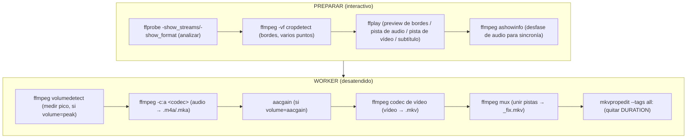

# Comandos de las herramientas por fase

Comandos de **ffmpeg / ffprobe / ffplay / aacgain** que se lanzan en cada fase. Todos se ejecutan con las herramientas de la versión en uso (`$ctx.FFmpeg`, `$ctx.FFprobe`, `$ctx.FFplay`, `$ctx.AacGain`), que apuntan a `tools\<app>\<version>\<plataforma>\`. Los placeholders (`<...>`) provienen del contexto/perfil/job.

Qué herramienta se lanza en cada momento:



Leyenda de placeholders comunes:
- `<file>` = ruta del vídeo original (`Original\...`).
- `<N>` = `$ctx.Threads` (`encode.threads`, 0 = auto).
- `<fps>` = `$ctx.Fps` (`encode.video.fps`).
- `<hz>` = bitrate/samplerate de audio (`Profile.AudioHz` o `encode.audio.hz`).
- `<start>`/`<dur>` = `encode.video.border.start` / `encode.video.border.duration` en el scan de bordes; `preview.start` / `preview.seconds` en las previews de ffplay (por defecto `0`/`0` = desde el principio y sin límite). El inicio se ajusta solo si el vídeo es más corto (`Get-CvSafeStart`).

---

## 1. Análisis de streams (ffprobe)

`Get-MediaInfo` — obtiene todo en JSON (sustituye a los `.vbs`/`findstr` antiguos):

```
ffprobe -v quiet -print_format json -show_streams -show_format <file>
```

El JSON resultante alimenta la selección de vídeo/audio/subtítulos y el resumen final.

---

## 2. Detección de bordes negros (`Find-CropDetect`)

Escanea un tramo con `cropdetect` y se queda con el recorte más frecuente (`W:H:X:Y`):

```
ffmpeg -hide_banner -ss <start> -to <start+dur> -i <file> -vf cropdetect -f null -
```

De la salida (`stderr`) se extraen las líneas `crop=W:H:X:Y` y se agrupan; gana la más repetida.

**Muestreo en varios puntos** (`Find-CropDetectSamples`, `encode.video.border.samples`): en vez de un solo tramo, se escanea en `samples` puntos repartidos uniformemente entre `encode.video.border.start` y el final del vídeo. **Cada punto escanea `encode.video.border.duration` segundos completos** (no se reparte: N puntos = N escaneos de `encode.video.border.duration`, así que más puntos = más tiempo total de análisis). Los recortes de cada punto se agrupan por **votos**: si el más votado alcanza `encode.video.border.autoAcceptPct` % (por defecto 60) de los puntos que detectaron borde **y** supera al segundo por al menos `encode.video.border.autoAcceptMinMargin` votos (por defecto 2), se **acepta automáticamente** descartando los atípicos (una escena oscura o unos créditos con otro encuadre no obligan a intervenir) → preview + confirmar. El margen evita auto-aceptar con evidencia débil cuando hay pocas muestras (`2/3` = 67% pero solo +1 → pregunta; `6/9` = 67% con +3 → auto). Si no se cumplen ambas condiciones (voto repartido/empate) se avisa (`[AVISO]`) y se ofrece un menú ordenado por votos para elegir cuál probar. Con `samples=1` (o duración desconocida) se comporta como el escaneo único clásico. Explicación completa con matriz de decisión: [explica-deteccion-bordes.md](explica-deteccion-bordes.md).

---

## 3. Previsualización (ffplay)

Las previews (`-autoexit`: se cierran al acabar o antes con `q`/ESC) usan `preview.start` (inicio; `0` = desde el principio, ajustado con `Get-CvSafeStart`) y `preview.seconds` (duración; `0` = **sin límite**, todo el vídeo, sin `-t`). **Por defecto (`0`/`0`) reproducen todo desde el principio y las cierra el usuario.** En los menús se puede forzar un **inicio puntual** con `P N <seg>`. La preview se ejecuta en la consola principal (no en ventana aparte) y recibe el foco (`CvWin::ToForeground`). En los comandos de abajo, `[-ss <start>]` y `[-t <seg>]` **solo se añaden** si `start` / `seconds` son > 0 (por defecto ninguno).

**Bordes** (`Show-Preview`) — primero el original, luego con el recorte aplicado; con varias pistas de vídeo apunta a la elegida (`-vst`):

```
ffplay -hide_banner -loglevel error [-ss <start>] [-t <seg>] -autoexit [-vst v:<pos>] -window_title "ORIGINAL" <file>
ffplay -hide_banner -loglevel error [-ss <start>] [-t <seg>] -autoexit [-vst v:<pos>] -vf "crop=<W:H:X:Y>" -window_title "RECORTADO <crop>" <file>
```

**Pista de vídeo** (`Show-VideoPreview`, menú de 2+ pistas de vídeo) — selecciona la pista con `-vst v:<pos>` (posición 0-based entre las de vídeo, `Get-VideoStreamPos`):

```
ffplay -hide_banner -loglevel error [-ss <start>] [-t <seg>] -autoexit -vst v:<pos> -window_title "PISTA <idx>" <file>
```

**Pista de audio** (`Show-AudioPreview`, menús de audio) — selecciona la pista con `-ast a:<pos>`; con `A N` (solo audio) añade `-nodisp`:

```
ffplay -hide_banner -loglevel error [-ss <start>] [-t <seg>] -autoexit -ast a:<pos> [-nodisp] -window_title "PISTA <idx>" <file>
```

**Subtítulo** (`Show-SubtitlePreview`, menú de 2+ subtítulos completos) — vídeo con ese subtítulo superpuesto vía `-sst s:<pos>` (útil para distinguir normal vs SDH):

```
ffplay -hide_banner -loglevel error [-ss <start>] [-t <seg>] -autoexit -sst s:<pos> -window_title "SUBTITULO <idx>" <file>
```

---

## 4. Sincronía: desfase inicial del audio (`Get-AudioInitDelay`)

Lee el `pts_time` del primer frame de la pista de audio seleccionada (índice `<i>`):

```
ffmpeg -hide_banner -i <file> -map 0:<i> -af ashowinfo -f alaw -frames:a 1 -y NUL
```

Si `pts_time > 0`, el audio empieza más tarde que el vídeo y se ofrece añadir ese silencio al inicio. Explicación del flujo de sincronía en [explica-audio.md](explica-audio.md#3-sincronía-audiovídeo).

---

## 5. Audio: generar silencio + pista (solo si hay sincronía)

Cuando hay que compensar `<sync>` segundos, se genera un WAV (silencio + audio) en el **layout de salida** (`<layout>` = `stereo`/`5.1`/`7.1` según `audioChannels`) para recodificarlo después. Evita un bug del AAC que desincroniza al concatenar:

```
ffmpeg -hide_banner -y -i <file> -filter_complex \
  "[0:<i>]aformat=channel_layouts=<layout>[a2];aevalsrc=0:d=<sync>:sample_rate=<hz>:channel_layout=<layout>[sil];[sil][a2]concat=n=2:v=0:a=1[out]" \
  -map "[out]" <name>_concat.wav
```

> Nota: se referencia `[0:<i>]` (índice concreto), no `[0:a]` (que sería la primera pista y podría no ser la seleccionada). Si hay **downmix con voz reforzada** (5.1→estéreo, `downmixMode=dialogue`), el `aformat` se sustituye por el filtro `pan=stereo|c0=<center>*c2+<front>*c0+<surround>*c4|c1=…` (sube el central, baja surrounds; ver [explica-audio.md](explica-audio.md)).
>
> **Método por defecto (`encode.audio.syncAdelay: true`):** en vez del WAV de arriba, el retardo se aplica en la **misma pasada** de recodificación con `adelay=<ms>:all=1` encadenado con el volumen (sin temporal `_concat.wav`). `<ms>` = `round(<sync>·1000)` (milisegundos enteros). El WAV `_concat.wav` de arriba es el método **clásico** (`encode.audio.syncAdelay: false`).

---

## 6. Audio: medición de volumen (`Get-MaxVolume`, método `peak`)

Mide el pico (`max_volume`, en dB) independiente del locale:

```
ffmpeg -hide_banner <input> -af volumedetect -f null -
```

Donde `<input>` es `-i <file> -map 0:<i> ...` o `-i <name>_concat.wav -map 0:a` si hubo sincronía.

Esta medición recorre **todo** el audio, así que puede tardar; en el worker se muestra como un paso `- Analizando volumen... (pico -X dB) ✓` (para que no parezca colgado antes de "Aplicando ganancia").

Comparativa de tiempo de los métodos de volumen (`peak`/`loudnorm`/`aacgain`) y selección de la mejor pista de audio: [explica-audio.md](explica-audio.md).

---

## 7. Audio: recodificación con normalización de volumen (`Invoke-AudioRun`)

Base común del comando (la fuente es `<file>` o el WAV sincronizado):

```
ffmpeg -hide_banner -y -threads <N> -i <fuente> <VOLUMEN> -c:a <codec> [-aac_coder twoloop] -ac <canales> -ar <hz> [-b:a <bitrate>] <name>.<m4a|mka>
```

`<codec>` = `audioCodec` del perfil (`aac` por defecto; también `ac3`/`eac3`/`libmp3lame`/`flac`/`libopus`). `-aac_coder twoloop` **solo** con AAC; `-b:a` se omite en FLAC (sin pérdida); Opus fuerza `-ar 48000`. El temporal es `.m4a` para AAC y `.mka` (Matroska) para el resto. `<canales>` = `encode.audio.channels` (2 por defecto; 6 = 5.1, 8 = 7.1; downmix si la fuente tiene más). La parte `<VOLUMEN>` depende de `encode.audio.volume.method` (`$ctx.VolumeMethod`). Formatos soportados, especificaciones y el flujo del builder en [explica-audio.md](explica-audio.md):

### peak (LEGACY)
Mide el pico y lo sube hasta el objetivo `encode.audio.volume.peakTarget` (0 dBFS por defecto; `-1` deja *headroom* contra el clipping inter-sample del AAC) con el filtro `volume`:
```
-filter_complex "[<label>]volume=<gain>dB:precision=fixed[a]" -map "[a]"
```
`<gain> = peakTarget - max_volume` (redondeado). Solo **amplifica**: si el pico ya alcanza o supera el objetivo, no se aplica filtro (no atenúa).

### loudnorm (EBU R128, por defecto)
Normalización de sonoridad con `I`/`TP`/`LRA` de `config.encode.audio.volume.loudnorm`:
```
-filter_complex "[<label>]loudnorm=I=<I>:TP=<TP>:LRA=<LRA>[a]" -map "[a]"
```

### aacgain (ReplayGain, sin pérdida)
Se codifica **sin** ajuste y luego se aplica la ganancia sobre el `.m4a` ya codificado, sin recodificar:
```
aacgain /r /c /q <name>.m4a
```

Solo aplica con `audioCodec: aac` (aacgain procesa AAC/MP3 en MP4). Con otro códec (salida `.mka`) se usa `peak` en su lugar.

`<label>` es `0:a` si venimos del WAV sincronizado, o `0:<i>` en caso normal.

---

## 8. Vídeo: codificación (`Invoke-VideoRun` + `Get-VideoArgs`)

Comando completo (sin audio ni subtítulos; se añaden en el multiplexado):

```
ffmpeg -hide_banner -y -threads <N> -i <file> -an -sn -map_chapters -1 \
  -metadata title= -metadata:s:v title= -metadata:s:v language=und \
  [-vf "<filtros>"] <ARGS_ENCODER> -map 0:<idx_video> -f matroska <name>.mkv
```

`<idx_video>` es el índice absoluto de la **pista de vídeo elegida** en PREPARAR (congelado en `video.index`), no `0:v:0`: con varias pistas de vídeo (o una carátula incrustada antes del vídeo real) `0:v:0` podría mapear la equivocada. En jobs antiguos sin ese campo se usa `0:v:0` como respaldo.

`<filtros>` combina recorte y escalado si aplican: `crop=<W:H:X:Y>,scale=<resize>`.

**Tone-mapping HDR→SDR:** si el origen es HDR (`video.hdr`) y `encode.video.tonemapHdr` ≠ `off`, se añade `-init_hw_device vulkan` y el filtro `libplacebo` al final de la cadena (`…,libplacebo=tonemapping=bt.2390:colorspace=bt709:color_primaries=bt709:color_trc=bt709:range=tv,format=<p010le|yuv420p>`), y la salida se etiqueta como SDR (`-color_primaries bt709 -color_trc bt709 -colorspace bt709 -color_range tv`). Corre en la GPU (Vulkan). Detalle en [explica-tonemap-hdr.md](explica-tonemap-hdr.md).

`<ARGS_ENCODER>` según el encoder del perfil ([ref-perfiles.md](ref-perfiles.md)):

### hevc_nvenc (H.265 GPU)
```
-c:v hevc_nvenc -tier high -pix_fmt <p010le|yuv420p> -preset slow
[-profile:v <profile>] [-level:v <level>]
<-rc constqp -qp <q>  |  -qmin <qmin> -qmax <qmax>>
[-multipass <qres|fullres>] -rc-lookahead:v 32 [-r <fps>] -movflags +faststart
```
`p010le` si el profile es `main10`, si no `yuv420p`. `-multipass` (2-pass NVENC) solo si `multipass` ≠ `off` (perfil o `encode.video.multipass`). `-r <fps>` solo si `encode.video.forceFps` (por defecto sí). **No** se pasa `-refs` (muchas GPUs abortan con "No capable devices found").

### h264_nvenc (H.264 GPU)
```
-c:v h264_nvenc -pix_fmt yuv420p -preset slow
[-profile:v <profile>] [-level:v <level>]
<-rc constqp -qp <q>  |  -qmin <qmin> -qmax <qmax>>
[-multipass <qres|fullres>] -rc-lookahead:v 32 [-r <fps>] -movflags +faststart
```

### libx264 (H.264 CPU)
```
-c:v libx264 -pix_fmt <yuv420p10le|yuv420p> [-crf <crf>] -preset slow [-profile:v <p>] [-level:v <l>] [-tune animation] -refs 4 -r <fps> -movflags +faststart
```

### libx265 (H.265 CPU)
```
-c:v libx265 -pix_fmt <yuv420p10le|yuv420p> [-crf <crf>] -preset slow [-profile:v <p>] [-level:v <l>] [-tune animation] -refs 4 -r <fps> -movflags +faststart
```

Notas:
- **profile/level en todos los H.26x**: `-profile:v`/`-level:v` se emiten cuando el perfil los define, tanto en NVENC (`hevc_nvenc`/`h264_nvenc`) como en CPU (`libx264`/`libx265`). AV1 (`libsvtav1`/`av1_nvenc`) no los usa.
- **10 bits en CPU**: con perfil `main10` (x265) o `high10` (x264) el `pix_fmt` es `yuv420p10le` (si no, `yuv420p` 8 bits). Debe casar con el perfil: emitir un perfil de 10 bits con `pix_fmt` de 8 bits hace que el encoder **descarte el perfil**.
- `-tune animation` solo se añade si en PREPARAR se respondió que el vídeo es animación (solo se pregunta con `libx264`/`libx265`).
- `constqp` se usa cuando `qmin == qmax`; si no, `-qmin`/`-qmax`.
- Qué significan `crf`/`qmin`/`qmax`/`qp`, para qué sirven y cómo elegirlos (escala 0–51): [explica-control-tasa.md](explica-control-tasa.md).

---

## 9. Multiplexado final (`Invoke-Multiplex`)

Une vídeo (temporal recodificado, o el original si es `copy`) + audio (`.m4a`, o el del original si es `copy`) + subtítulos seleccionados, copiando streams (sin recodificar):

```
ffmpeg -hide_banner -y -threads <N> \
  -i <video>            # input 0 (temporal .mkv o el original)
  [-i <name>.m4a]       # input 1 (audio recodificado, si existe)
  [-i <file>]           # input N (subtítulos/adjuntos/capítulos + audio en copy, del original)
  -map_metadata -1 -fflags +bitexact -map_chapters <in> \       # limpieza de metadatos + capítulos del original
  -metadata title= \
  <-map 0:v:0 (encode: intermedio, 1 pista)   |   -map 0:<idx_video> (copy: pista elegida del original)> -metadata:s:v title= -metadata:s:v language=und \
  <-map 1:a:0 -metadata:s:a title= -metadata:s:a language=<lang>   |   -map <N>:a:0? -map_metadata:s:a:0 <N>:s:a:0 (copy: del original, input N)> \
  # subtítulos: primero forzados, luego completos:
  -map <sub_input>:<idx>? -metadata:s:s:<n> language=<lang> -metadata:s:s:<n> title=<"Forzados"|""> -disposition:s:<n> <default+forced|0> \
  # por cada adjunto conservado (si postprocess.attachments.keep):
  -map <orig>:<idx>? -metadata:s:t:<n> filename=<...> -metadata:s:t:<n> mimetype=<...> \
  -c:v copy -c:a copy [-c:s copy] [-c:t copy] -f matroska <name>_fix.mkv
```

**Subtítulos:** del idioma preferido se conservan **todos**, clasificados en **forzado** y **completo** (por flag/título o por tamaño de cues; ver [ref-perfiles.md](ref-perfiles.md)). El **forzado** → título `Forzados` y disposition `default+forced`; el **completo** → título en blanco y **sin** disposition (`0`, ni default ni forced). Orden: forzados antes que completos. Si ninguno es del idioma preferido, se pregunta cuáles conservar. La lógica está en `Select-Subtitles`/`Split-CvSubtitlesByRole`/`ConvertTo-SubSel` en [Subtitle.psm1](../lib/Subtitle.psm1).

**Capítulos:** se conservan del original con `-map_chapters <in>` (en modo copy el input 0 ya es el original; al recodificar, el intermedio se creó con `-map_chapters -1`, así que se toman del input del original).

**Audio en copy:** la pista se mapea del **original** por su índice de input (`<N>:a:0`, el input del original), **no** de `0:a:0` — al recodificar el vídeo, el input 0 es el temporal (creado con `-an`, sin audio). El `?` lo hace opcional: si la **fuente no tiene audio** (vídeo mudo) el mapeo se **omite** y sale un MKV **solo-vídeo** (emitir el mapa/`-map_metadata` a un stream inexistente haría abortar ffmpeg). Al copiar vídeo desde **AVI**, PREPARAR **avisa** de que el stream-copy a MKV puede fallar por timestamps (usar un perfil que recodifique).

### Limpieza de metadatos (evitar "Etiquetas" que no están en el original)

Al recodificar, ffmpeg **hereda** los tags del origen y de los contenedores intermedios, ensuciando el MKV final con etiquetas que el original no tenía:

| Origen del tag | Ejemplo | Problema |
|---|---|---|
| Stats del vídeo original copiadas al recodificar | `BPS`, `NUMBER_OF_FRAMES`, `_STATISTICS_WRITING_APP`… | Describen el **códec viejo** (H.264), no el HEVC de salida → obsoletas. |
| Etiqueta del encoder de vídeo | `ENCODER=Lavc… hevc_nvenc` | No estaba en el original. |
| Contenedor `.m4a` (MP4) del audio | `VENDOR_ID`, `HANDLER_NAME` | Los añade MP4; no aplican al MKV. |
| Etiqueta global del muxer | `ENCODER=Lavf…` (SimpleTag global) | mkvmerge la muestra como "Etiquetas globales". |

Para dejar el MKV limpio, el multiplex:

1. **`-map_metadata -1`** — descarta la fuente global de metadatos. En este ffmpeg **también vacía los tags de cada pista** (una sola opción limpia global + streams), así que no hacen falta `-map_metadata:s:*` por pista.
2. **`-fflags +bitexact`** — evita que el muxer escriba su propia etiqueta `ENCODER` global (queda solo el "writing application" en la cabecera EBML, igual que el original; mkvmerge **no** lo cuenta como Etiqueta).
3. Tras limpiar, se **re-fijan solo** los metadatos deseados: `title` (global y por pista), `language` y `disposition`. En el audio recodificado, `<lang>` es el **idioma de la pista elegida congelado en el job** (`audio.lang`), no un valor fijo: si el archivo no tenía audio del idioma preferido, es el que confirmaste en el fallback (o `und`).
4. **Audio en modo `copy`** (perfil 1): como el paso 1 borró también su idioma/título, se **restauran los metadatos originales** de esa pista con `-map_metadata:s:a:0 0:s:a:0` (el audio recodificado a `.m4a` no lo necesita porque se le fijan `title`/`language` explícitos).
5. **Limpieza final con `mkvpropedit`** (ver abajo): quita el tag `DURATION` que el muxer añade por pista.

### Tag `DURATION` y limpieza con mkvpropedit (`Remove-CvMkvTags`)

Al cerrar el fichero, el muxer de Matroska de ffmpeg escribe **un `SimpleTag` `DURATION` por pista** (la duración exacta de cada una, que no coincide entre vídeo/audio/subtítulo). **No hay flag de ffmpeg** para omitirlo sin perder los Cues y la duración (`-live 1` los quita pero deja el fichero sin índice de búsqueda y con duración `N/A`). mkvmerge, cuando escribe ese `DURATION`, lo acompaña del juego `_STATISTICS_TAGS` y así su GUI lo reconoce como estadística y lo oculta; el `DURATION` suelto de ffmpeg se muestra como "Etiqueta".

Por eso, tras multiplexar, se pasa **mkvpropedit** (de MKVToolNix), que borra las etiquetas **in situ** sin recodificar y **conservando Cues, duración y dispositions**:

```
mkvpropedit <name>_fix.mkv --tags all:
```

Es opcional (`postprocess.stripTags`) y usa el `mkvpropedit` de `tools\mkvtoolnix\<ver>\<plataforma>` (auto-descargado) o el que se indique en `postprocess.mkvpropedit`. Ver [ref-herramientas.md](ref-herramientas.md) y [ref-configuracion.md](ref-configuracion.md).

---

## 10. Lectura de versión instalada (`Get-CvToolInstalledVersion`)

Para confirmar qué versión hay en una carpeta se ejecuta la propia app:

```
ffmpeg.exe -version      # regex: ffmpeg version (\d+\.\d+(?:\.\d+)?)
aacgain.exe /v           # regex: [Vv]ersion (\d+\.\d+(?:\.\d+)?)
mkvpropedit.exe --version # regex: mkvpropedit v(\d+\.\d+)
7zr.exe                  # regex: 7-Zip.*?(\d+\.\d+)
```

---

## Ejecución de ffmpeg: progreso, ventana y log de error

Los pasos largos (recodificar **vídeo**/**audio**) se ejecutan según `behavior.progress`:

- **`progress = true` (por defecto):** ffmpeg corre **inline** (sin ventana, `CreateNoWindow`) con `-nostats -progress pipe:1`; se lee su salida de progreso y se pinta una línea viva `- <acción>...  42%  ETA 03:12  1.8x  1234.5kbits/s  q28` (`Invoke-ToolProgress`): porcentaje, ETA, velocidad, **bitrate** de salida (audio y vídeo) y, en **vídeo**, el **cuantizador `q`** (`-ShowQ`). El `stderr` de ffmpeg se **captura**; si el proceso **falla** (código ≠ 0) se muestran sus últimas líneas y se guarda **completo** en `logs\error_ffmpeg-video|audio_<nombre>_<fecha>_<pid>.log` (`Save-CvToolError`/`Show-CvToolError`).
- **`progress = false`:** ffmpeg va en una **ventana aparte minimizada sin foco** (`Invoke-ToolShow`, `CvProc::RunMinimizedNoActivate`), y en la consola solo se ve el `✓` al terminar. (Las **previews** ffplay sí van en primer plano con foco, ver §3.)

## Modo debug

Con `debug.enabled = true` o el marcador `debug_on`, las codificaciones van a la ventana principal (no inline con progreso ni en ventana aparte), para ver todo el log de ffmpeg, y antes de cada ejecución se **imprime el comando completo**. Además, si `debug.pausePerCommand = true` (por defecto) se pide **ENTER** para continuar antes de cada comando; con `debug.pausePerCommand = false` se ejecuta sin pausar (log corrido).
