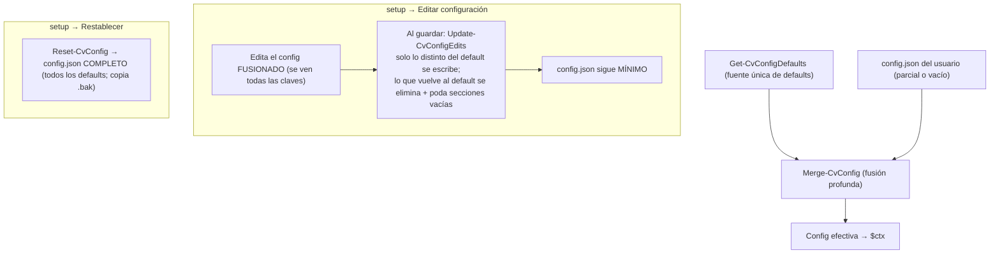

# Referencia de `config.json`

Se carga al arrancar (`Get-CvConfig`) y se **fusiona en profundidad** con los valores por defecto (`Get-CvConfigDefaults`, la fuente única): puedes tener un `config.json` parcial y se completan las claves que falten, sin romper al añadir opciones nuevas.

Por eso el `config.json` distribuido es **mínimo**: solo lleva lo que se **sobrescribe** respecto a los defaults (p. ej. la versión de ffmpeg, el idioma de audio o el tamaño de ventana). Todo lo demás —incluido el catálogo completo de `downloads` (`ffmpeg`, `aacgain`, `sevenzip`, `mkvtoolnix`) y la sección `postprocess`— sale de los defaults. Un `config.json` vacío (`{}`) también es válido.

La forma cómoda de editarlo es `setup.cmd` → **Editar configuración** (ver [ref-herramientas.md](ref-herramientas.md)), que carga el config **fusionado** (así ves y editas TODAS las opciones aunque el fichero sea mínimo) pero al guardar aplica **solo los valores que cambiaste** sobre el `config.json` actual, sin reescribir el resto: un fichero mínimo sigue mínimo (+ lo editado) y uno completo sigue completo. Para (re)generar un `config.json` **completo** con todos los valores por defecto, usa **Restablecer config.json**.

Carga (arranque) y edición (setup):



## Estructura

Esquema completo (tras la fusión con los defaults):

```json
{
  "downloads":   { "ffmpeg": {...}, "aacgain": {...}, "sevenzip": {...}, "mkvtoolnix": {...} },
  "languages":   { "audio": [...], "subtitle": [...] },
  "encode":      { "outputExtension": "mkv", "extensions": ["avi","flv","mp4","mov","mkv"], "threads": 0,
                   "video": { "videoEncoder": "hevc_nvenc", "videoProfile": "main10", "videoLevel": "5.0", "fps": "23.976", "forceFps": true, "multipass": "off", "tonemapHdr": "auto", "tonemapCurve": "bt.2390", "anamorphic": "square", "qualityCheck": "off",
                              "auto": { "gpuOnly": false, "maxCodec": "", "crf": 23, "crfAv1": 30, "qmin": 1, "qmax": 23, "level": "5.0" },
                              "tuning": { "presetNvenc": "slow", "presetX26x": "slow", "presetSvtav1": "6", "presetAv1Nvenc": "p6", "rcLookahead": 32, "refs": 4, "tier": "high" },
                              "border": { "start": 120, "duration": 120, "samples": 6, "autoAcceptPct": 60, "autoAcceptMinMargin": 2, "autoSamples": 3, "autoDuration": 5, "minCropPct": 2 } },
                   "audio": { "hz": 44100, "channels": 2, "encoder": "aac_coder", "codec": "aac", "bitrate": "192k", "downmixMode": "default", "downmixCoeffs": { "center": 0.5, "front": 0.35, "surround": 0.15 }, "syncAdelay": true, "multiAudio": true, "keepTitle": false, "syncThreshold": 2.0, "aacCoder": "twoloop",
                              "volume": { "method": "peak", "peakTarget": 0, "loudnorm": { "I": -16, "TP": -1.5, "LRA": 11 } } },
                   "subtitles": { "toSrt": ["webvtt"] } } },
  "customProfile": { "videoEncoder": "hevc_nvenc", "videoProfile": "main10", "videoLevel": "5.0", "qmin": 1, "qmax": 23, "crf": 21, "multipass": "off", "audioCodec": "aac", "audioBitrate": "192k" },
  "preview":     { "start": 0, "seconds": 0, "syncSeconds": 0 },
  "postprocess": { "stripTags": true, "mkvpropedit": "", "attachments": { "keep": false, "fonts": true, "covers": false, "other": false } },
  "behavior":    { "cleanTemps": true, "separateWindow": true, "lockCloseButton": true, "log": true, "workers": 2, "retries": 2, "progress": true, "promptTimeout": { "default": 0, "sync": 5, "border": 10, "animation": 10, "anamorphic": 10, "audioSync": 15, "video": -1, "audio": -1, "subtitle": -1 }, "promptTimeoutStopOnType": true },
  "debug":       { "enabled": false, "pausePerCommand": true },
  "test":        { "enabled": false, "minutes": 5, "betaDownmix": false, "betaOnePass": false },
  "console":     { "background": "DarkBlue", "foreground": "Yellow", "font": "Cascadia Code", "fontSize": 18, "windowWidth": 150, "windowHeight": 40, "sepWidth": 64, "progressBarWidth": 20, "asciiMarks": false },
  "paths":       { "original": "", "proceso": "", "convertido": "", "logs": "" },
  "profiles":    [ { "label": "...", "videoEncoder": "...", "crf": 18, ... } ],
  "gpuCache":    { "ffmpeg": "7.1.1", "gpu": "NVIDIA GeForce ...", "encoders": ["h264","hevc"] }
}
```

> **`gpuCache`** es un nodo **auto-gestionado (dato de máquina)**: lo escribe el arranque al sondear qué encoders por GPU soporta este equipo (clavado por versión de ffmpeg + modelo de GPU). **No se muestra en el editor de `setup`** y se conserva al editar; no lo edites a mano (si cambia la ffmpeg o la GPU se re-sondea solo). Detalle en [ref-perfiles.md](ref-perfiles.md) y [ref-flujo.md](ref-flujo.md).

## `downloads` — catálogo de herramientas

Una entrada por app. Ver el sistema completo en [ref-herramientas.md](ref-herramientas.md).

| Clave | Ejemplo | Significado |
|---|---|---|
| `selected` | `"8.1.2"` | Versión por defecto (la que usa PREPARAR y se congela en el job). |
| `type` | `"zip"` / `"7z"` / `"file"` | Paquete zip (se extrae), `.7z` (se extrae con `7zr`) o ejecutable directo. |
| `url` | `".../{version}/..."` | URL de descarga; `{version}` se sustituye. |
| `binPath` | `"ffmpeg-{version}-full_build/bin"` | Carpeta dentro del zip donde están los exe. |
| `files` | `["ffmpeg.exe","ffprobe.exe","ffplay.exe"]` | Ejecutables a copiar. |
| `platform` | `"x86_64"` | Plataforma del binario (`x86`/`x64`/`x86_64`, se normaliza). |
| `versionExe` / `versionArgs` / `versionRegex` | `"ffmpeg.exe"` / `["-version"]` / `"ffmpeg version (\\d+...)"` | Cómo leer la versión instalada. |
| `versions` | `{ "7.1.1": "<sha256>" }` | Versiones disponibles y su SHA256. |
| `dependsOn` | `["sevenzip"]` | (Opcional) Otras apps del catálogo que se aseguran **antes** de instalar esta. P. ej. `mkvtoolnix` necesita `sevenzip` (7zr) para extraer su `.7z`. |

## `languages`

| Clave | Ejemplo | Uso |
|---|---|---|
| `audio` | `["es"]` | Idiomas preferidos de audio. |
| `subtitle` | `["spa","es","castellano",...]` | Idiomas preferidos de subtítulos. |

Se **canonicalizan** las variantes (`Get-CvLangCanon`): `es`, `es-ES`, `es_es`, `spa`, `esp`, `castellano`, `spanish` cuentan como el mismo idioma, así que **basta un código** en la lista para reconocer cualquier variante (p. ej. `["es"]` ya reconoce una pista etiquetada `spa`). Lo mismo para `en`/`fr`/`de`/`it`/`pt`/`ja`/`zh`/`ko`/`ru`/`ca`/`gl`/`eu`. La comparación la hace `Test-CvLanguage`.

## `encode`

| Clave | Ejemplo | Uso |
|---|---|---|
| `outputExtension` | `"mkv"` | Extensión del contenedor de salida. |
| `extensions` | `["avi","flv","mp4","mov","mkv"]` | Extensiones de **entrada** que se procesan de `Original\` (sin punto; se tolera `.ext`/`*.ext`). Añade aquí `ts`, `webm`, `m4v`… si las necesitas. |
| `threads` | `0` | `-threads` de ffmpeg. **`0` = auto**: el encoder decide y, en la práctica, usa **todos los núcleos** de CPU. Pon un número `N` para limitarlo a N hilos. |

Las claves de vídeo van bajo **`encode.video`** y las de audio bajo **`encode.audio`** (`outputExtension`/`extensions`/`threads` quedan en la raíz de `encode`).

**`encode.video`**

| Clave | Ejemplo | Uso |
|---|---|---|
| `video.videoEncoder` | `"hevc_nvenc"` | **Codec de vídeo por defecto** (semilla del builder custom): `libx264` / `h264_nvenc` / `libx265` / `hevc_nvenc` / `libsvtav1` / `av1_nvenc` / `copy` / `auto`. Fuente única; **la hereda `customProfile.videoEncoder`**. **Ojo:** los perfiles de serie y los de `profiles[]` declaran **su propio** encoder, así que este global **no** los sustituye — solo siembra el constructor CUSTOM (opción `0`). |
| `video.videoProfile` | `"main10"` | Perfil de codec por defecto (`main`/`main10`…); la hereda `customProfile.videoProfile`. Se ignora si no aplica al codec. |
| `video.videoLevel` | `"5.0"` | Level por defecto (`4.0`/`4.1`/`5.0`…); la hereda `customProfile.videoLevel`. Mismo formato `"5.0"` que `video.auto.level` (ffmpeg trata `"5"`=`"5.0"`). |
| `video.fps` | `"23.976"` | Fps de salida cuando `forceFps` está activo (`-r`). |
| `video.forceFps` | `true` | Si `true` (por defecto), fuerza la salida a `fps` con `-r` (reajusta dup/drop los vídeos de otro fps de origen). Si `false`, **se conserva el fps de cada archivo** (no se pasa `-r`) — recomendable si tus fuentes ya vienen a distintos fps y no quieres reajustarlas. |
| `video.multipass` | `"off"` | **2-pass de NVENC** (`-multipass`), solo `hevc_nvenc`/`h264_nvenc`: `"off"` (por defecto) · `"qres"` (1ª pasada a ¼ de resolución) · `"fullres"` (a resolución completa). Más calidad a costa de más tiempo de GPU. **No** afecta a los encoders de CPU (libx264/libx265 lo ignoran). Es el valor **global**; un perfil (custom o de `config.json`) puede **sobreescribirlo** con su propio `multipass`. |
| `video.tonemapHdr` | `"auto"` | **Tone-mapping HDR→SDR.** `"auto"` (por defecto) = si el origen es HDR (BT.2020 con PQ/HLG) lo convierte a **SDR BT.709** con `libplacebo` (GPU/Vulkan) para que no se vea lavado en SDR; `"off"` = nunca (deja el color como está). El material SDR no se toca. Detalle en [explica-tonemap-hdr.md](explica-tonemap-hdr.md). |
| `video.tonemapCurve` | `"bt.2390"` | **Curva de tone-mapping** de `libplacebo` (parámetro `tonemapping=`): `bt.2390` (por defecto, recomendada) · `bt.2446a` · `spline` · `reinhard` · `mobius` · `hable` · `gamma` · `linear` · `clip`… Solo aplica cuando `tonemapHdr` actúa. |
| `video.anamorphic` | `"square"` | Tratamiento del vídeo **anamórfico** (píxeles no cuadrados, SAR ≠ 1; p. ej. un `1920x1072` con SAR `115:87` que **se ve** a ~`2538x1072`). Al detectarlo al **recodificar**, PREPARAR **pregunta** qué hacer preseleccionando este valor (ENTER/timeout lo aceptan); en modo `copy` solo **avisa**. `"square"` (por defecto) = cuadra a píxeles cuadrados fijando el **ancho** (`1920` → `1920x810`, SAR `1:1`, sin ampliar). `"squareheight"` = cuadra fijando el **alto**. `"keep"` = conserva el SAR/DAR. En `square`/`squareheight` se elimina el SAR conservando la proporción; `maxWidth`/`changeSize` siguen aplicándose. Timeout: `behavior.promptTimeout.anamorphic`. Completa: [explica-anamorfico.md](explica-anamorfico.md). |
| `video.qualityCheck` | `"off"` | **Control de calidad** de la salida frente al origen tras codificar: `"off"` (por defecto), `"ssim"` o `"vmaf"`. Es una **pasada extra** de ffmpeg que decodifica **los dos vídeos enteros** → **lento** en pelís largas (ssim ~5-9× realtime; vmaf ~0,06× = puede tardar **horas**), por eso viene **desactivado**. El resultado se registra (`[QC]`). No se mide en `copy`. `vmaf` requiere `libvmaf`. Métricas: [explica-calidad.md](explica-calidad.md). |
| `video.auto` | objeto | Ajustes del **perfil Auto** (opción `A` del menú y `videoEncoder: "auto"` en un perfil): filtros de encoder + control de tasa. Claves abajo. Ver [ref-perfiles.md](ref-perfiles.md). |
| `video.auto.gpuOnly` | `false` | Filtro del **perfil Auto**. Si `true`, Auto solo considera encoders por **GPU** (NVENC); si no hay GPU compatible, cae a CPU con aviso. `false` (por defecto) = permite CPU. |
| `video.auto.maxCodec` | `""` | Filtro del **perfil Auto**: **tope de códec** hasta el que sube Auto. `""` (por defecto) = sin tope; `"h264"` / `"h265"` / `"av1"`. Ej: con `"h265"`, aunque la GPU soporte AV1, Auto no pasa de H.265. Auto escala **av1 > h265 > h264**, GPU antes que CPU. |
| `video.auto.crf` | `21` | **Perfil Auto**: CRF que usa con `libx264`/`libx265` (0-51, menor = mejor). Fuente única del control de tasa del Auto (no hardcodeado); también **la hereda `customProfile.crf`**. |
| `video.auto.crfAv1` | `30` | **Perfil Auto**: CRF que usa con `libsvtav1`/AV1 (**escala 0-63**, distinta a H.26x; `30` ≈ calidad de `23` en x265). |
| `video.auto.qmin` | `1` | **Perfil Auto**: `Qmin` de los encoders **NVENC** (control por QP). |
| `video.auto.qmax` | `23` | **Perfil Auto**: `Qmax` de los encoders **NVENC** (control por QP). |
| `video.auto.level` | `"5.0"` | **Perfil Auto**: `-level:v` de H.264/H.265 (CPU **y** NVENC: `libx264`/`libx265`/`h264_nvenc`/`hevc_nvenc`; AV1 no usa level). ffmpeg trata `"5"`=`"5.0"`. |
| `video.tuning` | objeto | **Tuning del encoder de vídeo** (fuente única; lo usa `Get-VideoArgs`): preset por familia, `rc-lookahead` (NVENC), `refs` (x264/x265) y `tier` (hevc). Claves abajo. |
| `video.tuning.presetNvenc` | `"slow"` | Preset de `hevc_nvenc`/`h264_nvenc` (p. ej. `slow`, o `p1`-`p7`). |
| `video.tuning.presetX26x` | `"slow"` | Preset de `libx264`/`libx265` (`ultrafast`…`placebo`). |
| `video.tuning.presetSvtav1` | `"6"` | Preset de `libsvtav1` (`0`-`13`; menor = más lento/mejor). |
| `video.tuning.presetAv1Nvenc` | `"p6"` | Preset de `av1_nvenc` (`p1`-`p7`). |
| `video.tuning.rcLookahead` | `32` | `-rc-lookahead:v` de los encoders **NVENC** (frames). |
| `video.tuning.refs` | `4` | `-refs` (frames de referencia) de `libx264`/`libx265`. |
| `video.tuning.tier` | `"high"` | `-tier` de `hevc_nvenc` (`main` \| `high`). |

**`encode.audio`**

| Clave | Ejemplo | Uso |
|---|---|---|
| `audio.hz` | `44100` | Samplerate de audio por defecto (Hz); `libopus` fuerza 48000. |
| `audio.channels` | `2` | Canales del audio **recodificado** (`-ac`), tratado como **máximo**: `2` = estéreo, `6` = 5.1, `8` = 7.1. Si la fuente tiene **más**, se hace **downmix**; si tiene **menos**, **no** se hace upmix (se conservan los del origen). (No afecta a `audioEncoder: copy`.) Detalle en [explica-audio.md](explica-audio.md). |
| `audio.encoder` | `"aac_coder"` | **Salida de audio por defecto** cuando un perfil no la fija: `"aac_coder"` (recodificar) o `"copy"` (copiar sin recodificar). Fuente única; la usan `New-CvProfile`, `ConvertTo-CvProfile` (perfiles de `config.json`) y `customProfile`. |
| `audio.codec` | `"aac"` | **Codec de recodificación por defecto**: `aac`/`ac3`/`eac3`/`libmp3lame`/`flac`/`libopus`. Misma fuente única que arriba. |
| `audio.bitrate` | `"192k"` | **Bitrate de audio por defecto** (`"copy"` = copiar la pista sin recodificar). Misma fuente única. |
| `audio.downmixMode` | `"default"` | **Solo al bajar 5.1 → estéreo.** `"default"` = downmix estándar de ffmpeg. `"dialogue"` 🧪 **(BETA)** = downmix con **voz reforzada** (`pan` que sube el central —diálogos— y baja los surrounds); coeficientes provisionales, el worker lo marca con `[beta]`. Detalle en [explica-audio.md](explica-audio.md). |
| `audio.downmixCoeffs` | `{ center: 0.5, front: 0.35, surround: 0.15 }` | Pesos del downmix `dialogue`: `center` = central (diálogos), `front` = frontales L/R, `surround` = surrounds (el LFE se descarta). **Clip-safe si suman ≤ 1,0**. Solo se usan con `downmixMode = "dialogue"`. |
| `audio.syncAdelay` | `true` | Método del **silencio de sincronía** audio/vídeo. `true` (por defecto) = filtro `adelay` en **una sola pasada** (sin WAV intermedio). `false` = método **clásico** (WAV `silencio + pista`). `adelay` cuantiza a **ms enteros** (ver [ref-gotchas.md](ref-gotchas.md)). **También decide si se compensa el desfase inicial** (Caso 1): con `true` ffmpeg **ya conserva** el `start_time` del audio, así que **no** se compensa (hacerlo lo duplicaría y desincronizaría la salida); solo el WAV clásico pierde los timestamps y necesita el silencio. Detalle en [explica-audio.md](explica-audio.md). |
| `audio.multiAudio` | `true` | Con **2+ pistas del idioma preferido**, permite **conservar varias** y elegir la **predeterminada**. `false` = **monopista** (elige una). Con 0-1 pistas del idioma preferido no cambia nada. Detalle en [explica-audio.md](explica-audio.md). |
| `audio.keepTitle` | `false` | Si `true`, la(s) pista(s) de audio de salida **conservan el título** del origen (útil para distinguir varias del mismo idioma). `false` (por defecto) = **título en blanco**. |
| `audio.syncThreshold` | `2.0` | **Detección de audio adelantado**: si el audio **acaba** N s (este umbral) **antes** que el vídeo con inicios alineados, PREPARAR **avisa**, hace un **preview forzoso** y **pide confirmación** del retardo (por defecto el detectado; teclear otro / `0` = ninguno; ver [explica-audio.md](explica-audio.md) · Caso 2). `0` = desactiva. El retardo se aplica con `adelay`. **Ojo:** un audio con **cola legítimamente más corta** puede dar un falso positivo → por eso pregunta y previsualiza antes de aplicar. |
| `audio.aacCoder` | `"twoloop"` | Coder del encoder **AAC nativo** (`-aac_coder`): `twoloop` (por defecto, mayor calidad) u otros que soporte ffmpeg. Solo aplica al codec `aac`. |

**`encode.subtitles`**

| Clave | Default | Qué hace |
|---|---|---|
| `subtitles.toSrt` | `["webvtt"]` | **Lista de tipos de subtítulo (por codec) a convertir a SRT.** Un subtítulo **legible** cuyo codec esté en la lista se transcodifica a SubRip (`-c:s srt`) en el mismo comando. El **WEBVTT embebido** que ffmpeg **no puede leer** (el demuxer de Matroska lo marca `none`) se **rescata con `mkvextract`** a un temporal y se convierte a srt en la misma ejecución. Los subtítulos ilegibles **no** cubiertos por la lista (o en contenedor no-MKV) se **ignoran** con `[AVISO]` (copiarlos tumbaría la conversión). Lista **vacía** = no convertir nada. Añade p. ej. `"ass"`, `"mov_text"`. Necesita `mkvextract` (se descarga con mkvtoolnix). Detalle en [ref-gotchas.md](ref-gotchas.md). |

Sobre `threads` (uso de CPU):

- Por defecto (`0` = auto) **no hay límite**: ffmpeg reparte el trabajo entre todos los núcleos disponibles. Aplica a la codificación de vídeo, la de audio y el multiplexado.
- Con **NVENC** (`hevc_nvenc`/`h264_nvenc`) el peso está en la **GPU**; `threads` apenas influye (la CPU solo alimenta al encoder). Dejarlo en `0` es lo normal.
- Con encoders de **CPU** (`libx264`/`libx265`), `0` aprovecha toda la CPU. **Ojo si usas varios workers** (`behavior.workers` > 1): se lanzan varias codificaciones en paralelo y todas intentan usar todos los núcleos a la vez (se pisan, *oversubscription*, sin ganar velocidad). En ese caso, o baja `behavior.workers`, o limita `threads` (p. ej. ≈ núcleos ÷ workers). Con NVENC el límite real es el nº de sesiones simultáneas de la GPU, no la CPU.

## `customProfile`

Valores **por defecto** (semilla) del constructor de perfil **custom** interactivo (opción `0` del menú *USAR PERFIL*). En cada menú, **ENTER acepta el valor por defecto** (o eliges otro). Cada opción se ignora si no aplica al codec elegido (p. ej. `videoProfile: main10` no existe para H.264, así que ahí el default cae a "ninguno"). **Acepta los mismos campos que un perfil del array [`profiles`](#profiles--perfiles-de-codificación-propios)** (paridad): cada campo es el pre-relleno de su pregunta en el builder.

| Clave | Ejemplo | Uso |
|---|---|---|
| `videoEncoder` | `"hevc_nvenc"` | Encoder **preseleccionado** en el menú del builder: `libx264` / `h264_nvenc` / `libx265` / `hevc_nvenc` / `libsvtav1` (AV1 CPU, validado) / `av1_nvenc` (AV1 GPU, RTX 40+, **`[SIN PROBAR]`**) / `copy` / **`auto`**. **Derivado de `encode.video.videoEncoder`** (fuente única). Con **`"auto"`** el builder ofrece esa opción y, al elegirla, **se salta** las preguntas de perfil/level/tasa (las fija `Resolve-CvProfileAuto` al preparar según el mejor encoder del equipo); las de bordes/resize/audio se siguen preguntando. |
| `videoProfile` | `"main10"` | Perfil de codec por defecto (`main`/`main10` en H.265; `baseline`/`main`/`high`/`high10` en H.264). **Derivado de `encode.video.videoProfile`.** |
| `videoLevel` | `"5.0"` | Level por defecto (`4.0`, `4.1`, `5.0`, … según codec). **Derivado de `encode.video.videoLevel`.** |
| `qmin` / `qmax` | `1` / `23` | Control de tasa por defecto en NVENC (GPU). **Derivados de `encode.video.auto.qmin`/`qmax`** (fuente única). Acotados a 0–51; **`-1` (o negativo) = auto** (sin `-qmin`/`-qmax`, decide el encoder). |
| `crf` | `21` | Control de tasa por defecto en CPU (libx264/libx265). **Derivado de `encode.video.auto.crf`** (fuente única). Acotado a 0–51; **`-1` = auto** (sin `-crf`, usa el CRF por defecto del encoder). |
| `detectBorder` | `false` | Default de la pregunta de detección de bordes: `false` (No) · `true` (sí, interactivo) · `"auto"` (pre-escaneo decide). |
| `changeSize` | `""` | Default del reescalado "escalar siempre" (`""` = no; `"1920:-2"` = escala siempre, altura `-2` automática **par**). |
| `maxWidth` | `0` | Default del reescalado "ancho máximo" (`0` = no; `1920` = reduce a ese ancho **solo si es mayor**, no amplía). Alternativa a `changeSize` en el builder. |
| `multipass` | `"off"` | Default del **2-pass NVENC** (`off`/`qres`/`fullres`); solo aparece si el encoder es NVENC. |
| `audioEncoder` | `"aac_coder"` | Default de la salida de audio (`"aac_coder"`/`"copy"`). **Heredado de `encode.audio.encoder`** (fuente única). |
| `audioCodec` | `"aac"` | Codec de salida al recodificar (`aac`/`ac3`/`eac3`/`libmp3lame`/`flac`/`libopus`). **Heredado de `encode.audio.codec`**. Ver [explica-audio.md](explica-audio.md). |
| `audioBitrate` | `"192k"` | Bitrate de audio (`"copy"` = copiar sin recodificar). **Heredado de `encode.audio.bitrate`**. |
| `audioHz` | `44100` | Frecuencia de audio por defecto (Hz); `libopus` fuerza 48000 al codificar. |
| `audioChannels` | `2` | Canales de salida por defecto (MÁXIMO, no upmix): `2` = estéreo, `6` = 5.1, `8` = 7.1. |
| `downmixMode` | `"default"` | Default del downmix 5.1→estéreo: `default` · `dialogue` (voz reforzada 🧪 BETA). Solo se pregunta si la salida es estéreo. |
| `downmixCoeffs` | `{ center: 0.5, front: 0.35, surround: 0.15 }` | Pesos por defecto del downmix `dialogue`; al elegir `dialogue` el builder ofrece personalizarlos. |

Qué son CRF/QMIN/QMAX/QP, para qué sirven y cómo elegir valores: [explica-control-tasa.md](explica-control-tasa.md).

## `encode.video.border`

Detección de bordes negros con `cropdetect` en varios puntos del vídeo (ruta completa: **`encode.video.border`**, junto al resto de ajustes de vídeo). Cómo se reparten los puntos, se votan los recortes y se decide auto-aceptar o preguntar (con matriz de decisión) en [explica-deteccion-bordes.md](explica-deteccion-bordes.md).

| Clave | Ejemplo | Uso |
|---|---|---|
| `start` | `120` | Segundo donde empieza el muestreo de `cropdetect` (primer punto). Si el vídeo es más corto, se ajusta solo a ~10% de su duración. |
| `duration` | `120` | Segundos que escanea **cada** punto (no es un total: con `samples=6` son 6 escaneos de `duration` s cada uno). |
| `samples` | `6` | Nº de puntos repartidos del vídeo donde se escanean bordes (`1` = solo al inicio, clásico). Cuantos más puntos, más fiable la detección (p. ej. si los créditos iniciales o una escena oscura tienen distinto encuadre); cada punto mantiene su ventana de `duration` s, así que subir `samples` **aumenta el tiempo total** de análisis (N × `duration`). |
| `autoAcceptPct` | `60` | % de votos que debe alcanzar el recorte **más votado** (sobre los puntos que detectaron borde) para **aceptarse automáticamente**, descartando los atípicos (p. ej. una escena oscura con otro encuadre). Si el más votado llega a ese % **y** cumple `autoAcceptMinMargin`, se usa sin preguntar (preview + confirmar); si no, se muestra el menú de recortes por votos para elegir a mano. `100` = exigir unanimidad. Detalle y matriz de decisión: [explica-deteccion-bordes.md](explica-deteccion-bordes.md). |
| `autoAcceptMinMargin` | `2` | Margen mínimo de votos del más votado sobre el segundo para auto-aceptar (**además** del %). Evita auto-aceptar con evidencia débil cuando hay pocas muestras: `2/3` = 67% pero solo `+1` de margen → pregunta; `6/9` = 67% con `+3` → auto. `0` = solo cuenta el %. Detalle y matriz de decisión: [explica-deteccion-bordes.md](explica-deteccion-bordes.md). |
| `autoSamples` / `autoDuration` | `3` / `5` | Pre-escaneo del modo `DetectBorder: 'auto'` (más ligero que el normal): nº de puntos y segundos por punto. Nota: el escáner aplica un mínimo de **5 s/punto**, así que `autoDuration < 5` se trata como 5. |
| `minCropPct` | `2` | Reducción mínima (% de ancho o alto) para que el modo `auto` considere que **hay barras de verdad**; por debajo se toma como ruido de borde y **no** recorta (p. ej. un `3824` sobre `3832` = 0,2% → se ignora). |

## `preview`

Reproducción con ffplay en PREPARAR (previews de **pista de audio**, **pista de vídeo** y **bordes**). Independiente de `encode.video.border` (que es el análisis de `cropdetect`).

| Clave | Def. | Uso |
|---|---|---|
| `start` | `0` | Segundo donde **empieza** la muestra. `0` = **desde el principio**. Si el vídeo es **más corto** que el valor, el inicio se ajusta solo a ~10% de su duración (no se queda fuera). |
| `seconds` | `0` | **Duración** (s) de la muestra. `0` = **sin límite**: reproduce hasta el final (o hasta que cierres con `q`/ESC). `> 0` = una muestra de esos segundos. |
| `syncSeconds` | `0` | **Tope** (s) de **cada preview** de la comparación **A/B** de sincronía de audio (original vs corregido). Como ahora se reproduce la **fuente directa** con ffplay (no se codifica ningún clip), admite **`0` = sin límite** (reproduce hasta el final o hasta cerrar con `q`/ESC), igual que `seconds`. Ponlo `> 0` si prefieres una muestra corta. |

> Por defecto (`0`/`0`) la preview reproduce **todo el vídeo desde el principio** y la cierra el usuario. Sube `seconds` si prefieres una muestra corta. En los menús de selección de pista se puede indicar un **segundo de inicio puntual**: `P N <seg>` (p. ej. `A 2 300` reproduce la pista 2 solo-audio desde el segundo 300).

## `encode.audio.volume`

Normalización de volumen del audio de salida (ruta completa: **`encode.audio.volume`**, junto al resto de ajustes de audio).

| Clave | Valores | Uso |
|---|---|---|
| `method` | `peak` / `loudnorm` / `aacgain` | Método de normalización (ver "Audio" en [ref-comandos.md](ref-comandos.md)). |
| `peakTarget` | `0` | Pico objetivo (dBFS) del método `peak`: `0` = máximo sin recorte; `-1` deja margen (*headroom*) contra el clipping inter-sample del AAC. Solo amplifica (si el pico ya supera el objetivo, no atenúa). Se limita a ≤ 0. |
| `loudnorm.I` | ej. `-16` | Integrated loudness (LUFS) — solo `loudnorm`. |
| `loudnorm.TP` | ej. `-1.5` | True peak (dBTP). |
| `loudnorm.LRA` | ej. `11` | Loudness range (LU). |

## `postprocess`

Limpieza del MKV final tras multiplexar (ver "Tag DURATION y limpieza con mkvpropedit" en [ref-comandos.md](ref-comandos.md)).

| Clave | Def. | Uso |
|---|---|---|
| `stripTags` | `true` | Ejecuta `mkvpropedit <out> --tags all:` para quitar las etiquetas `DURATION` por pista que añade el muxer de ffmpeg (conservando Cues, duración y dispositions). |
| `mkvpropedit` | `""` | Ruta a `mkvpropedit.exe`. **Vacío** = usar la versión descargada en `tools\mkvtoolnix\<ver>\<plataforma>` (se auto-descarga la 1ª vez). Se puede fijar una ruta propia para usar otra instalación. |
| `attachments.keep` | `false` | Interruptor maestro: conservar adjuntos del original (fuentes, carátulas…). Por defecto **no** se conserva ninguno. |
| `attachments.fonts` | `true` | Si `keep`, permite las **fuentes** (`.ttf`/`.otf`, `font/*`) — útiles para subtítulos ASS/SSA. |
| `attachments.covers` | `false` | Si `keep`, permite las **carátulas/imágenes** (`image/*`, `cover*`…). |
| `attachments.other` | `false` | Si `keep`, permite el **resto** de adjuntos. |

## `behavior`

| Clave | Def. | Uso | Marcador equivalente |
|---|---|---|---|
| `cleanTemps` | `true` | Borra temporales al terminar cada archivo. | `keep_temp` (los conserva) |
| `separateWindow` | `true` | Codifica en ventana aparte minimizada **sin robar el foco** (`SW_SHOWMINNOACTIVE`). | `same_window` (todo en la principal) |
| `lockCloseButton` | `true` | Desactiva el botón X durante el proceso. | — |
| `log` | `true` | Guarda un transcript de la ejecución en `logs\` (un fichero por ventana: fecha + PID). | `no_log` (lo desactiva) |
| `workers` | `2` | Nº de workers en paralelo propuesto al terminar PREPARAR (esta ventana + N−1 nuevas). Es el valor por defecto del prompt; se puede cambiar en el momento (**0** = solo preparar y salir, sin codificar). | — |
| `retries` | `2` | Reintentos por archivo si su codificación falla, antes de abandonarlo. (Distinto de `workers`.) | — |
| `progress` | `true` | En los pasos largos (recodificar **vídeo**/**audio**) muestra una **línea viva** con **% , ETA, velocidad, bitrate** y (en vídeo) el **cuantizador `q`** (`- Procesando Video...  42%  ETA 03:12  1.8x  1234.5kbits/s  q28`) ejecutando ffmpeg **inline** (lee su `-progress`). `false` = clásico: ffmpeg en **ventana aparte** y solo `✓` al terminar. En modo debug no aplica. Convive con `separateWindow` (si `progress` está activo, esos pasos van inline; el multiplexado y las previews no cambian). | — |
| `promptTimeout` | *(objeto)* | **Auto-aceptar** el valor por defecto en las preguntas de PREPARAR (las simples —sync/bordes/animación— y los menús de selección de pista de vídeo/audio/subtítulos) si no tocas el teclado durante *N* segundos, para dejar la preparación desatendida. Contador de **inactividad**: cualquier tecla lo reinicia; si empiezas a escribir, no salta. Es un objeto (ver abajo). | — |
| `promptTimeoutStopOnType` | `true` | Qué hace el auto-timeout **cuando ya has tecleado algo**. `true` (por defecto) = al escribir el **auto se desactiva** y solo **ENTER** envía (no se auto-acepta lo tecleado a medias). `false` = comportamiento clásico: al expirar se **envía lo tecleado** (o el default si no hay nada). Si no tecleas, ambos se comportan igual. | — |

### `behavior.promptTimeout` — timeout granular por pregunta

El timeout es configurable **por tipo de pregunta**, con un genérico de reserva:

| Clave | Def. | Uso |
|---|---|---|
| `default` | `0` | Timeout **genérico** en segundos. `0` = desactivado. |
| `sync` | `5` | Pregunta de silencio de sincronía audio/vídeo. `-1` = hereda de `default`; `≥0` = valor propio (`0` = desactivado solo para esta). |
| `border` | `10` | Preguntas de detección de bordes: reintentar/confirmar recorte **y** las de nº de muestras / inicio / duración del escaneo. `-1` = hereda de `default`. |
| `animation` | `10` | Pregunta «¿es un vídeo de animación?». `-1` = hereda de `default`. |
| `anamorphic` | `10` | Pregunta de **vídeo anamórfico** (mantener SAR / cuadrar por ancho / por alto). Al expirar toma el modo configurado en `encode.video.anamorphic`. `-1` = hereda de `default`. |
| `audioSync` | `15` | Timeout del **paso 1** de la pregunta de **audio adelantado** (`encode.audio.syncThreshold`): al expirar **preselecciona el retardo detectado** (que aún pasa por **preview forzoso + confirmación**, esta **sin timeout**). `-1` = hereda de `default`. |
| `video` | `-1` | Menú de selección de **pista de vídeo** (2+ pistas). Al expirar toma la preseleccionada (`*`). `-1` = hereda de `default` (por defecto `0` = off, para no auto-elegir pista sin querer). |
| `audio` | `-1` | Menús de selección de **pista de audio** (varias del idioma preferido, o fallback sin idioma). Al expirar toma la preseleccionada. `-1` = hereda de `default`. |
| `subtitle` | `-1` | Menú de **subtítulos fallback** (ninguno del idioma preferido). Al expirar **no conserva ninguno**. `-1` = hereda de `default`. |

Al expirar, si **no** has tecleado nada se aplica la respuesta por defecto (equivale a pulsar ENTER; se puede fijar otra en código con `-TimeoutDefault`). Si **sí** tecleaste algo, depende de `behavior.promptTimeoutStopOnType` (ver arriba): por defecto (`true`) al teclear el auto se **desactiva** y solo ENTER envía; con `false` (clásico) al expirar se respeta lo tecleado. El prompt avisa del timeout mostrando `[auto Ns]`. Para una pregunta/menú nuevo basta añadir su clave aquí y pasar su nombre a `Read-CvLine`/`Read-CvMenuLine` (vía `Get-CvPromptTimeout`). Solo actúa en consola interactiva real (en modo desatendido/tests con la entrada redirigida no aplica). Ejemplo: `"promptTimeout": { "default": 15, "sync": 5, "animation": 0 }` → 15 s general, 5 s en sync, animación sin timeout, bordes hereda 15 s.

Los marcadores son ficheros vacíos en la raíz del proyecto que fuerzan el comportamiento sin editar el JSON.

> **Editor de `setup.ps1`:** cada opción del editor de configuración (menú **Editar config.json**) muestra, junto a su valor actual, una **descripción de qué hace** (catálogo `Get-CvConfigHelp`), para no tener que consultar esta referencia mientras se edita.

## `debug` — depuración

| Clave | Def. | Uso | Marcador equivalente |
|---|---|---|---|
| `enabled` | `false` | Modo debug: **log detallado** (comandos de ffmpeg, pasos internos, `[INFO]` de audio/subtítulo/vídeo) en vez de la vista compacta; además las codificaciones van a la **ventana principal** (ni inline con progreso ni en ventana aparte), para ver todo el log. | `debug_on` |
| `pausePerCommand` | `true` | En modo debug, antes de **cada ejecución de ffmpeg** imprime el comando y pide **ENTER** para continuar. `false` = ejecuta **sin pausar** (log detallado corrido, sin ir confirmando comando a comando). Solo aplica si `enabled` (o `debug_on`). | — |

## `test` — modo pruebas

Codifica solo un tramo del principio de cada archivo, para validar un perfil/ajuste **rápido** sin procesar el vídeo entero.

| Clave | Def. | Uso | Marcador equivalente |
|---|---|---|---|
| `enabled` | `false` | Activa el modo pruebas: codifica solo los **primeros `minutes` minutos** de cada archivo (el resto se descarta). Se avisa al arrancar y en el resumen (la salida es un **recorte**, no el archivo completo). Funciona con todos los perfiles, incluido `copy` (recorta también el vídeo copiado del original y los subtítulos/capítulos al mismo tramo). | `test_on` |
| `minutes` | `5` | Minutos que se codifican por archivo cuando `enabled` está activo (mínimo 1). | — |
| `betaDownmix` | `false` | **🧪 BETA.** Activador del downmix `dialogue` (voz reforzada). **Doble llave**: `encode.audio.downmixMode = "dialogue"` fija el modo, pero solo refuerza la voz si además `betaDownmix = true`. Con `false`, `dialogue` cae al downmix **estándar** de ffmpeg (el worker lo avisa). Ver [explica-audio.md](explica-audio.md). | — |
| `betaOnePass` | `false` | **🧪 BETA.** Funde audio + vídeo + multiplexado en **una sola ejecución de ffmpeg** (evita los temporales intermedios y dos arranques). `false` (por defecto) = **siempre** por etapas. La **elegibilidad** (códec/sincronía/volumen/HDR) y el flujo están en [ref-flujo.md](ref-flujo.md) (fuente única). | — |

Se aplica con `-t` en la codificación de vídeo, en la de audio (incluidos el wav de sincronía y la medición de pico) y en el multiplex final. `TestLimit` (segundos) en el contexto.

Con el modo activo, antes de procesar cada archivo se imprime un **resumen del origen** (`Write-SourceSummary`) con toda la info de sus pistas: vídeo (resolución/codec/fps), **todas** las de audio (codec/canales/idioma/título), **todas** las de subtítulo (tipo/idioma/forzado/default/nº de cues/título) y nº de capítulos.

En el **resumen de conversión** (al terminar), la duración es la del fichero **generado**; en modo pruebas se indica también la del origen entre paréntesis (`Duracion: 0:05:00 (origen 0:56:19)`), para que quede claro que la salida es un recorte. Las transiciones se muestran **`origen -> destino`** de forma coherente:

- **Tamaño**: siempre origen → destino con el % de ahorro.
- **Vídeo**: `codec origen -> codec destino`; la **resolución** solo aparece a ambos lados cuando cambia por un resize (si no cambia, una sola vez), p. ej. `h264 1920x1080 -> hevc 1920x800`.
- **Audio**: `codec/canales/bitrate` de **origen -> destino**, p. ej. `eac3 6ch 640k -> aac 2ch 192k (config)`; en modo `copy` (sin recodificar) se muestra una sola vez. El origen es la **pista de audio elegida** (índice congelado en el job); el bitrate de origen se lee de ffprobe (`bit_rate` o tag `BPS`) y el de destino, el medido o el configurado del perfil marcado `(config)` cuando ffprobe no lo reporta (habitual con AAC en MKV).

## `console`

| Clave | Ejemplo | Uso |
|---|---|---|
| `background` / `foreground` | `"DarkBlue"` / `"Yellow"` | Colores (nombres de `ConsoleColor`). |
| `font` | `"Cascadia Code"` | Fuente de la consola (`SetCurrentConsoleFontEx`). Por defecto `Cascadia Code`; si el equipo no la tiene, conhost hace fallback a su fuente (puedes poner `Consolas`, que viene en todo Windows). |
| `fontSize` | `18` | Tamaño de fuente. |
| `windowWidth` / `windowHeight` | `150` / `40` | Tamaño de la ventana (con buffer alto para scroll). |
| `sepWidth` | `64` | Ancho (caracteres) de los separadores de sección `===` / `---` de la UI (cabecera, menús, resúmenes). Fuente única del ancho; los helpers `Get-CvSepLine`/`Get-CvDashLine` lo usan (o un ancho explícito por-llamada). |
| `progressBarWidth` | `20` | Ancho (caracteres) de la barra visual de progreso del worker (`████████░░░░░░░░░░░░`, junto al `%` en vídeo/audio). `0` = sin barra (solo el `%`). Fuente única; `Get-CvProgressBar` la usa. Solo aplica con `behavior.progress = true` y duración conocida. |
| `asciiMarks` | `false` | Usa marcas ASCII (`[OK]`/`[ERROR]`) y corchetes `[ ]` en los avisos, en vez de los símbolos `✓`/`✗` y el badge `▐ … ▌`. Útil si la consola/fuente no tiene esos glifos (se verían como cuadros). Es apariencia de consola (por eso está aquí y no en `behavior`). |

## `paths` — carpetas de trabajo

Permite ubicar las carpetas fuera de la carpeta del programa. Cada valor admite **ruta absoluta** (`E:\Media\Original`, `\\servidor\share\in`) o **relativa** al programa; **vacío** = por defecto junto al programa. La carpeta se crea sola si no existe.

| Clave | Vacío (por defecto) | Uso |
|---|---|---|
| `original` | `<programa>\Original` | Vídeos de entrada. |
| `proceso` | `<programa>\Proceso` | Jobs, lock y temporales. |
| `convertido` | `<programa>\Convertido` | Salida. |
| `logs` | `<programa>\logs` | Transcript de las ejecuciones. |

> La carpeta `tools\` (binarios) no es configurable: siempre va junto al programa.

## `profiles` — perfiles de codificación propios

Array **opcional** de perfiles que se **añaden** a los de serie en el menú *USAR PERFIL* (numerados **a continuación** de ellos); no los sustituyen. Cada objeto usa los campos de un perfil en `camelCase`, todos opcionales:

```json
"profiles": [
  { "label": "Anime 1080p", "videoEncoder": "libx265", "crf": 18, "changeSize": "1920:-2" },
  { "videoEncoder": "hevc_nvenc", "videoProfile": "main10", "videoLevel": "5", "qmin": 1, "qmax": 20, "detectBorder": true },
  { "label": "Auto 1080p", "videoEncoder": "auto", "maxWidth": 1920 }
]
```

| Clave | Ejemplo | Uso |
|---|---|---|
| `label` | `"Anime 1080p"` | Texto del menú. Si se omite, se genera un resumen automático. |
| `videoEncoder` | `"libx265"` | `copy` / `hevc_nvenc` / `libx265` / `h264_nvenc` / `libx264` / `libsvtav1` (AV1 CPU, validado) / `av1_nvenc` (AV1 GPU, RTX 40+, **`[SIN PROBAR]`**) / **`auto`**. Con **`"auto"`** el mejor encoder del equipo se resuelve al **preparar** (igual que la opción `A` del menú: sonda de GPU + filtros `encode.video.auto.gpuOnly`/`maxCodec` + control de tasa de `encode.video.auto`), conservando el resto de campos del perfil; el encoder concreto queda congelado en el `.job.json`. En un perfil `auto` **no** hace falta fijar `qmin`/`qmax`/`crf`/`videoProfile`/`videoLevel` (los pone el auto). Ver [ref-perfiles.md](ref-perfiles.md#videoencoder-auto-en-un-perfil-propio). |
| `videoProfile` / `videoLevel` | `"main10"` / `"5"` | `-profile:v` / `-level:v`. |
| `qmin` / `qmax` | `1` / `20` | NVENC. Ausentes = calidad automática. |
| `crf` | `18` | CPU (libx264/libx265). |
| `detectBorder` | `true` | Detección de bordes por archivo. |
| `changeSize` | `"1920:-2"` | `scale=` (altura `-2` = automática **par**). Escala **siempre** (también amplía). Se usa `-2` y **no** `-1` porque `-1` puede dar una altura **impar** (sobre todo combinado con recorte de bordes) y 4:2:0 exige dimensiones pares → la codificación en **CPU** (libx264/libx265) abortaría; `-2` redondea a par. |
| `maxWidth` | `1920` | Reduce a ese ancho **solo si el vídeo es mayor** (manteniendo aspecto; no amplía). Alternativa a `changeSize` (si están los dos, manda `changeSize`). Se compara contra el **ancho mostrado** (`almacenado × SAR`), no el almacenado: en vídeo **anamórfico** (SAR ≠ 1, p. ej. un `1920` que se ve a `2538`) el tope actúa sobre lo que realmente se ve, y el reescalado conserva el aspecto (DAR) del original. Ver [ref-perfiles.md](ref-perfiles.md) y la nota de vídeo anamórfico en [ref-gotchas.md](ref-gotchas.md). |
| `audioEncoder` / `audioCodec` / `audioBitrate` / `audioHz` | `"aac_coder"` / `"aac"` / `"192k"` / `44100` | Audio. `audioCodec` = codec de salida al recodificar (`aac`/`ac3`/`eac3`/`libmp3lame`/`flac`/`libopus`). Ver [explica-audio.md](explica-audio.md). |

Se editan **a mano** en el JSON (el editor navegable de `setup` los muestra pero remite a este documento, para no corromper el array de objetos). Ver [ref-perfiles.md](ref-perfiles.md).

## Fichero de config alternativo (`-Config`)

`Convert.cmd` y `setup.cmd` aceptan `-Config <ruta>` para usar/editar **otro** fichero de configuración en vez de `config.json` (ruta absoluta o relativa al directorio actual). Útil para mantener varios juegos de ajustes/perfiles:

```bat
Convert.cmd -Config perfiles\anime.json
setup.cmd   -Config perfiles\anime.json
```

Las ventanas de worker extra heredan el mismo `-Config`. Si la ruta no existe, se avisa y se usan los valores por defecto.
