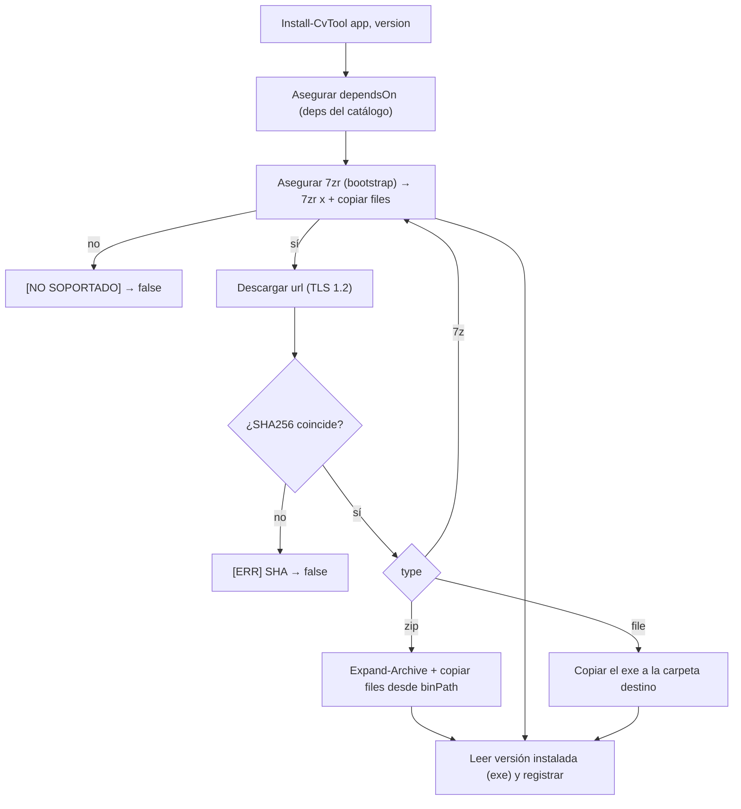

# Herramientas: versiones, plataforma y descargas

El conversor descarga y gestiona sus binarios (ffmpeg, aacgain, mkvtoolnix, 7zr) por sí mismo. Todo se describe en la sección `downloads` de `config.json` y lo maneja `lib\Tools.psm1`.

## Estructura en disco

```
tools/
├── ffmpeg/
│   ├── 8.1.2/x64/{ffmpeg,ffprobe,ffplay}.exe
│   ├── 7.1.1/x64/{ffmpeg,ffprobe,ffplay}.exe
│   └── 5.1.2/x64/{ffmpeg,ffprobe,ffplay}.exe
├── aacgain/
│   └── 2.0.0/x64/aacgain.exe
├── mkvtoolnix/
│   └── 100.0/x64/  mkvpropedit.exe    (limpieza de etiquetas del MKV final)
│                   mkvextract.exe     (rescate de subtítulos que ffmpeg no lee, p. ej. WEBVTT)
└── sevenzip/
    └── 26.02/x64/7zr.exe              (extractor .7z; bootstrap de mkvtoolnix)
```

Patrón: **`tools\<app>\<version>\<plataforma>\`**. Varias versiones conviven; cada job usa la suya.

- La carpeta la resuelve `Get-CvToolDir` (fuente única).
- La plataforma es la del **binario** que declara el descriptor (`Get-CvAppPlatform`), no la del proceso.

## Plataforma

Cada app declara en su descriptor la plataforma del archivo descargable:

```json
"platform": "x86_64"
```

- Se **normaliza** (`ConvertTo-CvPlatform`): cualquier etiqueta con `64` → `x64`; con `86`/`32`/`386` → `x86`.
- El SO se detecta con `[Environment]::Is64BitOperatingSystem`.
- **Soporte** (`Test-CvToolSupported`): un binario `x64` requiere SO de 64 bits; `x86` corre siempre. Si no hay build para la plataforma del equipo, se avisa **`[NO SOPORTADO]`** y no se instala/usa.

> Actualmente solo hay binarios de 64 bits (ffmpeg amd64, aacgain amd64). La estructura ya soporta `x86` para el futuro (haría falta añadir URLs/SHA de 32 bits en el config).

## Instalación (`Install-CvTool`)



Destino: `tools\<app>\<version>\<plataforma>` (calculado, ya no hay `dest` en el config).

**Tipos de descarga** (`type`): `zip` (extrae con `Expand-Archive`), `file` (ejecutable directo, se copia), y `7z` (LZMA: lo extrae `7zr.exe`). MKVToolNix usa `7z` porque solo se distribuye así.

**Dependencias (`dependsOn`)**: un descriptor puede declarar `dependsOn: ["<app>", ...]`; `Install-CvTool` **asegura cada dependencia** (`Confirm-CvTool`, instalándola si falta) antes de descargar/extraer la app. Es genérico —no hardcodeado para el caso 7z—. Ejemplo: `mkvtoolnix` declara `dependsOn: ["sevenzip"]` porque necesita `7zr.exe` para extraer su `.7z`. Si una dependencia no se puede obtener, la instalación aborta con `[ERR]`.

### Validación de compatibilidad GPU (NVENC)

Tras instalar una versión de **ffmpeg** (y también desde la opción *Comprobar compatibilidad GPU* de `setup`) se hace una **validación funcional** de la codificación por GPU NVIDIA (`Test-CvNvenc`): se codifica un clip sintético mínimo con `hevc_nvenc` (y si falla, `h264_nvenc`), y se da un veredicto claro:

```
[GPU] - COMPATIBLE: la codificacion por GPU (NVENC) funciona (hevc_nvenc).
```
o, si falla, con la(s) línea(s) de causa extraídas del propio ffmpeg (ignorando el ruido de terminación):

```
[GPU] - NO COMPATIBLE: ... no funciona con ffmpeg 8.1.2 en este equipo.
[GPU] -   Causa:
[GPU] -     Driver does not support the required nvenc API version. Required: 13.1 Found: 13.0
[GPU] -     The minimum required Nvidia driver for nvenc is 610.00 or newer
[GPU] -   Solucion: perfil CPU (libx264/libx265), otra version de ffmpeg o actualizar el driver NVIDIA.
```

Detecta de antemano el caso típico de una versión de ffmpeg demasiado nueva para el driver (ffmpeg 8.x exige NVENC 13.1; si el equipo solo llega a 13.0, la GPU falla). La instalación se completa igualmente, pero desde `setup` la versión **no se deja como predeterminada** si es incompatible: se vuelve a la anterior (**fallback**, ver [ref-setup.md](ref-setup.md)).

## Versión por job y autoinstalación

- En **PREPARAR**, el job congela `ffmpegVersion` (y `aacgainVersion` si aplica) = la `selected` de config en ese momento.
- En el **WORKER**, antes de codificar se llama a `Confirm-CvTool` con la versión del job: si no está instalada, **la descarga sola**; luego `New-CvToolContext` apunta las herramientas a esa versión.
- Distintos jobs pueden usar distintas versiones sin conflicto.

Ver [ref-jobs.md](ref-jobs.md).

## `setup.ps1` / `setup.cmd`

La utilidad de gestión (menú de herramientas/estado/pruebas/limpieza, editor de configuración, config alterno `-Config` y lanzadores debug) tiene su propia referencia: **[ref-setup.md](ref-setup.md)**. Aquí queda solo el **sistema de herramientas** (instalación, plataforma, versión por job) que `setup` utiliza.

## Añadir una versión nueva

En `config.json`, dentro de `downloads.<app>.versions`, añade `"<version>": "<sha256>"`. Si sigue el patrón de la `url` (con `{version}`), ya se puede instalar desde `setup` o se autoinstala si un job la pide.

> El catálogo completo (incluidas `sevenzip` y `mkvtoolnix`) es la **fuente única** `Get-CvConfigDefaults` (`lib\Config.psm1`) y se fusiona con `config.json` al arrancar. Por eso `config.json` solo necesita listar lo que quieras **sobrescribir** (p. ej. la `selected` de ffmpeg); las apps que no aparezcan en el fichero se toman de los defaults y funcionan igual (auto-descarga incluida). `sevenzip`/`mkvtoolnix` no vienen en `config.json` para no meter ruido, pero el editor de `setup` solo muestra lo que está en el fichero: si quieres editarlas ahí, añádelas.
