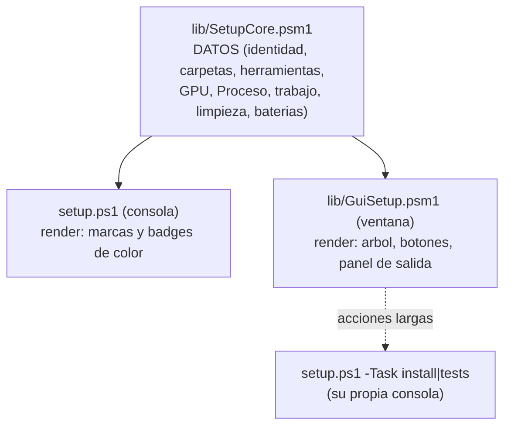

# setup: gestión de herramientas y configuración

`setup.ps1` (lanzado con `setup.cmd`) es la utilidad de gestión del conversor: instalar/actualizar herramientas (ffmpeg, aacgain, MKVToolNix, 7zr), editar `config.json` con un editor navegable, ver el estado del entorno, comprobar la compatibilidad GPU, ejecutar los tests unitarios y limpiar `Proceso\`/`logs\`. No ejecuta el pipeline de conversión (eso es `Convert.ps1`).

```powershell
setup.cmd                       # normal (config.json junto al programa)
setup.cmd -Config otra.json     # usar/editar un config alterno (ver "Config alterno")
powershell -ExecutionPolicy Bypass -File setup.ps1

setup-gui.cmd                   # LO MISMO, en ventana (ver "Setup en ventana")
setup-gui.cmd -Config otra.json # admite los mismos parametros
```

La sesión queda registrada en `logs\setup_<fecha>_<PID>.log` (mismo interruptor `behavior.log` / marcador `no_log`). El arranque (config + contexto + apariencia + cabecera) es común con `Convert.ps1` vía `Start-CvSession`.

## Menú principal

Agrupado por bloques (**Herramientas / Estado / Compatibilidad / Pruebas / Configuración / Limpieza**). La gestión de herramientas vive en un **submenú** para que el menú principal no crezca con el número de apps:

| Bloque · Opción | Qué hace |
|---|---|
| **Herramientas** · Instalar / gestionar herramientas | Submenú con una entrada por app (ffmpeg, aacgain, mkvtoolnix, sevenzip…) y "Reinstalar TODO". Por app: elige versión (selector ordenado de más nueva a más antigua), borra esa carpeta de versión y la (re)instala; ofrece fijarla como `selected`. Al instalar **ffmpeg** valida NVENC y, si no es compatible, **vuelve a la versión anterior** (ver abajo). Instalación: [ref-herramientas.md](ref-herramientas.md). |
| **Estado** · Ver estado | Muestra (bajo demanda): **identidad** (versión de ConvertVideo + config en uso, marcando si es alterno `-Config` o no existe); **checklist de directorios**; **versiones de herramientas** instaladas por app/plataforma (o `[NO SOPORTADO]`); **codecs por GPU (NVENC) soportados por la gráfica del sistema** (`h264`/`h265`/`av1_nvenc`) — **comprobación en vivo** (sonda real, **sin usar la caché** `gpuCache` del config, para reflejar el estado actual, p. ej. tras cambiar de GPU/driver); **estado de `Proceso\`** (jobs pendientes, bloqueos —con cuántos **caducados/huérfanos**— y temporales); y **trabajo** (nº de vídeos en `Original\` y convertidos `*_fix.<ext>` en `Convertido\`). |
| **Compatibilidad** · Comprobar compatibilidad GPU (NVENC) | Prueba NVENC en las versiones de ffmpeg instaladas, **sin reinstalar**. |
| **Pruebas** · Ejecutar tests unitarios | Lanza `test\unit-tests.ps1` (funciones puras: sin GPU ni ffmpeg, < 1 s) como **proceso hijo** y reporta si todo pasó o falló algún caso. Ver [ref-pruebas.md](ref-pruebas.md). |
| **Pruebas** · Ejecutar batería de features | Lanza `test\feature-tests.ps1` (E2E; usa ffmpeg; los casos de GPU se **saltan** si no hay NVENC) como proceso hijo. Tarda más (codifica). Ver [ref-pruebas.md](ref-pruebas.md). |
| **Pruebas** · Ejecutar batería de setup | Lanza `test\gui-tests.ps1`: los **datos** de setup (`SetupCore`) sobre un root temporal y el **editor de configuración en ventana**, dirigido sin ratón para comprobar que editar un número/enum/lista y volver al default guardan lo que deben. Sin entorno gráfico esos casos se **saltan**. |
| **Configuración** · Editar configuración | Editor navegable de todas las secciones del config en uso (ver abajo). |
| **Configuración** · Restablecer | Vuelve a los valores por defecto (conserva el catálogo `downloads`; copia en `<fichero>.bak`). |
| **Limpieza** · Limpiar jobs / bloqueos (Proceso) | Borra `*.job.json`, `*.lock`, temporales o todo (con confirmación); las cuentas se muestran en el menú. Patrones: `Get-CvProcesoPatterns`. |
| **Limpieza** · Limpiar logs | Borra los `*.log` de `logs\` (excepto el de la sesión actual). |
| Salir | — |

> El estado ya no se imprime en cada vuelta al menú; se ve con la opción **Ver estado**. Al saltar de menú a menú se **limpia la pantalla**; tras una acción con información relevante (instalación, borrado, guardado) hay una **pausa** antes de limpiar.

## Setup en ventana (`setup-gui.cmd`)

`setup-gui.ps1` es **la misma utilidad en modo gráfico** (WinForms): mismas acciones, mismo config y mismo log. No es una versión recortada ni un programa aparte — **las dos caras comparten los datos**, así que lo que ves en una es lo que ves en la otra.



- **Regla de diseño**: `SetupCore` devuelve **objetos**, nunca texto con colores ni prompts; cada interfaz decide cómo pintarlos y cómo confirmar. Por eso añadir una acción (o una batería de test) se hace **una vez** y aparece en las dos.
- **Panel de salida**: cada acción vuelca su resultado en un panel monoespaciado a la derecha (el equivalente a lo que la consola imprime).
- **Acciones largas en su propia consola**: instalar una herramienta y lanzar una batería no se ejecutan dentro de la ventana (WinForms es de un solo hilo y se quedaría congelada), sino como `setup.ps1 -Task …` en una consola aparte, donde se ve el progreso real (descarga, SHA256, NVENC, casos de test). Al terminar una instalación, la ventana **refresca** el estado.
- **Sin entorno gráfico** (host no STA, servidor sin escritorio): avisa y remite a `setup.cmd`, que hace exactamente lo mismo.

### Qué configuración se gestiona (en vez de un `setup-gui-Debug.cmd`)

Al abrir **sin `-Config`**, la ventana **pregunta** qué configuración gestionar: lista los `config*.json` que encuentre junto al programa (con `config.json` preseleccionado y `config.debug.json` marcado como *depuración*) más **`Otro...`** para buscar uno en disco. Cancelar = no abrir nada.

Así se cubre lo que en consola hacen los dos lanzadores (`setup.cmd` / `setup-Debug.cmd`) sin duplicar un `.cmd`, y además se puede abrir un config que esté en cualquier carpeta. Con **`-Config <ruta>` explícito no pregunta** (`setup-gui.cmd -Config config.debug.json` va directo), así que sigue siendo automatizable. Los candidatos salen de `Get-CvSetupConfigCandidates` (`lib\SetupCore.psm1`), no de la ventana.

Todos los textos (título, barra inferior, estado, editor) muestran el **nombre real** del fichero, y el estado marca `[alterno]` cuando **no** es el `config.json` de junto al programa.

### Visor de logs

Además de **limpiar** logs (que es lo único que ofrece la consola), la ventana tiene **Ver logs...**: lista los `*.log` de `logs\` con **el más reciente arriba**, su fecha y su tamaño, y muestra el contenido del que elijas. Botones: *Abrir fuera* (con el programa asociado de Windows), *Actualizar* y *Eliminar este log*.

**Se muestran legibles**: la línea viva de progreso se repintaba cientos de veces por archivo y **cada repintado quedaba en el log** (en un log real, 4273 de 5181 líneas — el 82%). Desde v4.6.0 esa línea ya **no entra en el transcript** (`Write-CvProgressLine` escribe con `[Console]::Write`, que no pasa por el host), pero los logs anteriores siguen llenos; al mostrarlos, `Format-CvLogText` **colapsa cada racha de repintados** en el último —el estado al que se llegó— avisando de cuántos recoge (*"[... 57 actualizaciones de progreso ...]"*) y quita la copia duplicada del texto que dejaba el doble volcado del cursor. Un log de 5182 líneas se queda en 937, **sin perder nada**: las líneas que no son progreso siguen siendo las mismas 897 (verificado comparando ambos modos sobre un log real). La casilla **"Ver crudo (sin limpiar)"** muestra el fichero **tal cual** en cualquier momento, por si hay que revisar algo que la limpieza recoge. **El fichero no se toca** nunca; *Abrir fuera* también lo enseña íntegro.

> El recorte de la copia duplicada se aplica **solo a las líneas de progreso**: aplicarlo a cualquier línea destrozaba los separadores (`====…` se quedaba en un solo `=`, porque repiten su comienzo). Hay tests de regresión de eso.

Dos detalles más que no son opcionales y los resuelve `Get-CvSetupLogText` (`lib\SetupCore.psm1`):

- El log de la **sesión en curso** se puede **leer** (se abre con `FileShare::ReadWrite`; un `ReadAllText` normal fallaría porque el transcript lo tiene abierto) y se marca en la lista como *← en curso*, pero **no se puede borrar**.
- Un log muy grande se lee **solo por el final** (últimos 512 KB por defecto), avisando en la primera línea, para no cargar decenas de MB en memoria.

### Editor de configuración en ventana

Mismo contenido y **misma semántica de guardado** que el editor de consola (se edita el config **fusionado** y se escribe **solo lo que difiere del default**, vía `Update-CvConfigEdits`), con otro render:

- **Árbol** de secciones a la izquierda (se oculta `gpuCache`, que es caché de máquina, igual que en consola).
- A la derecha, el control según el tipo: **desplegable** para los enums (mismo catálogo `Get-CvEditorOptions`, con la descripción de cada valor), **true/false** para los bool, **texto** para números y cadenas (validado: un número inválido avisa y no se aplica) y **una línea por elemento** para las listas.
- **Ayuda por clave** (`Get-CvConfigHelp`) y **valor por defecto** de fábrica a la vista, con botón **Volver al valor por defecto** (al guardar, esa clave desaparece del fichero).
- **Interruptor "Mostrar opciones avanzadas"** (desmarcado al abrir): sin marcar, el árbol enseña **solo lo que se toca a diario** y esconde las ramas avanzadas; marcándolo aparece todo. El nivel se declara **en la propia opción**, con el marcador `[av]` al principio de su texto en el catálogo de ayuda (`Get-CvConfigHelp`, que ya es el registro por-opción), así que no hay una lista paralela de rutas que se desincronice al renombrar una sección; `Get-CvHelpFor` quita el marcador (nadie lo ve) y `Get-CvConfigAdvancedPaths` **deriva** la lista. Hoy están marcadas:

  | Ruta oculta | Por qué |
  |---|---|
  | `downloads` | Catálogo de descargas; se gestiona desde el menú **Herramientas**. |
  | `profiles` | Perfiles propios; se editan a mano en el fichero ([ref-perfiles.md](ref-perfiles.md)). |
  | `customProfile` | Valores semilla del constructor de perfil *custom*. |
  | `paths` | Carpetas de trabajo alternativas (vacío = junto al programa). |
  | `debug` | Log detallado y pausa por comando. |
  | `test` | Modo pruebas (recorte a N minutos) y betas. |
  | `encode/video/tuning` | Ajuste fino del encoder: presets, `rc-lookahead`, `refs`, `tier`. |
  | `encode/video/border` | Parámetros del escaneo `cropdetect`: puntos, duración, umbrales. |
  | `encode/audio/downmixCoeffs` | Pesos del downmix *dialogue*. |
  | `encode/audio/volume/loudnorm` | Parámetros EBU R128 (`I`/`TP`/`LRA`). |

  Lo del día a día (idiomas, encoder/perfil de vídeo, códec y volumen de audio, subtítulos, comportamiento, consola, preview) **no se oculta nunca**. Y si alguna opción **editada** se queda fuera, el propio interruptor lo dice —*"(N editada(s) oculta(s))"*— para que nadie eche de menos un ajuste que sí había cambiado.

- **Lo editado se ve de un vistazo**: las claves cuyo valor **no** es el de fábrica salen en **azul y negrita**, y las secciones que contienen alguna se abren **ya desplegadas** al entrar (el resto queda recogido). El resaltado se recalcula al vuelo: al cambiar un valor se marca, y al restaurar su default se desmarca. La regla es la **misma** que decide el guardado (`Test-CvCfgIsDefault`), así que lo resaltado es exactamente lo que acabará escrito en `config.json`.
- Avisa si intentas cerrar con **cambios sin guardar**. Los perfiles propios (`profiles`) se explican pero no se editan aquí, como en consola.

### Modo no interactivo (`-Task`)

`setup.ps1` acepta ejecutar **una sola acción y salir**, sin menú. Lo usa la ventana para las acciones largas, y sirve para automatizar desde un `.cmd` o CI:

```powershell
setup.ps1 -Task install -App ffmpeg -Version 7.1.1 [-SetDefault]   # instala (y fija como 'selected')
setup.ps1 -Task tests   -Suite unit|features|gui                   # lanza una bateria del catalogo
```

Las baterías salen del catálogo único `Get-CvSetupTestSuites` (`lib\SetupCore.psm1`): añadir una ahí la hace aparecer **sola** en el menú de consola, en la ventana y en `-Task`.

## Compatibilidad GPU (NVENC) y fallback de versión

Al **instalar/reinstalar ffmpeg**, tras copiar los binarios se hace una **validación funcional** de NVENC (`Test-CvNvenc`: codifica un clip sintético con `hevc_nvenc`, y si falla `h264_nvenc`) y se da un veredicto (COMPATIBLE / NO COMPATIBLE con la causa extraída de ffmpeg). Detalle del mecanismo en [ref-herramientas.md](ref-herramientas.md).

Si la versión recién instalada **NO es compatible** con NVENC en este equipo (típico: ffmpeg 8.x exige un driver NVIDIA más nuevo del instalado), `setup` **prueba las versiones anteriores del catálogo** (`downloads.ffmpeg.versions`) hasta dar con una compatible:

1. Toma las versiones **anteriores** a la fallida (las más nuevas no ayudarían: el fallo es "driver demasiado antiguo para este ffmpeg"), ordenadas de **más nueva a más antigua** (`Get-CvNvencFallbackCandidates`).
2. Por cada candidata: la **instala** (descarga fresca + verifica SHA, sin borrar la anterior por si la descarga falla) y **comprueba NVENC**. Se queda con la **primera compatible** y la fija como `selected`.
3. Si **ninguna** es compatible, **avisa** (usa un perfil CPU `libx264`/`libx265` o actualiza el driver NVIDIA) y no cambia la selección.

Así no depende de qué versiones estén ya instaladas: descarga y prueba las del catálogo. `Install-CvTool` expone el resultado NVENC con `-NvencOk`.

El bucle lo hace `setup.ps1` (en `Ensure-Tool`), iterando los candidatos de `Get-CvNvencFallbackCandidates` (`lib\Tools.psm1`) e instalando cada uno con `Install-CvTool -NvencOk`. La comprobación *Comprobar compatibilidad GPU* del menú **no** reinstala ni cambia la selección: solo informa.

## Editor de configuración

Recorre el árbol del config en uso (se muestra su **nombre real** en el título: `config.json`, `config.debug.json`…):

- **Escalares**: las claves con un **conjunto fijo de valores** (enums) se editan **eligiendo de un menú** en vez de teclear —bool, colores (`background`/`foreground`), método de volumen, códec/canales/encoder de audio, encoder/perfil/level/tonemap/anamórfico/qualityCheck/tier/multipass de vídeo, detección de bordes…—; el catálogo de opciones sale de `Get-CvEditorOptions` (que reutiliza las fuentes únicas de Config/Profile). Las claves abiertas (curva de tonemap, perfil/level) ofrecen además "custom" para teclear otro valor; las de valor libre (fps, bitrate, dimensiones, rutas, números…) siguen pidiendo el valor. Cada opción muestra su **ayuda** (catálogo `Get-CvConfigHelp`) y marca el **valor por defecto** de fábrica.
- **Listas** (idiomas): añadir / eliminar / editar elementos.
- **Objetos**: se navegan hacia dentro.

Se edita el config **fusionado** (defaults + overrides), así que el editor muestra **todas** las opciones aunque el fichero sea mínimo. Al guardar, solo se escribe lo que **difiere del default** (lo que vuelve al default se elimina del fichero); el serializador propio **conserva valores, tipos, arrays y formato** (4 espacios, CRLF) y normaliza a array los campos que deben serlo (PS 5.1 desenvuelve los arrays de 1 elemento al leer JSON). Referencia de claves: [ref-configuracion.md](ref-configuracion.md).

## Config alterno (`-Config`) y modo debug

`-Config <ruta>` (en `Convert.ps1` y `setup.ps1`, reenviado por `Convert.cmd`/`setup.cmd` con `%*`) usa un **fichero de configuración alterno** en vez del `config.json` por defecto. La ruta se resuelve a **absoluta** (`Resolve-CvConfigPathArg`): vacío = `<Root>\config.json`; relativa = respecto al directorio actual; absoluta = tal cual. Todos los textos de `setup` (editor, prompts, menú, estado) muestran el **nombre real** del fichero, no un literal `config.json`.

Cuando `Convert.ps1` abre **ventanas worker en paralelo**, **reenvía el mismo `-Config`** (ruta absoluta) a cada una, así que todas usan el mismo config.

Lanzadores de depuración incluidos:

| Fichero | Uso |
|---|---|
| `config.debug.json` | Override mínimo `{ "debug": { "enabled": true } }` (se fusiona con los defaults). |
| `Convert-Debug.cmd` | Igual que `Convert.cmd` pero con `-Config config.debug.json`: abre el conversor con el **log detallado** (comandos de ffmpeg y pasos internos) sin tocar tu `config.json`. |
| `setup-Debug.cmd` | Igual que `setup.cmd` pero con `-Config config.debug.json`: para **editar/gestionar** ese config de depuración. |

## Añadir una versión nueva de una herramienta

En el config, dentro de `downloads.<app>.versions`, añade `"<version>": "<sha256>"`. Si sigue el patrón de la `url` (con `{version}`), ya se puede instalar desde `setup` o se autoinstala si un job la pide. El catálogo completo es la fuente única `Get-CvConfigDefaults`; ver [ref-herramientas.md](ref-herramientas.md).
