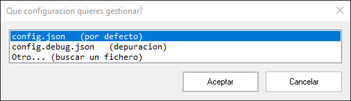
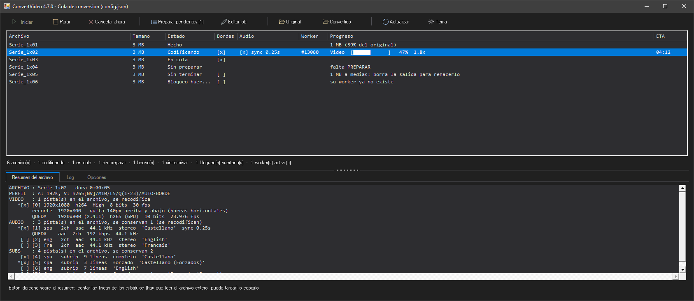
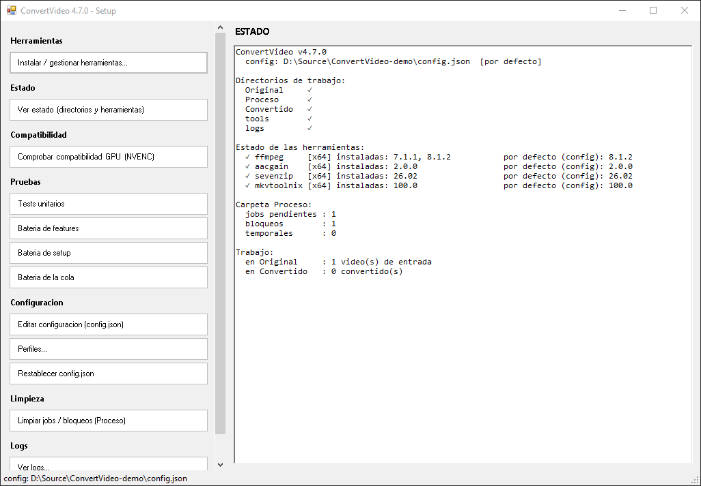
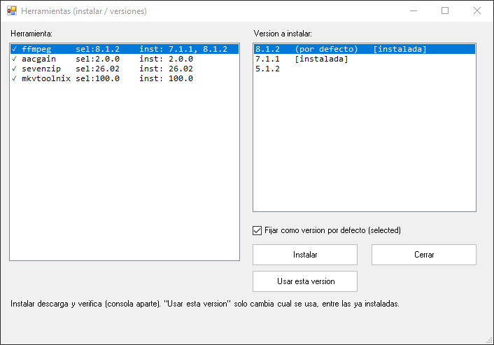
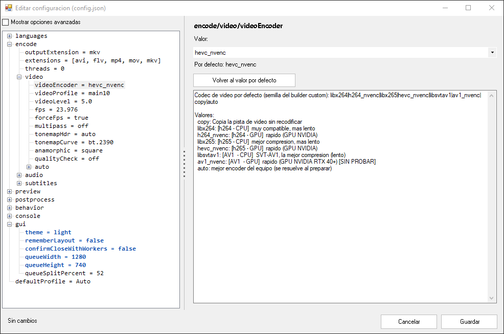

# 1. Primeros pasos

[⬅ Índice del manual](README.md) · [Siguiente: preparar ➡](02-preparar.md)

## Qué hace falta

- **Windows de 64 bits** con el PowerShell que ya trae (5.1). No hay que instalar nada más.
- **FFmpeg** y compañía se descargan solos la primera vez (verificados con SHA256), o los instalas tú desde setup.
- Para los perfiles de GPU, una tarjeta **NVIDIA** compatible. Sin ella, los perfiles de CPU funcionan igual (más lentos).

## Las carpetas

| Carpeta | Para qué |
|---|---|
| **`Original\`** | Aquí dejas los vídeos a convertir (`.avi`, `.flv`, `.mp4`, `.mov`, `.mkv`; la lista es configurable). |
| **`Proceso\`** | El trabajo en curso: un `.job.json` por archivo preparado, los bloqueos y los temporales. No se toca a mano. |
| **`Convertido\`** | El resultado: `<nombre>_fix.mkv`. |
| **`logs\`** | Un log por sesión. |

## Qué lanzador abrir

| Lanzador | Cuándo |
|---|---|
| **`Convert-gui.cmd`** | **El de siempre**: la cola de conversión en ventana, con el `config.json` de al lado. |
| `Convert-gui-Config.cmd` | Lo mismo, pero **preguntando** con qué configuración trabajar (útil si tienes varios `config*.json`). |
| `setup-gui.cmd` | Herramientas, configuración, estado, logs y limpieza, en ventana. |
| `Convert.cmd` | El conversor **en consola** (pregunta archivo por archivo y luego codifica). Sigue estando: la ventana no lo sustituye. |
| `setup.cmd` | Setup en consola. |
| `FixSyncSub.cmd` | Utilidad aparte para arreglar y sincronizar subtítulos `.srt` sueltos ([ref-fixsyncsub.md](../docs/ref-fixsyncsub.md)). |
| `*-Debug.cmd` | Los mismos, pero sobre `config.debug.json` (log detallado) sin tocar tu configuración normal. |

Todos admiten `-Config <ruta>` para trabajar con otro fichero de configuración.

Cuando un lanzador **no** lleva `-Config`, se pregunta al abrir:

La regla es esa: **con `-Config` va directo, sin `-Config` pregunta**.

## Claro u oscuro

Las ventanas siguen a Windows: si tienes el sistema en **modo oscuro** (Configuración → Personalización → Colores → *Modo de aplicación*), el programa sale oscuro sin tocar nada.

Si lo prefieres al revés que el sistema, hay dos formas: el botón **`Tema`** de la barra de la cola —cambia al momento y lo deja guardado— o la configuración (`gui` → `theme`), donde puedes fijar **`light`** o **`dark`** en vez de `system`.

Dos detalles de Windows que no dependen del programa: en modo claro la **barra de título** es la que ponga el sistema, y las **barras de desplazamiento** de los cuadros de texto siguen siendo las suyas. Los diálogos de abrir ficheros también son los de Windows.

## Setup en ventana

`setup-gui.cmd` es la misma utilidad de gestión que `setup.cmd`, con botones. A la izquierda las acciones, agrupadas; a la derecha el **panel de salida**, donde cada acción escribe su resultado.

| Grupo | Para qué |
|---|---|
| **Herramientas** | Instalar o cambiar de versión de FFmpeg, aacgain, MKVToolNix y 7zr. |
| **Estado** | Lo de la captura: versión, qué config se está usando, carpetas, herramientas instaladas, qué hay en `Proceso\` y cuántos vídeos hay a la entrada y a la salida. |
| **Compatibilidad** | Prueba NVENC en las versiones de FFmpeg que tengas instaladas, sin reinstalar nada: dice qué códecs por GPU traga tu tarjeta de verdad. |
| **Pruebas** | Las baterías de test del proyecto. Cada una se abre en su propia consola. |
| **Configuración** | El editor de `config.json` (abajo), tus **perfiles propios** ([página 2](02-preparar.md#tus-propios-perfiles)) y *Restablecer* (deja una copia `.bak`). |
| **Limpieza** | Borrar jobs, bloqueos y temporales de `Proceso\`. |
| **Logs** | Ver los logs o borrarlos. |

Las acciones que tardan —instalar una herramienta, una batería de test— **no se ejecutan dentro de la ventana**: se abren en una consola aparte donde se ve el progreso real (descarga, verificación, casos de test). Es a propósito: una ventana WinForms es de un solo hilo y se quedaría congelada mientras tanto.

### Instalar o cambiar de versión

A la izquierda, cada herramienta con la versión **en uso** (`sel:`) y las que tienes **instaladas** (`inst:`). Al marcar una, a la derecha salen las versiones descargables.

- **`Instalar`** descarga, verifica el SHA256 y la deja instalada. Con FFmpeg, además comprueba NVENC y, si la nueva versión no le va a tu GPU, **vuelve a la anterior**.
- **`Usar esta versión`** solo cambia **cuál se usa** entre las que ya tienes: no descarga nada. Es lo que quieres para volver atrás sin bajar otra vez lo mismo.

Cada job se queda con la versión de FFmpeg con la que se preparó, así que un lote empezado sigue usando la suya aunque instales otra ([ref-herramientas.md](../docs/ref-herramientas.md)).

### Editar la configuración

Un árbol con todas las secciones y, a la derecha, la clave elegida: su valor (con el control que le toque — desplegable para las opciones cerradas, texto para números, una línea por elemento en las listas), **qué significa** y **cuál es el valor de fábrica**.

- **`Volver al valor por defecto`** deshace esa clave.
- **`Mostrar opciones avanzadas`** enseña también las secciones que no se tocan a diario (como el catálogo de descargas).
- Al **guardar** se escribe **solo lo que difiere del valor por defecto**: tu `config.json` no se llena de claves que no has cambiado, y lo que devuelves al default desaparece del fichero.

La referencia completa de cada clave está en [ref-configuracion.md](../docs/ref-configuracion.md).

---

Con las herramientas instaladas, lo siguiente es decidir qué se le hace a cada vídeo: [2. Preparar ➡](02-preparar.md)
