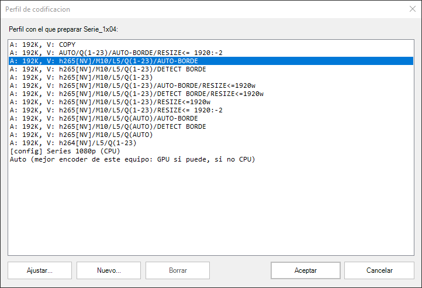
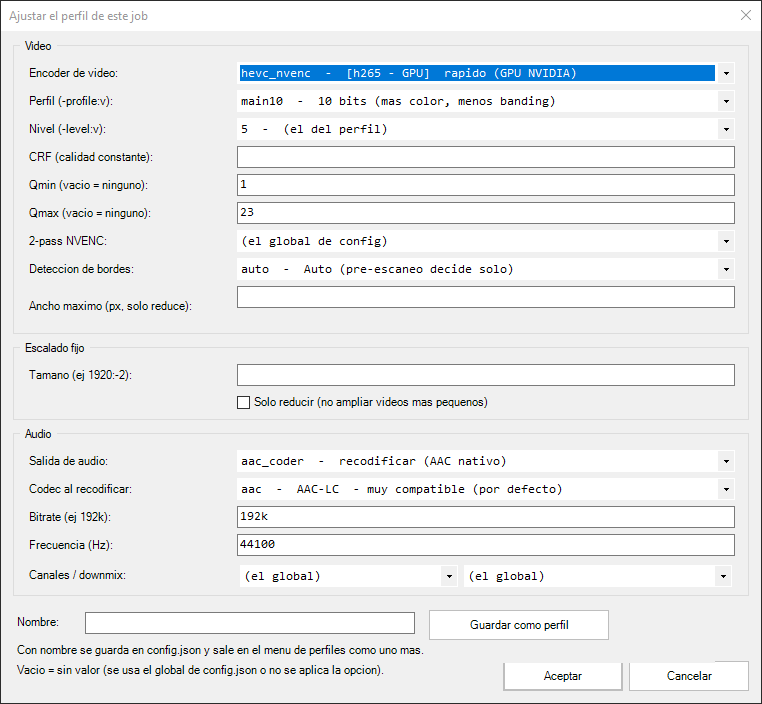
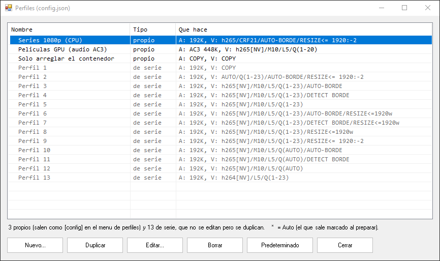
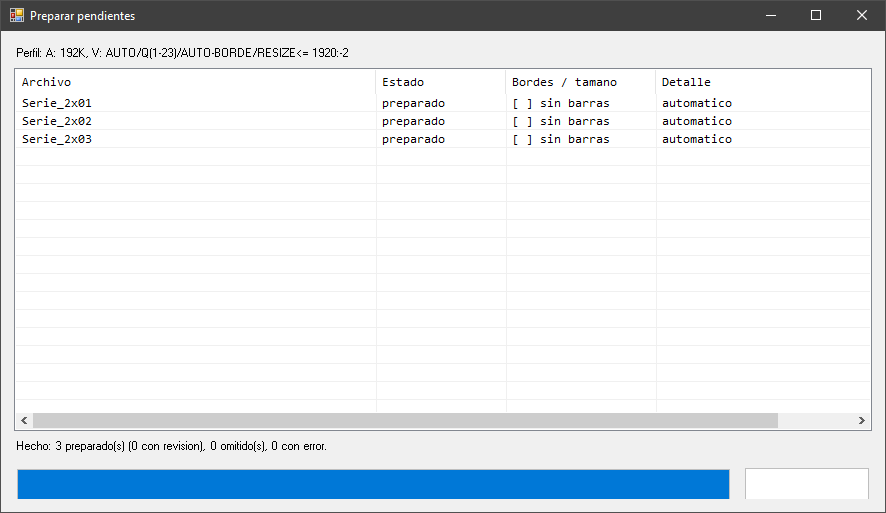
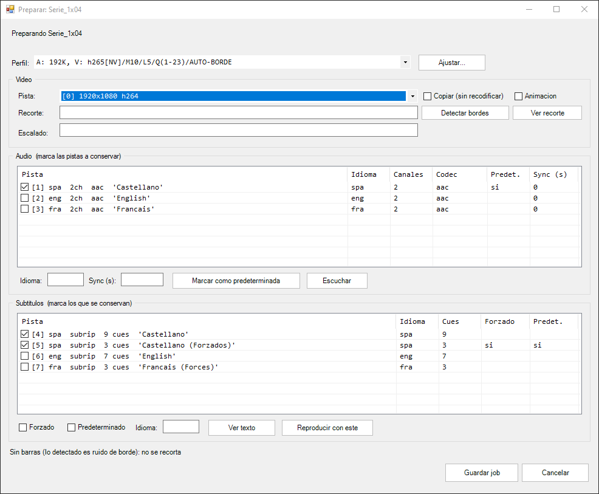

# 2. Preparar: decidir qué se le hace a cada vídeo

[⬅ Primeros pasos](01-primeros-pasos.md) · [Índice](README.md) · [Siguiente: convertir ➡](03-convertir.md)

El programa trabaja en dos tiempos, y esto es el primero:

1. **PREPARAR** — se decide (o se detecta) todo lo de cada archivo: qué pista de vídeo, si hay bandas negras que recortar, a qué tamaño, qué audio y en qué idioma, si hay desfase que corregir, qué subtítulos se conservan. Eso se **congela** en `Proceso\<nombre>.job.json`.
2. **CODIFICAR** — los workers cogen archivos preparados y los convierten sin preguntar nada ([página 3](03-convertir.md)).

Separarlo así tiene una ventaja práctica: contestas todo de una sentada y luego dejas la máquina codificando horas sin tener que estar delante.

## El perfil

Lo primero que se pregunta, **una sola vez para todo el lote**, es con qué perfil preparar. El perfil es el "cómo se codifica": encoder, calidad, si se buscan bandas negras, si se reescala y qué se hace con el audio.

Las etiquetas se leen así:

| Trozo | Significa |
|---|---|
| `A: 192K` | El audio se recodifica a 192 kbps. |
| `V: h265[NV]` | Vídeo H.265 por **GPU** NVIDIA (`[NV]`). Sin `[NV]`, es CPU. |
| `M10` | 10 bits (más color, menos *banding*). |
| `L5` | Level del códec. |
| `Q(1-23)` | Control de calidad (aquí, Qmín/Qmáx de NVENC). |
| `AUTO-BORDE` | **Busca bandas negras** y recorta solo si lo tiene claro. `DETECT BORDE` = las busca siempre y te lo enseña para que lo confirmes. |
| `RESIZE<=1920w` | Reduce a ese ancho como mucho (nunca amplía). |
| `COPY` | No recodifica el vídeo: lo copia tal cual (rapidísimo; solo arregla el contenedor, el audio y las pistas). |
| `Auto` | Elige el mejor encoder **de este equipo**: GPU si puede, si no CPU. Se resuelve al preparar y se guarda ya concretado en el job. |

Con **`Ajustar...`** se parte de un perfil y se cambia solo lo que quieras: subir el bitrate del audio, pasar de GPU a CPU, capar el ancho…

Los campos vacíos significan "lo que diga la configuración global".

Y aquí está lo importante: el ajuste tiene **dos finales**.

| Botón | Qué pasa |
|---|---|
| **Aceptar** | Se usa en **este** lote y nada más. Lo ajustado se congela en el job. |
| **Guardar como perfil** | Le pones un **nombre** y además queda guardado: a partir de ahí sale en la lista de perfiles como uno más, marcado con `[config]`, en la ventana **y** en la consola. |

## Tus propios perfiles

Los perfiles guardados son tuyos y se mantienen desde tres sitios, todos equivalentes:

- **En el diálogo de arriba**: `Nuevo...` crea uno partiendo de cero, `Ajustar...` guarda el que estés tocando y `Borrar` quita el marcado (solo los `[config]`; los de serie no se tocan).
- **En setup** (`setup-gui.cmd` → *Configuración → Perfiles...*): la lista completa, con *Nuevo*, *Duplicar*, *Editar* y *Borrar*. Debajo de los tuyos salen los **de serie** en gris: no se pueden editar ni borrar, pero sí **duplicar** — es lo más cómodo para hacerte uno, porque partes de algo que ya funciona y solo cambias lo que quieras.

Con el botón **Predeterminado** marcas cuál de todos sale ya elegido cada vez que preparas (con un `*` delante); el mismo botón lo quita y vuelve a salir *Auto*. Si siempre usas el mismo perfil, esto te ahorra elegirlo cada vez.

- **En consola**: `setup.cmd` → *Configuración → Perfiles*, y también al terminar un perfil *Custom* en el menú de perfiles, que pregunta si lo quieres guardar (por defecto **no**).

Tres detalles que conviene saber:

- **El nombre es la identidad**: guardar con un nombre que ya existe **sustituye** ese perfil (así se edita). Si el nombre ya lo usa otro, se avisa y no se guarda nada.
- **Lo que dejes vacío no se guarda**, y eso es a propósito: significa "usa el valor global". Así, si mañana cambias el bitrate de audio general, tus perfiles lo siguen en vez de quedarse anclados a lo de aquel día.
- Un perfil guardado **aparece al momento** en la lista; no hay que reiniciar nada.

## Preparar pendientes (lo normal)

En la cola, el botón **`Preparar pendientes (N)`** recorre todos los archivos que aún no tienen job: pregunta el perfil una vez y luego va archivo por archivo **decidiendo lo que puede decidir solo**.

| Columna | Qué dice |
|---|---|
| **Estado** | `preparado` (job escrito), `revisar...` mientras te pregunta, `omitido` si cancelaste su ventana, `error` si el archivo no se puede leer. |
| **Bordes / tamaño** | `[x] 1920x800` = se han detectado barras y se recortan (el tamaño es el que queda). `[ ] sin barras` = se buscaron y no había. Un tamaño a secas = no hay recorte, pero el escalado cambia el tamaño. Vacío = ni se buscó ni cambia nada (por ejemplo con el vídeo en `copy`). |
| **Detalle** | `automatico` cuando se resolvió solo, `revisado a mano` cuando lo confirmaste tú, y el motivo cuando se paró a preguntar. Aquí también aparece lo que se detectó y se aplicó solo, como un retardo de audio. |

Abajo, el resumen: *"Hecho: 3 preparado(s) (0 con revisión), 0 omitido(s), 0 con error"*.

**Solo se para a preguntar en los mismos casos en que se pararía la consola**: varias pistas de vídeo, vídeo anamórfico, ninguna o varias pistas de audio en tu idioma, subtítulos pero ninguno en tu idioma, o un recorte que no está claro. En esos casos abre el editor **ya relleno** y con el motivo escrito arriba; tú confirmas o cambias, y sigue con el siguiente.

## El editor de un archivo

Lo abre `Editar job`, el doble clic en una fila, o el propio recorrido de arriba cuando necesita una decisión.

| Zona | Qué se decide |
|---|---|
| **Perfil** | El de arriba. Cambiarlo aquí recalcula lo que dependa de él (incluida la regla de bordes) sin volver a leer el vídeo entero. |
| **Vídeo** | Qué pista, si se copia sin recodificar, el **recorte** (`ancho:alto:x:y`) y el **escalado**. `Detectar bordes` fuerza un escaneo completo y `Ver recorte` te lo enseña con el reproductor para que veas si te has pasado. |
| **Audio** | Una fila por pista. **Marcas** las que se conservan, dices cuál es la **predeterminada**, corriges el **idioma** si viene mal etiquetado y ajustas el **retardo** (`Sync`) si la voz va adelantada o atrasada. `Escuchar` la reproduce. |
| **Subtítulos** | Una fila por pista, con idioma, códec, cuántas líneas tiene y si es **forzado**. Marcas los que se conservan. `Ver texto` enseña el contenido (o, si es de imagen tipo PGS, lo extrae y lo abre con tu programa asociado) y `Reproducir con este` abre el vídeo con ese subtítulo encima, que es la forma rápida de distinguir unos normales de unos forzados o unos SDH. |

Abajo del todo, en gris, la ventana va contando lo que ha hecho: en la captura, *"Sin barras (lo detectado es ruido de borde): no se recorta"*. Es el resultado de la detección de bandas negras que ha corrido al abrir, porque el perfil elegido las busca.

**`Guardar job`** escribe el `.job.json` y el archivo pasa a estar *en cola*. **`Cancelar`** no guarda nada.

> Las pistas de subtítulos **vacías** (0 líneas) se enseñan pero no vienen marcadas: mapear una deja la barra de progreso clavada en 0% (es un fallo conocido de ffmpeg con pistas sin cues).

## Detalles que ahorran tiempo

- Un archivo cuyo nombre empieza por **`_`** fuerza la detección de bordes aunque el perfil no la pida.
- Un archivo que empieza por **`TEST_`** se vuelve a preparar desde cero cada vez que arranca `Convert.cmd` en consola: su job viejo se tira. Va bien para iterar sobre la misma muestra cambiando opciones.
- Lo que decidas manda siempre sobre lo que proponía la detección automática.
- ¿Por qué a veces detecta bandas negras y a veces dice que no hay? Está explicado, con diagramas, en [explica-deteccion-bordes.md](../docs/explica-deteccion-bordes.md).

---

Con los jobs escritos, toca convertir: [3. La cola en marcha ➡](03-convertir.md)
