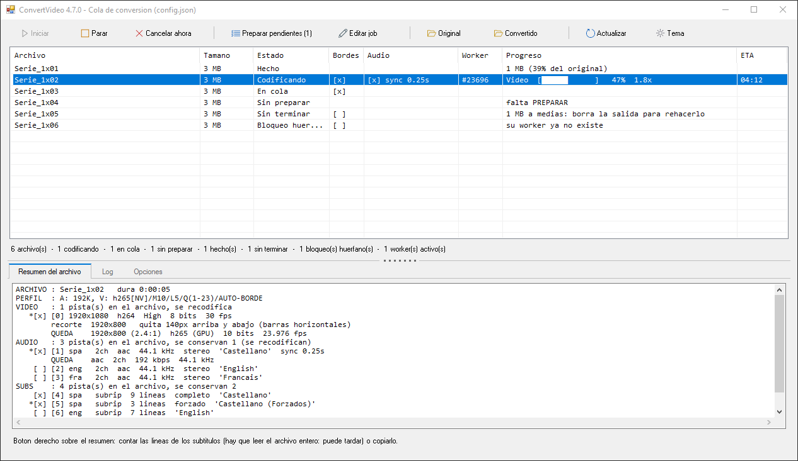
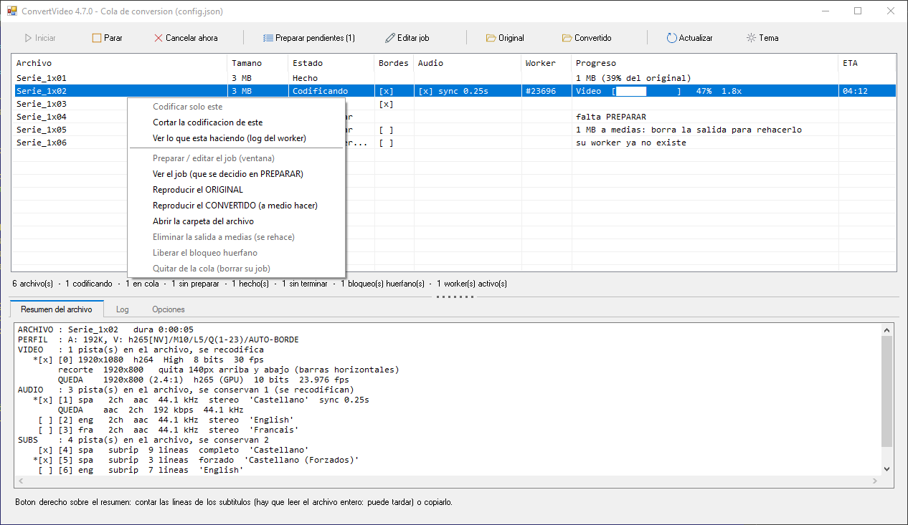
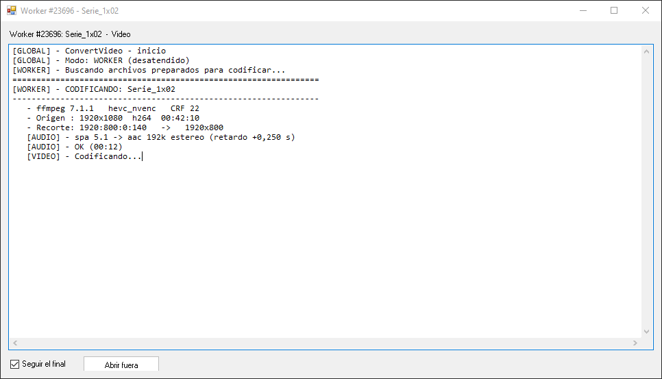
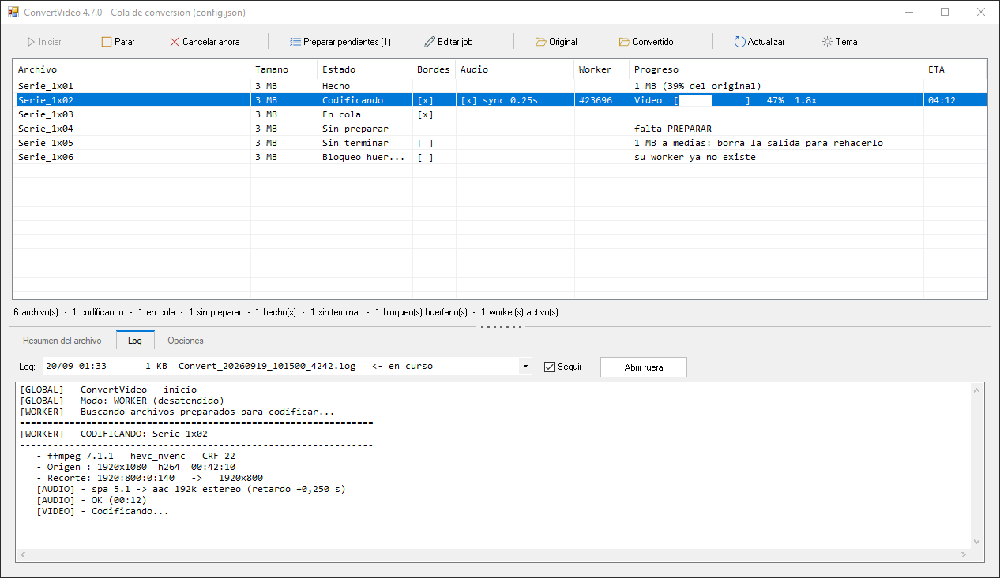
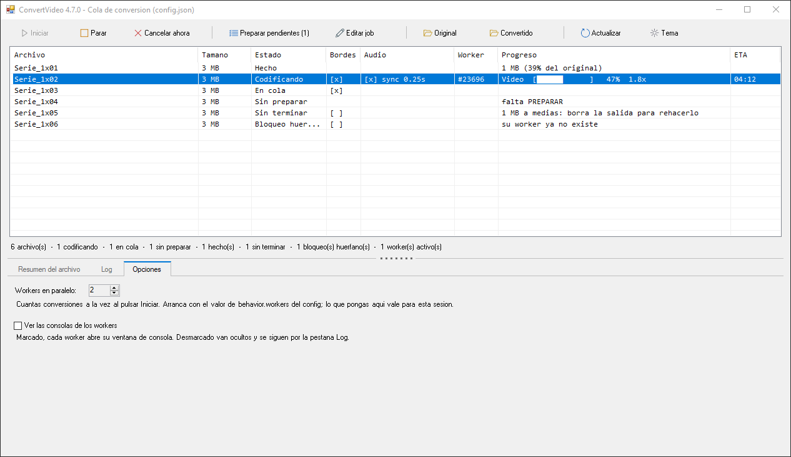

# 3. Convertir: la cola en marcha

[⬅ Preparar](02-preparar.md) · [Índice](README.md) · [Siguiente: cuando algo no sale ➡](04-cuando-algo-falla.md)

`Convert-gui.cmd` abre un panel con **todos los vídeos de `Original\`**, en qué estado está cada uno, quién lo está codificando y por dónde va. Sustituye a tener cuatro consolas negras abiertas mirándolas de una en una.

Al abrir comprueba que están las herramientas necesarias. Si falta FFmpeg te lo dice y se ofrece a abrir setup ahí mismo, en vez de dejarte descubrirlo a mitad de una conversión.

## La tabla

| Columna | Qué enseña |
|---|---|
| **Archivo** | El nombre base, el mismo que identifica su job y su salida. |
| **Tamaño** | Del archivo de entrada. |
| **Estado** | Los seis de la tabla siguiente. |
| **Bordes** | `[x]` si a ese archivo se le recorta; `[ ]` si se buscaron barras y no había; vacío si ni se miró. |
| **Audio** | Lo que conviene **revisar después de codificar**: `[x] sync 0,25s` (se aplica un retardo: escúchalo), `2 pistas` (comprueba que tu reproductor coge la buena), `5.1` (hay mezcla a estéreo por medio). |
| **Worker** | El PID del proceso que lo tiene cogido. |
| **Progreso** | Paso, barra, % y velocidad mientras se codifica; cuando está hecho, el tamaño de la salida y qué porcentaje es del original. Es la columna que se estira al agrandar la ventana. |
| **ETA** | Lo que falta, según el worker. |

Debajo, una línea con los totales: *6 archivo(s) · 1 codificando · 1 en cola · 1 sin preparar · 1 hecho(s) · 1 sin terminar · 1 bloqueo(s) huérfano(s) · 1 worker(s) activo(s)*.

### Los estados

| Estado | Qué significa | Qué hacer |
|---|---|---|
| **Sin preparar** | Está el vídeo, pero no tiene job. | `Preparar pendientes` ([página 2](02-preparar.md)). |
| **En cola** | Tiene job y nadie lo ha cogido. | `Iniciar`. |
| **Codificando** | Lo tiene un worker vivo. | Mirar el progreso. |
| **Hecho** | Existe la salida y ya no queda job. | Nada. |
| **Sin terminar** | Existe la salida **pero el job sigue ahí**: la conversión no llegó a acabar (se canceló, se cerró, se fue la luz). Lo que hay en `Convertido\` está a medias. | Botón derecho → *Eliminar la salida a medias*, y vuelve a la cola. |
| **Bloqueo huérfano** | Quedó un bloqueo de un worker que ya no existe. | Botón derecho → *Liberar el bloqueo huérfano* (o lo roba solo el siguiente worker). |

Esa diferencia entre *Hecho* y *Sin terminar* importa más de lo que parece: el worker **salta** los archivos que ya tienen salida, así que mientras el resto a medias siga ahí, ese vídeo no se rehace nunca.

## La barra de herramientas

Cuatro grupos, separados por una línea:

| Grupo | Botones |
|---|---|
| **Marcha** | **`Iniciar`** abre los workers y empieza. **`Parar`** es la parada **ordenada**: cada worker termina el archivo que tenga y no coge más (no se pierde nada). **`Cancelar ahora`** corta en seco los workers y su ffmpeg: se pierde lo que estuviera en curso, por eso pide confirmación. |
| **Preparación** | **`Preparar pendientes (N)`** y **`Editar job`**. |
| **Carpetas** | **`Original`** y **`Convertido`** las abren en el explorador. |
| **Vista** | **`Actualizar`**: refresca ya (la lista se refresca sola cada segundo mientras hay algo en marcha, y cada tres cuando no). **`Tema`**: cambia entre claro y oscuro al momento, y lo deja guardado para la próxima vez ([página 1](01-primeros-pasos.md#claro-u-oscuro)). |

Los botones se encienden y se apagan según lo que se puede hacer: con workers vivos no se puede volver a arrancar, y sin nada en cola `Iniciar` está apagado (el tooltip dice por qué).

### Codificar solo unos cuantos

Si marcas filas antes de pulsar, `Iniciar` cambia a **`Iniciar (N elegidos)`**. Y si lo marcado es solo una parte de la cola, se pregunta antes de arrancar:

> Tienes 3 archivo(s) marcados de los 12 que hay en cola. ¿Qué codifico?
> **Solo los 3 marcados** · **Toda la cola** · Cancelar

Está así porque es una trampa fácil: marcas una fila solo para leer su resumen y, sin darte cuenta, el botón pasa a codificar únicamente esa.

## El botón derecho

| Opción | Sobre qué actúa |
|---|---|
| *Codificar solo este* | Los marcados que estén **en cola**: abre un worker solo para ellos. |
| *Cortar la codificación de este* | Mata **su** worker (y su ffmpeg), no los demás. |
| *Ver el proceso (log)* | Si se está codificando, su log **en vivo**; si ya terminó, el tramo del log donde se convirtió. |
| *Reproducir el ORIGINAL* / *el CONVERTIDO* | Abre el vídeo para verlo. El convertido aparece en cuanto existe el archivo — también **mientras se codifica** (*a medio hacer*), que es la forma rápida de comprobar que va bien sin esperar al final. |
| *Preparar / editar el job* | Abre el editor ([página 2](02-preparar.md)). No se puede con un archivo que se está codificando: el worker ya trabaja con la copia que leyó. |
| *Ver el job* | El `.job.json` tal cual, para mirar qué se decidió. |
| *Abrir la carpeta del archivo* | En el explorador. |
| *Eliminar la salida a medias* | Borra el resto de una conversión cortada para que se rehaga. |
| *Liberar el bloqueo huérfano* | Quita un bloqueo de un worker que ya no existe. |
| *Quitar de la cola* | Borra su job: el archivo vuelve a *sin preparar*. |

Las opciones que no tienen sentido para la fila marcada salen en gris.

### Ver el resultado

Lo normal después de convertir es querer **verlo**: *Reproducir el CONVERTIDO* lo abre, y *Reproducir el ORIGINAL* abre el de entrada para comparar (se pueden tener los dos abiertos a la vez y saltar de uno a otro).

Lo abre **tu reproductor de siempre** (el que Windows tenga asociado a los `.mkv`), así que tienes tus atajos y tus subtítulos como los tengas configurados. Si no hubiera ninguno asociado, se usa el `ffplay` que ya trae el programa. Y si prefieres uno concreto, en `config.json` → `preview.player` puedes fijar `ffplay` o `external` con la ruta a tu reproductor (`preview.playerExe`).

La cola **no se queda bloqueada** mientras ves el vídeo: el reproductor se abre aparte y la lista sigue refrescándose.

## Ver qué está haciendo un archivo

**Doble clic** en una fila que se esté codificando (o *Ver el proceso*) abre su log en vivo, refrescado cada segundo:

En un archivo **ya terminado** hace lo equivalente: busca en `logs\` el **tramo de ese archivo** y lo enseña tal cual, que es como se averigua qué pasó con una conversión de hace tres horas.

Dos cosas que conviene saber: el log va unos segundos por detrás (PowerShell lo vuelca por bloques) y **no** trae la barra de progreso — esa se escribe aparte justamente para no inundar el log; el % en vivo lo tienes en la fila de la cola.

La ventana es **modal**: mientras la miras no se toca la cola (que sigue refrescándose por dentro). Se probó a hacerla sin modo y no salió bien, está contado en [ref-gotchas.md](../docs/ref-gotchas.md).

## Las pestañas de abajo

La línea con los puntitos que separa la lista de las pestañas **se arrastra**: reparte el alto como te convenga.

- **Resumen del archivo** — lo que se le va a hacer al archivo marcado, sacado de su job: perfil, recorte y tamaño que queda, qué pistas de audio se conservan y cómo quedan, qué subtítulos. Es la forma rápida de comprobar que lo preparado es lo que querías. Con el **botón derecho** sobre el resumen puedes copiarlo o contar las líneas de los subtítulos (eso último hay que leerse el archivo entero, así que solo se hace si lo pides).
- **Log** — el transcript completo de cualquier worker, con *Seguir* para quedarse en el final y *Abrir fuera* para verlo en tu editor.

- **Opciones** — los ajustes de **esta** sesión:

| Ajuste | Qué hace |
|---|---|
| **Workers en paralelo** | Cuántas conversiones a la vez al pulsar `Iniciar`. Arranca con lo que diga `behavior.workers` del config; lo que pongas aquí vale para esta sesión. |
| **Ver las consolas de los workers** | Marcado, cada worker abre su ventana negra. Desmarcado van ocultos y se siguen desde la pestaña *Log*. |

¿Cuántos workers? Cada uno es un proceso aparte con su propio ffmpeg, y todos comparten la misma GPU y el mismo disco, así que subir el número no multiplica la velocidad: a partir de cierto punto solo se estorban. Lo sensato es probar con dos y mirar la velocidad (`1.8x` y compañía) en la columna de progreso antes de subir más.

## Cerrar con conversiones en marcha

Cada worker es un **proceso aparte**: cerrar la ventana **no** lo para, seguiría codificando sin nada a la vista. Por eso, si cierras con workers vivos, se pregunta:

| Opción | Qué pasa |
|---|---|
| **Dejarlos en segundo plano** | Siguen codificando; al volver a abrir la cola aparecen otra vez. |
| **Parada ordenada** | Terminan el archivo que tengan y no cogen más. No se pierde nada. |
| **Cancelar ahora** | Se cortan los workers y su ffmpeg: se pierde el archivo en curso. |
| **No cerrar** | Volver a la cola. |

---

Si algo se queda a medias o no aparece lo que esperabas: [4. Cuando algo no sale ➡](04-cuando-algo-falla.md)
