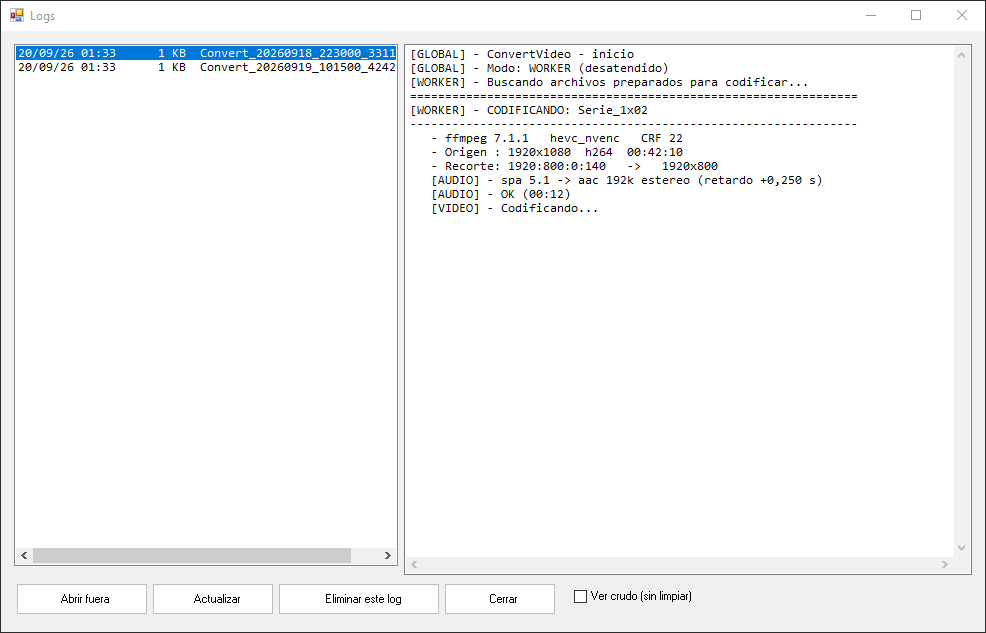
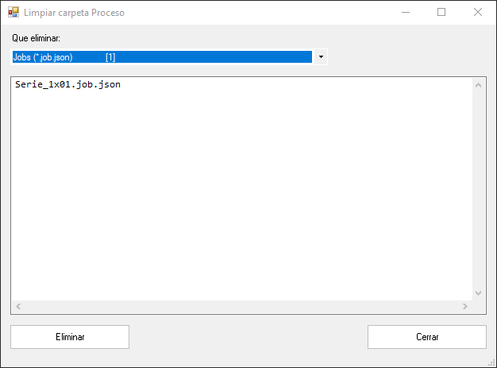

# 4. Cuando algo no sale

[⬅ Convertir](03-convertir.md) · [Índice](README.md)

## Lo primero: mirar su log

Casi todo se contesta abriendo el log **de ese archivo**: doble clic en su fila, o botón derecho → *Ver el proceso (log)*. Si ya terminó, se busca en `logs\` el tramo donde se convirtió y se enseña tal cual ([página 3](03-convertir.md)).

Para ver los logs enteros, con su fecha y su tamaño, está el visor de setup:

Se muestran **limpios**: la línea de progreso se repintaba cientos de veces por archivo y dejaba el log ilegible, así que cada racha de repintados se colapsa en el estado final avisando de cuántos recoge. Con *"Ver crudo (sin limpiar)"* se ve el fichero tal cual. El fichero nunca se modifica.

El log de la sesión en curso se puede leer pero no borrar (lo tiene abierto el propio programa).

## Síntomas típicos

| Lo que ves | Qué pasa | Qué hacer |
|---|---|---|
| Un archivo en **Sin terminar** | Hay salida en `Convertido\` pero el job sigue: la conversión se cortó. El worker **salta** los archivos que ya tienen salida, así que no se rehará solo. | Botón derecho → *Eliminar la salida a medias*. Vuelve a *En cola*. |
| Un archivo en **Bloqueo huérfano** | Un worker murió sin soltar su bloqueo. | Botón derecho → *Liberar el bloqueo huérfano*, o déjalo: el siguiente worker lo roba al ver que su proceso ya no existe. |
| Al abrir avisa de que **falta FFmpeg** | La versión que fija la configuración no está instalada. | Deja que abra setup y pulsa *Instalar*, o *Usar esta versión* si ya tienes otra ([página 1](01-primeros-pasos.md)). |
| **Cerré la ventana y sigue convirtiendo** | Es lo normal: cada worker es un proceso aparte. Al cerrar se pregunta qué hacer, y "dejarlos en segundo plano" es una respuesta válida. | Vuelve a abrir la cola y ahí siguen. Para pararlos, `Parar`. |
| La conversión **falla siempre en el mismo archivo** | Suele ser el origen (pista rota, códec raro). | Mira su log; prueba a prepararlo con un perfil `COPY` para descartar el encoder. |
| **El progreso se queda en 0%** | Casi siempre es un subtítulo **vacío** (0 líneas) que se ha marcado para conservar. | Edita el job y desmárcalo. Por eso vienen desmarcados de serie. |
| **No recorta las bandas negras** | El perfil elegido no las busca, o las buscó y no las vio claras. | Usa un perfil `AUTO-BORDE`/`DETECT BORDE`, o abre el editor y pulsa *Detectar bordes*; también puedes escribir el recorte a mano y comprobarlo con *Ver recorte*. Renombrar el archivo con `_` delante fuerza la detección. El porqué está en [explica-deteccion-bordes.md](../docs/explica-deteccion-bordes.md). |
| **El audio va adelantado o atrasado** | La columna *Audio* marca `[x] sync …` en los archivos donde se aplica un retardo: son los que hay que escuchar después. | En el editor, campo *Sync (s)* de la pista, y *Escuchar* para comprobarlo. |
| **Sale una pista de audio que no quería** | Se conserva lo que decidió PREPARAR. | Edita el job: marca las pistas a conservar y cuál es la predeterminada. |
| **Un vídeo no aparece en la lista** | Su extensión no está en la lista de entrada. | `config.json` → `encode.extensions` ([ref-configuracion.md](../docs/ref-configuracion.md)). |
| Quiero **rehacer uno desde cero** | — | Botón derecho → *Quitar de la cola* (borra su job) y prepáralo otra vez. Si además ya tenía salida, borra antes el `_fix.mkv` de `Convertido\`. |

## Empezar de cero

Si `Proceso\` se ha quedado con restos de un lote abandonado, en setup hay una limpieza que enseña **exactamente qué va a borrar** antes de hacerlo:

Se puede borrar por partes: jobs, bloqueos y ficheros de estado de los workers, temporales, o todo. Los vídeos de `Original\` y lo ya convertido **no se tocan**.

> No borres los bloqueos con workers en marcha: dos workers pueden acabar cogiendo el mismo archivo. Primero `Parar` (o `Cancelar ahora`), y luego limpias.

## Si hace falta ir más abajo

| Pregunta | Dónde |
|---|---|
| ¿Qué comando exacto de ffmpeg se lanza en cada fase? | [ref-comandos.md](../docs/ref-comandos.md) |
| ¿Qué significa cada clave de `config.json`? | [ref-configuracion.md](../docs/ref-configuracion.md) |
| ¿Cómo decide las cosas la fase de preparar, y qué hay dentro del job? | [ref-flujo.md](../docs/ref-flujo.md) · [ref-jobs.md](../docs/ref-jobs.md) |
| ¿Cómo funciona la cola por dentro (bloqueos, estado de los workers, parada)? | [ref-cola.md](../docs/ref-cola.md) |
| ¿Por qué un 4K HDR se ve lavado? ¿Qué es el CRF? ¿Qué pasa con el audio? | [explica-tonemap-hdr.md](../docs/explica-tonemap-hdr.md) · [explica-control-tasa.md](../docs/explica-control-tasa.md) · [explica-audio.md](../docs/explica-audio.md) |
| Fallos reales ya pisados y cómo se evitan | [ref-gotchas.md](../docs/ref-gotchas.md) |
